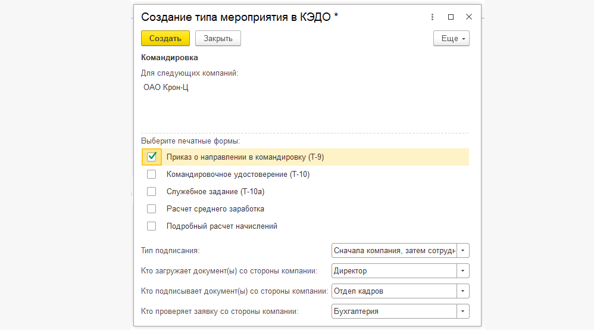

##  **Обмен данными с сервисом VK HR Tek**

При перемещении/копировании информационной базы обмен данными с КЭДО останавливается автоматически, если изменилось только имя базы. Пользователям с административными правами при входе в базу задаётся вопрос, переместилась ли база или создана копия. Если база переместилась, то обмен с КЭДО возобновляется. Если это копия базы, то обмен с КЭДО остаётся выключенным. Остальным пользователям КЭДО показывается предупреждение об остановке обмена данными. 

##  **Работа с универсальным процессом**

На форму создания типа мероприятия (универсального процесса) добавлен выбор ролей пользователей, которые загружают и подписывают документ и подтверждают заявку со стороны компании. Чтобы создать универсальный процесс, документ 1С не должен быть сопоставлен с документом КЭДО.

<warn>

Универсальный процесс создаёт только пользователь с ролью «Администратор»

</warn>

Например, для универсального процесса «Командировка» Администратор формирует и проводит приказ на командировку, далее нажимает кнопку **КЭДО**. Затем открывается форма **Создание типа мероприятия в КЭДО** с возможностью выбора печатных форм и ролей.

