Для подключения компании к сервису **VK HR Tek** перейдите в раздел **КЭДО** → **Начальная настройка**.

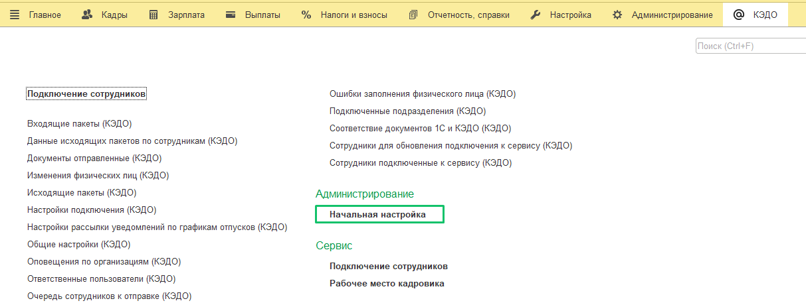

В разделе **КЭДО** → **Начальная настройка** → **Подключение к сервису** выполните следующие действия:

1. Для клиентов SaaS решения VK HR Tek: поля в **Параметрах подключения**, включая **Адрес** заполняются автоматически, их менять не требуется. 

Клиенты On-premise решения VK HR Tek заполняют поля в **Параметрах подключения**  самостоятельно (при первом подключении).

2. В поле **Организация** выберите наименование вашей организации. Поле **Уникальный идентификатор** заполнится автоматически.

2. При первом подключении организации для получения токена обратитесь к менеджеру внедрения VK HR Tek и сообщите ему наименование организации и уникальный идентификатор. 

3. В поле **Токен** введите токен, полученный от менеджера VK HR Tek, и нажмите кнопку **Подключиться к КЭДО**.

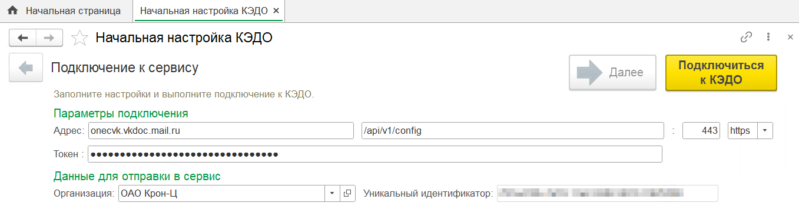

Дождитесь появления сообщения **Первый запуск состоялся успешно**.

##  **Выдача прав пользователям**

Пользователей, которые будут работать с кадровыми документами в расширении, необходимо включить в одну из групп доступа:

* **Администратор (КЭДО)** имеет доступ ко всем действиям в разделе **КЭДО**: начальные настройки, рабочее место кадровика, подключение сотрудников.  
* **Рабочее место (КЭДО)** имеет доступ только к разделу **КЭДО** → **Рабочее место кадровика**.   
* **Подключение сотрудников (КЭДО)** имеет доступ только к разделу **КЭДО** → **Подключение сотрудников**.

Для комбинации доступов можно добавить пользователей в несколько групп. Отправка документов в  КЭДО доступна для пользователей из любой группы.

Чтобы выдать роли через профили и группы доступа:

1. Перейдите в раздел **Администрирование** → **Настройки пользователей и прав**.

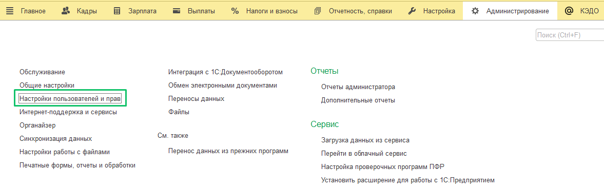

2. Откройте раздел **Профили групп доступа**.

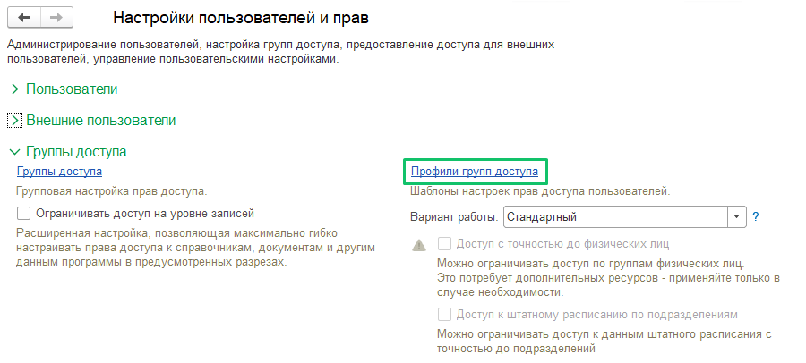

3. После первого запуска в список групп доступа уже должны быть добавлены профили:

* **Администратор (КЭДО)**,   
* **Рабочее место (КЭДО)**,  
* **Подключение сотрудников (КЭДО)**.

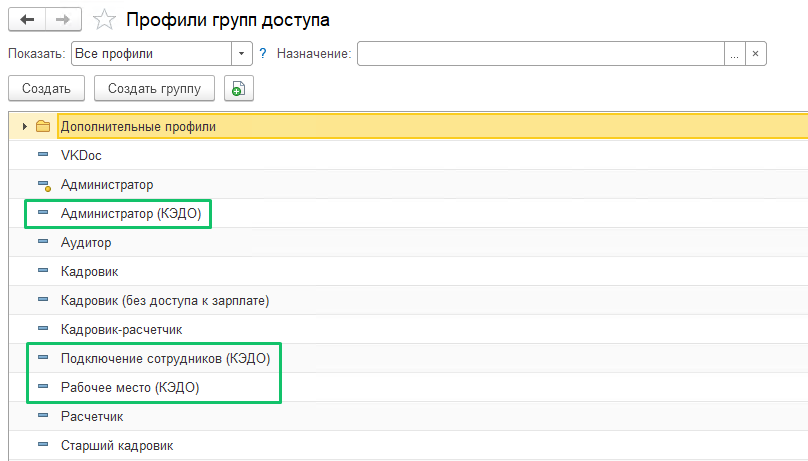

Перечисленные профили групп доступа появляются по умолчанию после [установки расширения](/ru/1C/admin/start). Если таких профилей нет в списке – обратитесь в техническую поддержку сервиса VK HR Tek.

4. Откройте раздел **Администрирование** → **Настройки пользователей и прав** → **Группы доступа**.

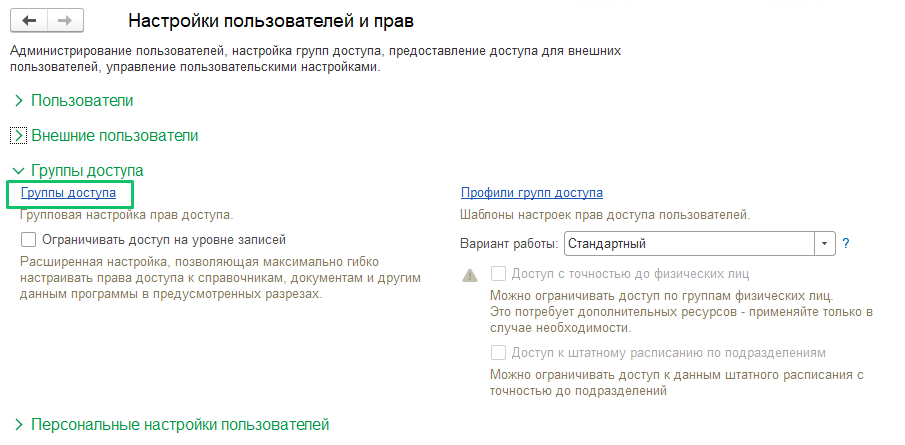

5. Чтобы добавить необходимых сотрудников в группу доступа в КЭДО, дважды нажмите на любую группу в списке. Проверьте, чтобы в поле **Профиль** было установлено значение, соответствующее значению в поле **Наименование**. На вкладке **Участники группы** нажмите кнопку **Подобрать**. 

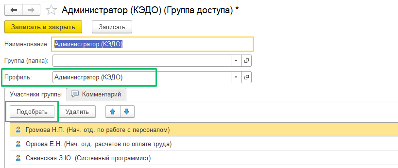

6. В форме **Подбор участников группы доступа** в левом списке выберите группу сотрудников или отдельных сотрудников, которые будут работать с КЭДО в 1С, и нажмите кнопку с изображением стрелочки (**>**) — **Выбрать группу** или **Выбрать пользователя**. Нажмите кнопку **Подобрать и закрыть**.

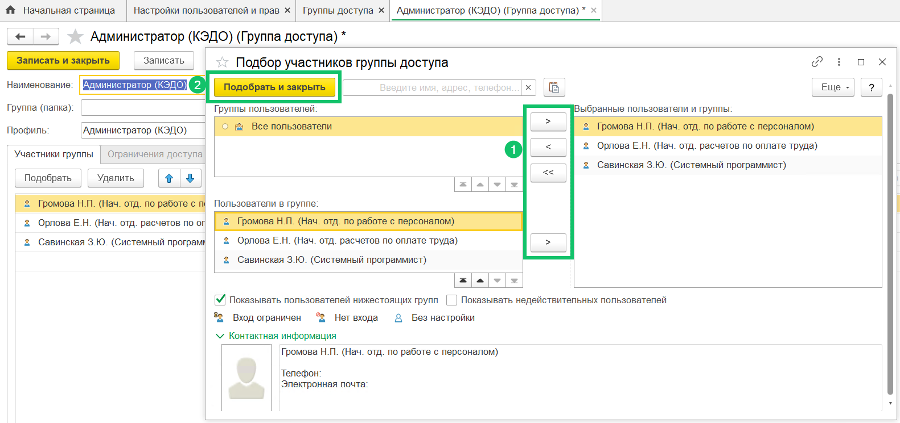

Если сотрудника не добавить в группу доступа, он не сможет работать с заявками в 1С и отслеживать их статус. 

7. Нажмите кнопку **Записать** или **Записать и закрыть**. 

##  **Добавление сертификата электронной подписи**

Система даёт возможность подписывать кадровые документы с помощью УКЭП из 1С. Для загрузки сертификата выполните следующие действия:

1.  В разделе **КЭДО → Начальная настройка → Настройки функциональности** установите флажок **Электронная подпись** и перейдите в раздел **Сертификаты и программы электронной подписи**.

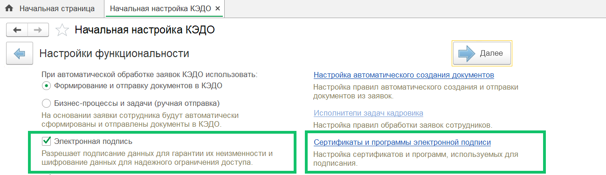

2. В форме **Настройки электронной подписи и шифрования**, на вкладке **Сертификаты** нажмите кнопку **Добавить** → **Для подписания и шифрования**.

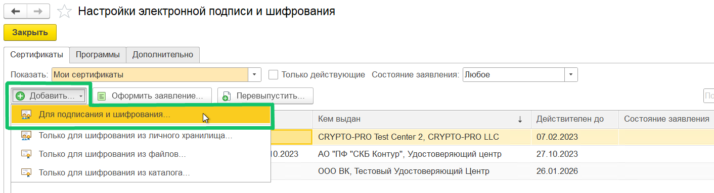

3. Перед загрузкой сертификата в 1С проверьте, что у вас на компьютере установлена программа КриптоПро и в нее загружен сертификат УКЭП. Только после этого можно перейти к загрузке сертификата в 1С.

В форме **Добавление сертификата для подписания данных** выберите файл сертификата на своём компьютере и нажмите кнопку **Далее**.

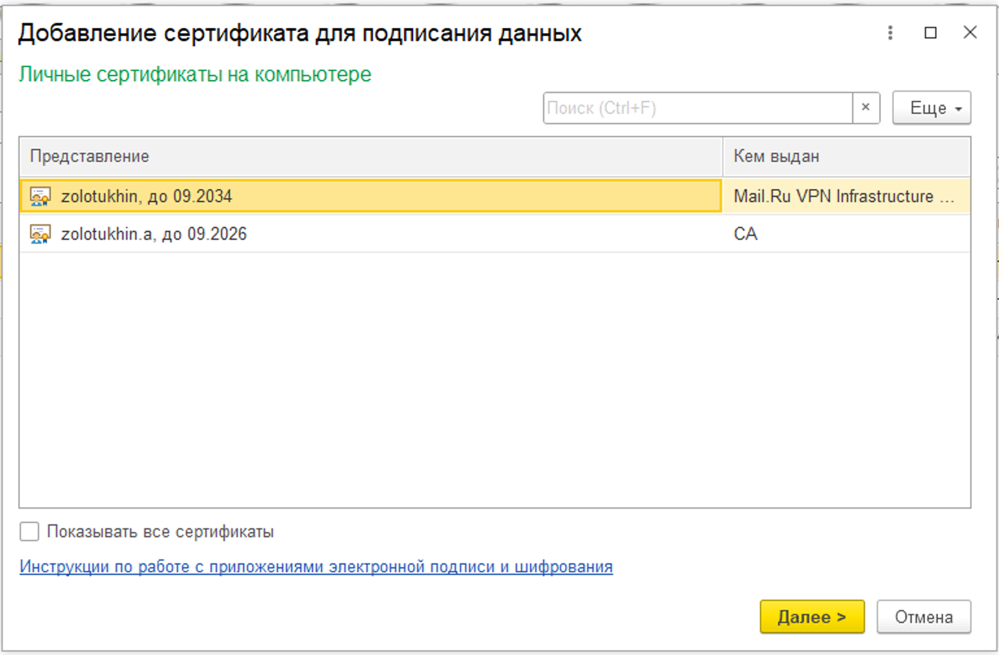

4. Укажите одного пользователя для использования сертификата. На вкладке **Сертификаты** дважды нажмите на строку с сотрудником. В форме сотрудника, в поле **Используют** выберите только одного сотрудника и нажмите кнопку **ОК**.

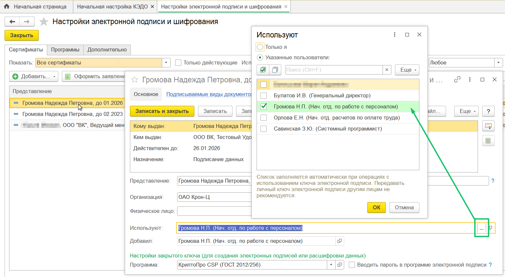

Альтернативный путь для загрузки сертификата: **Функции для технического специалиста** → **Справочники** → **Сертификаты ключей электронной подписи и шифрования** → **Добавить для подписания и шифрования** → **Добавление сертификата для подписания данных**.

##  **Проверка регламентного задания для обмена с сервисом VK HR Tek**

Регламентные задания — действия, которые выполняются автоматически в фоновом режиме, по определённому расписанию. Регламентные задания облегчают работу в программе, позволяя перенести выполнение рутинных задач в саму программу, и в то же время они снижают человеческий фактор. Например, неактивные типы заявок в КЭДО автоматически удаляются из соответствия документов 1С и КЭДО (каждые две минуты согласно регламентному заданию).

Необходимо проверить работу регламентного задания для обмена данными с сервисом VK HR Tek. Если регламентные задания  в базе выключены, то сервис не получит информацию о сотрудниках и обмен данными будет невозможен.

Чтобы включить регламентные задания: 

1. Перейдите в раздел **Администрирование** → **Обслуживание**.

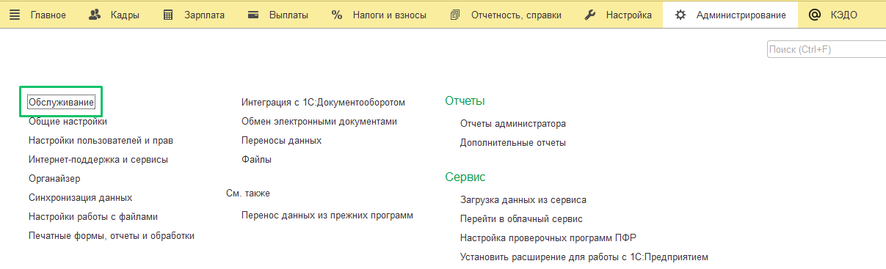

2. Откройте раздел **Регламентные и фоновые задания**.

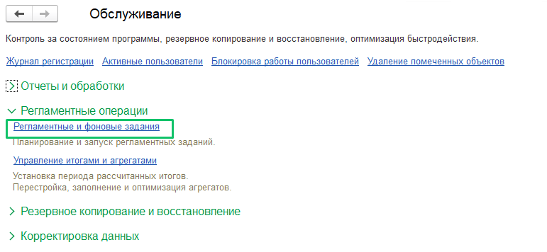

3. На вкладке **Регламентные задания** дважды нажмите на строку **Обмен данными с сервисом “КЭДО”**. В форме **Обмен данными с сервисом “КЭДО” (Регламентное задание)** проверьте, что флажок **Включено** установлен.

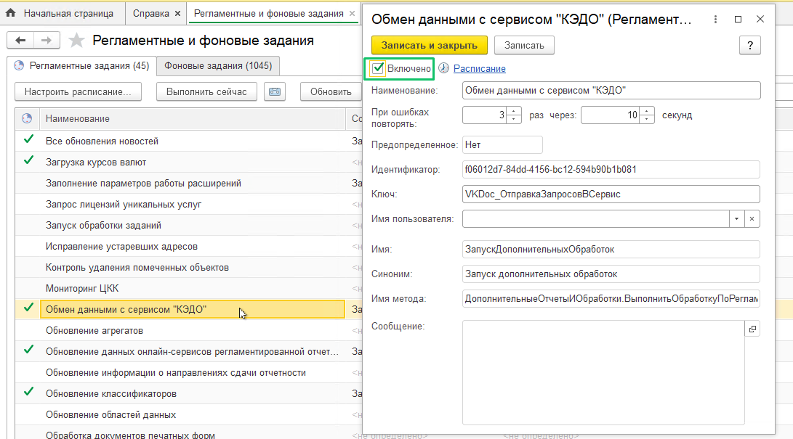

В общем списке включенные регламентные задания обозначены зелёной галочкой.

4. Выделите строку **Обмен данными с сервисом “КЭДО”** и нажмите кнопку **Настроить расписание…** В форме **Расписание** проверьте, что расписание установлено со значением **каждый день; каждые 120 секунд**.

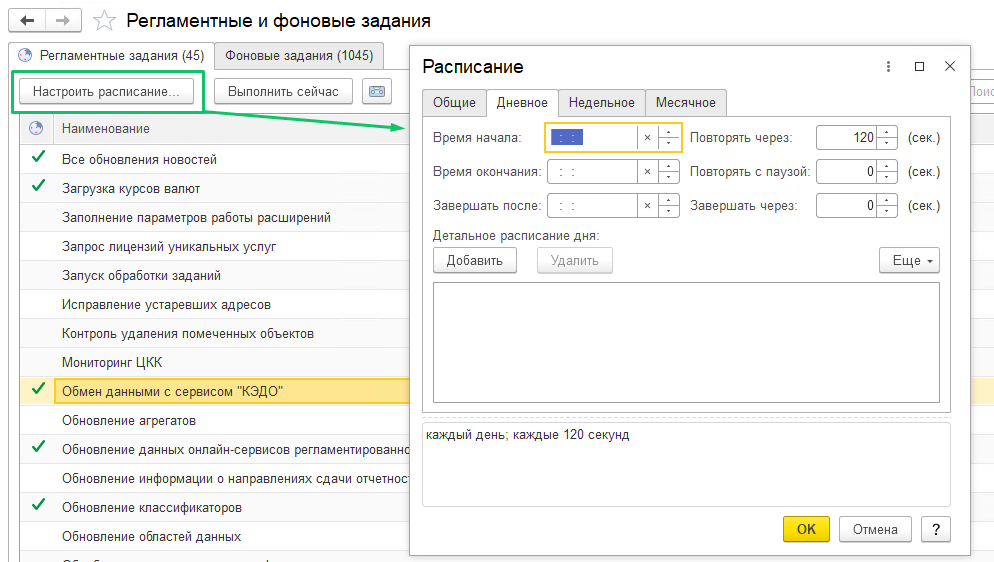

5. Если требуется выполнить регламентное задание в текущий момент, нажмите кнопку **Выполнить сейчас**. 

