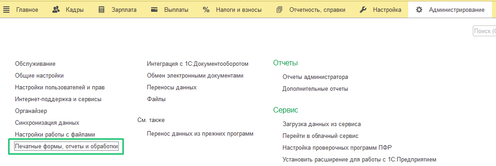
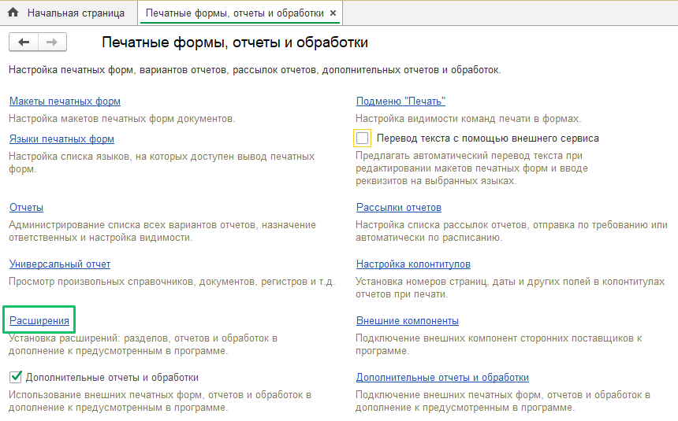
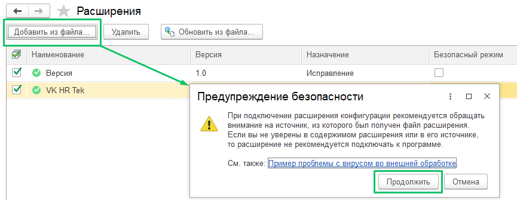
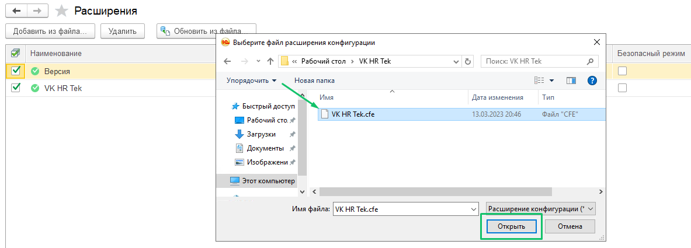
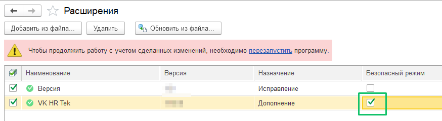
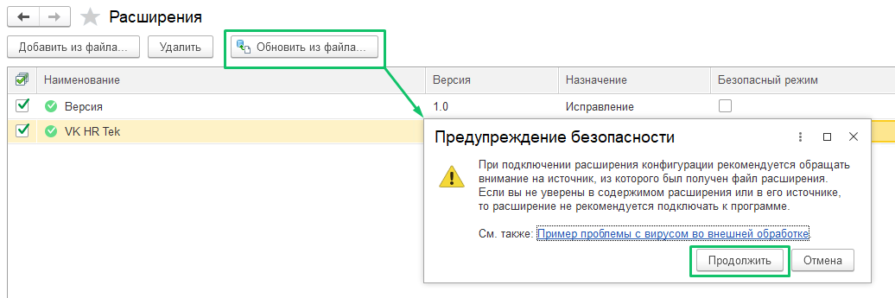
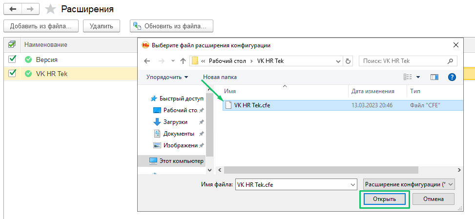
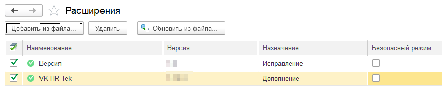
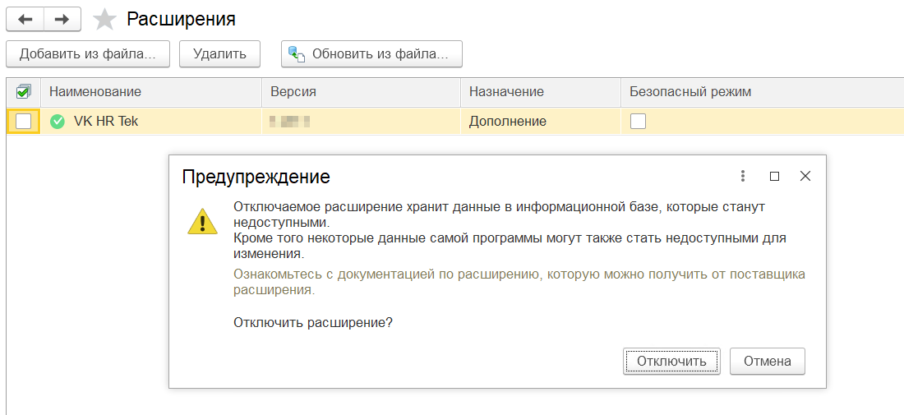
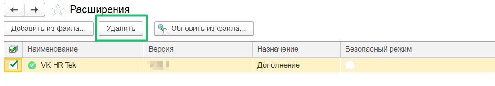

<info>

Актуальная версия расширения 1С КЭДО 2025.09.00 была протестирована на платформе 1С:Предприятие 8.3.26 с конфигурацией ЗУП КОРП, ред. 3.1.35.47.

</info>

На иллюстрациях приведены примеры названий версий расширения. Актуальные версии обновлений для подключения или обновления можно запросить у вашего менеджера VK HR Tek.

## Подключение расширения

1. Для подключения расширения перейдите в раздел **Администрирование** →  **Печатные формы, отчеты и обработки**.

2. Выберите раздел **Расширения**.

3. На открывшейся странице со списком расширений нажмите кнопку **Добавить из файла…** В диалоговом окне **Предупреждение безопасности** нажмите кнопку **Продолжить**. 

4. Выберите файл расширения на своем компьютере и нажмите кнопку **Открыть**.

5. После добавления расширения уберите флажок в колонке **Безопасный режим** и перезапустите 1С:ЗУП.

## **Обновление расширения** 

При смене релиза расширяемой конфигурации работоспособность  расширения обеспечивается путем предоставления пользователю новой версии через рассылку по электронной почте.

Чтобы установить новую версию расширения:

1. Перейдите в раздел **Администрирование** → **Печатные формы, отчеты и обработки** → **Расширения**.

2. На открывшейся странице в списке расширений выберите строку **VK HR Tek** и нажмите кнопку **Обновить из файла…** В диалоговом окне **Предупреждение безопасности** нажмите кнопку **Продолжить**.

3. Выберите файл обновления на своем компьютере и нажмите кнопку **Открыть**.

Версию расширения можно посмотреть в разделе **Расширения** или **Управление расширениями конфигурации**.  

## Отключение расширения

Отключение выполняется пользователем при обнаружении ошибок и невозможности дальнейшего использования расширяемой типовой конфигурации. Чтобы отключить расширение, необходимо иметь права Администратора или полные права.   
Для отключения расширения в разделе **Администрирование** → **Печатные формы, отчеты и обработки** → **Расширения** уберите флажок у имени расширения и в форме предупреждения нажмите кнопку **Отключить**. Перезапустите программу.

## Удаление расширения

Удаление расширения влечёт за собой удаление и потерю всех данных расширяемой типовой конфигурации, которые были внесены или изменены в процессе работы в расширении.  
Чтобы удалить расширение, необходимо иметь права Администратора или полные права.   
Для удаления расширения в разделе **Администрирование** → **Печатные формы, отчеты и обработки** → **Расширения** установите флажок у имени расширения и нажмите кнопку **Удалить**.

Перезапустите программу. После перезапуска выбранное расширение исчезнет из списка.

