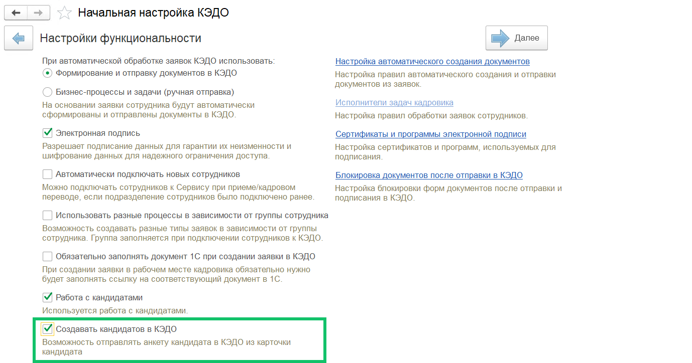
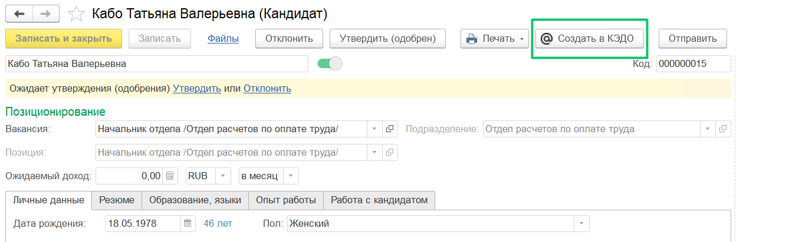

Специалист по найму может добавлять кандидата и связывать его с заявкой на подбор в расширении для 1С:ЗУП КОРП. Информация о кандидате (ФИО, номер телефона, e-mail) из 1С передаётся в КЭДО, где проверяется наличие ранее созданных заявок с тем же кандидатом. В случае обнаружения незавершённой заявки специалист получает предупреждение о том, что кандидат уже создан в КЭДО и нужно завершить заявку. Предупреждение не ограничивает повторную отправку кандидата в КЭДО. 

Далее специалист по найму указывает дополнительную информацию для создания кандидата в КЭДО:

* выбор компании из списка доступных в аккаунте;  
* выбор анкеты из списка доступных в компании.

Затем данные о кандидате, дополнительная информация и токен ответственного специалиста из 1С отправляются в КЭДО по нажатию кнопки **Создать в КЭДО** в карточке сохранённого кандидата. В случае если ответственный не состоит в группе специалистов по найму — возвращается ошибка.

После этого в КЭДО будет автоматически создана заявка с кандидатом, а кандидату будет отправлена анкета для заполнения, если в этой заявке больше не предусмотрены поля для заполнения со стороны компании.

Чтобы из карточки кандидата создать анкету кандидата в КЭДО, в **КЭДО** → **Начальная настройка** включите флаг **Создавать кандидатов в КЭДО**, а затем в справочнике кандидатов откройте нужную карточку и нажмите кнопку **Создать в КЭДО**.

