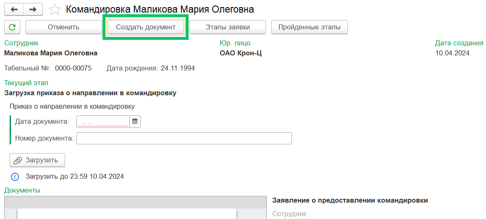
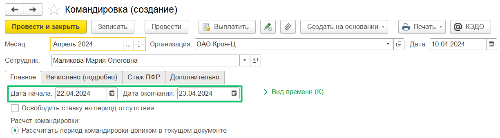
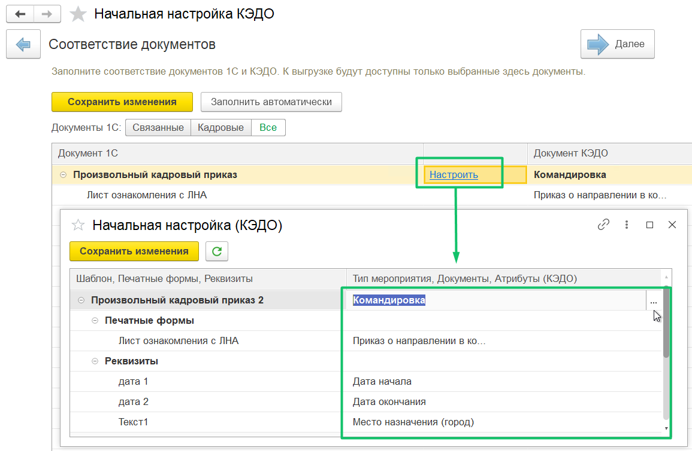
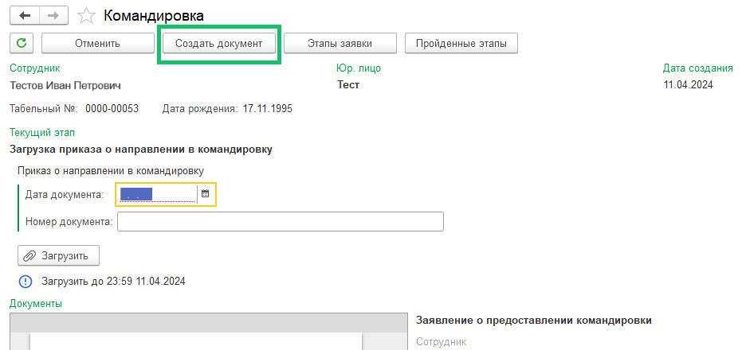
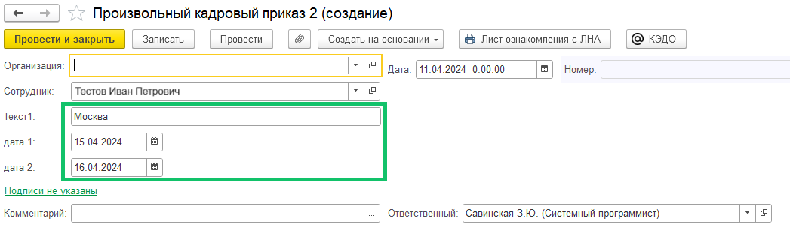

В 1С:ЗУП КОРП добавлено автозаполнение документов **Командировка** и **Произвольный кадровый приказ**. Из формы заявки нажмите кнопку **Создать документ**.

Для документа **Командировка**:

1. Проверьте, что в **КЭДО** → **Начальная настройка** → **Соответствие документов** настроено сопоставление документа 1С **Командировка** с приказом о направлении в командировку.  
2. В **Рабочем месте кадровика** откройте нужную заявку с типом **Командировка**. Заявка была создана сотрудником в КЭДО.  
3. В форме заявки нажмите кнопку **Создать документ**.  
4. Поля **Дата начала** и **Дата окончания** предзаполнены датами, которые сотрудник указывал при формировании заявки в КЭДО.

Для документа **Произвольный кадровый приказ**:

1. Проверьте, что в **КЭДО** → **Начальная настройка** → **Соответствие документов** настроено сопоставление документа 1С **Произвольный кадровый приказ** с любым доступным типом мероприятия КЭДО, например, с командировкой.

2. В **Рабочем месте кадровика** откройте нужную заявку с типом **Командировка**. Заявка была создана сотрудником в КЭДО.

3. В форме заявки нажмите кнопку **Создать документ**.

4. Поля для текста и дат будут предзаполнены данными, которые сотрудник указывал при формировании заявки в КЭДО.

