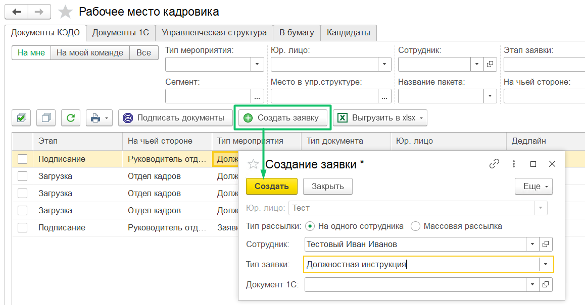

В Рабочем месте кадровика 1С:ЗУП КОРП можно привязывать заявку к **Произвольному кадровому приказу**. Для этого необходимо:

1. Настроить соответствие 1С документа **Произвольный кадровый приказ** с документом КЭДО.

2. Создать заявку с типом процесса, который был сопоставлен с произвольным кадровым приказом в разделе **Начальная настройка КЭДО** → **Соответствие документов**.

3. Открыть созданную заявку и нажать кнопку **Создать документ**.

4. Если требуется, заполнить произвольный кадровый приказ, а также провести и отправить документ в КЭДО. 

