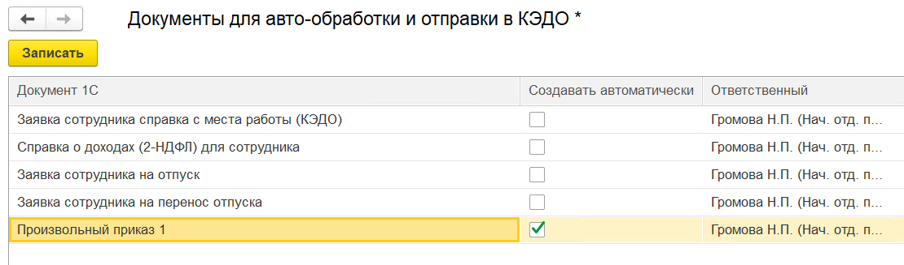

В расширении для 1С:ЗУП КОРП можно настроить автоматическое создание документов **Произвольные кадровые приказы** по данным из заявок сотрудников. При включении этой настройки документ будет подгружаться в заявку автоматически, не нужно создавать документ в заявке, заявка автоматически перейдёт на следующий этап. 

Для включения настройки перейдите в **КЭДО** → **Начальная настройка** → **Настройки функциональности** → **Настройка автоматического создания документов**, выберите ответственных и установите флажок **Создавать автоматически** для необходимых шаблонов приказов. Далее нажмите кнопку **Записать**.

