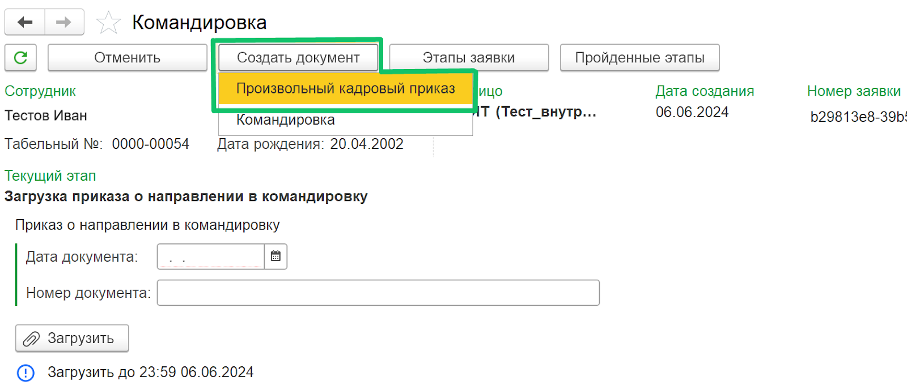
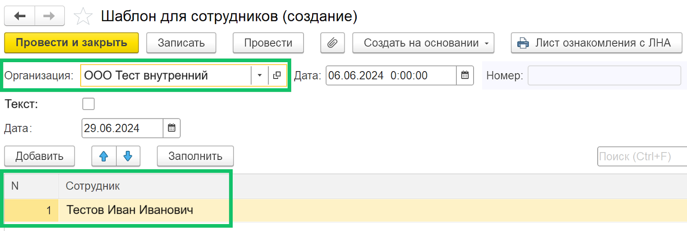
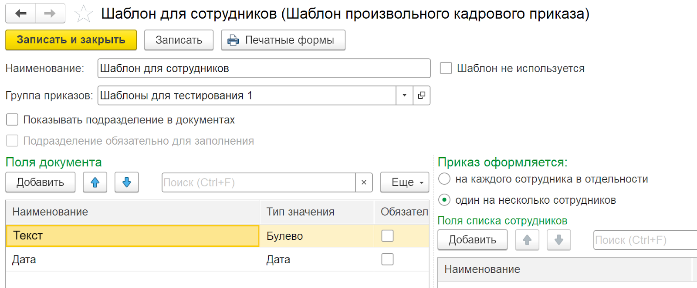
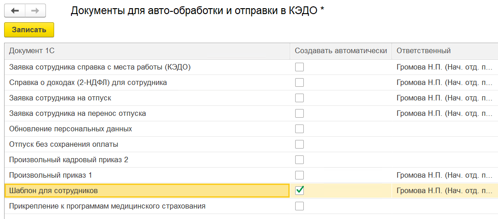

В расширение для 1С:ЗУП КОРП добавлено создание произвольного кадрового приказа по кнопке **Создать документ** из формы заявки. При создании документа автоматически заполняются данные организации и сотрудников, если шаблон произвольного кадрового приказа был заведён на список сотрудников.

Перед созданием произвольного кадрового приказа из заявки:

1. В разделе **Шаблоны произвольных кадровых приказов** должен быть создан шаблон произвольного кадрового приказа.

2. При настройке шаблона выберите печатную форму, которую будет формировать шаблон (внешняя печатная форма или печатная форма с расширением .docx).

3. Проверьте, что в **КЭДО** → **Начальная настройка** → **Соответствие документов** настроено сопоставление документа 1С **Произвольный кадровый приказ** с необходимым бизнес-процессом КЭДО.

4. Включите авто-обработку для шаблона произвольного кадрового приказа в **КЭДО** → **Начальная настройка** → **Настройки функциональности** → **Настройка автоматического создания документов**.

