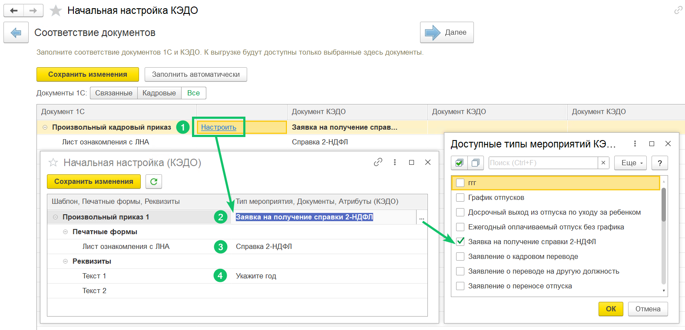

Для произвольных кадровых приказов в расширении для 1С:ЗУП КОРП можно выбирать соответствие реквизитов документов и атрибутов в КЭДО. Это необходимо для автоматического заполнения атрибутов при отправке приказов из расширения в КЭДО и при создании приказов в 1С по данным из заявки в КЭДО.

Для настройки перейдите в  **КЭДО** → **Начальная настройка** → **Соответствие документов**, напротив произвольного приказа нажмите кнопку **Настроить** и заполните соответствие шаблонов, печатных форм и реквизитов.

