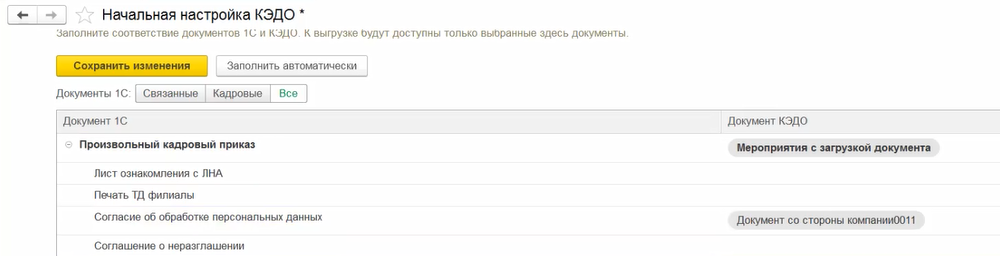
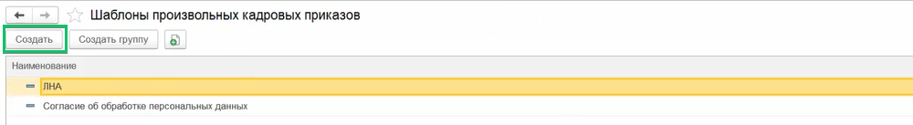
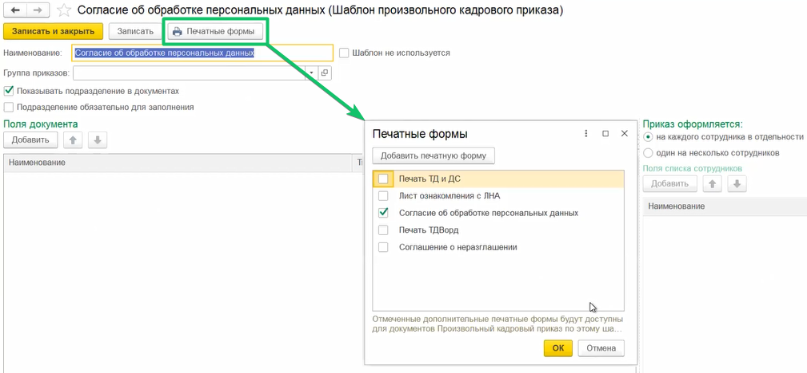
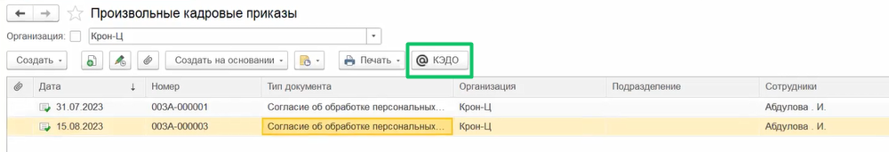
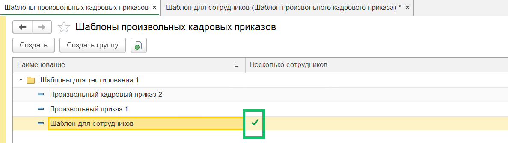
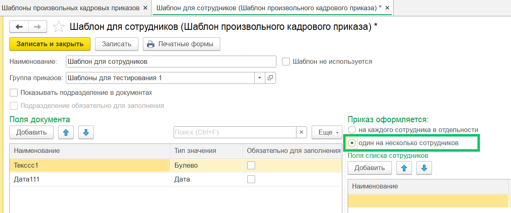

Из расширения для 1С:ЗУП КОРП в КЭДО можно отправлять документы **Произвольные кадровые приказы**, созданные на одного сотрудника.

Проверьте, что в разделе **Начальная настройка** → **Соответствие документов** добавлен 1С документ **Произвольный кадровый приказ**, с которым можно настроить сопоставления процессов КЭДО. Документ сопоставляется только с процессами, стартующими с этапа загрузки документа от компании. 

Чтобы корректно сопоставить документы КЭДО с произвольным кадровым приказом:

1. В разделе **Шаблоны произвольных кадровых приказов** должен быть создан шаблон произвольного кадрового приказа.

2. При настройке шаблона нужно указать, какую печатную форму будет формировать шаблон (внешняя печатная форма или печатная форма с расширением .docx).

Чтобы отправить произвольный кадровый приказ из расширения в КЭДО, откройте раздел **Произвольные кадровые приказы** и нажмите кнопку **КЭДО**.

Также можно отправлять документ **Произвольный кадровый приказ** со списком сотрудников из 1С:ЗУП КОРП в сервис VK HR Tek. Шаблоны таких приказов обозначены галочкой зелёного цвета.

Чтобы произвольный кадровый приказ был отправлен нескольким сотрудникам, в шаблоне приказа выберите настройку **один на несколько сотрудников**.

В 1С:ЗУП КОРП добавлена возможность создавать типы мероприятий КЭДО по каждому шаблону произвольного кадрового приказа.

