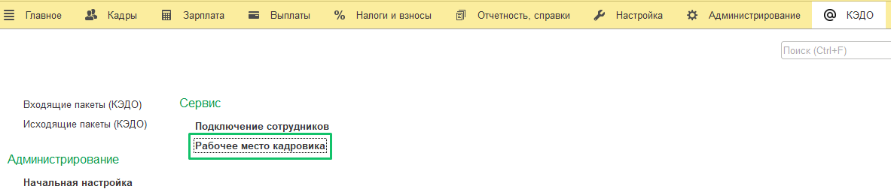
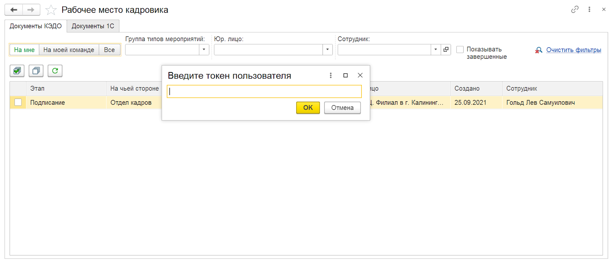

Перейдите в раздел **КЭДО** → **Рабочее место кадровика**.

Для использования КЭДО Пользователю — сотруднику Отдела кадров необходимо пройти авторизацию при первом входе в расширение. Для этого при открытии раздела **Рабочее место кадровика** введите токен, полученный в личном кабинете web-сервиса VK HR Tek, в Профиле Пользователя.

 
Срок действия токена — 90 дней, поэтому раз в 90 дней требуется обновлять токен в web-сервисе VK HR Tek и вводить его заново в форму **Токен устарел. Введите новый токен**.

