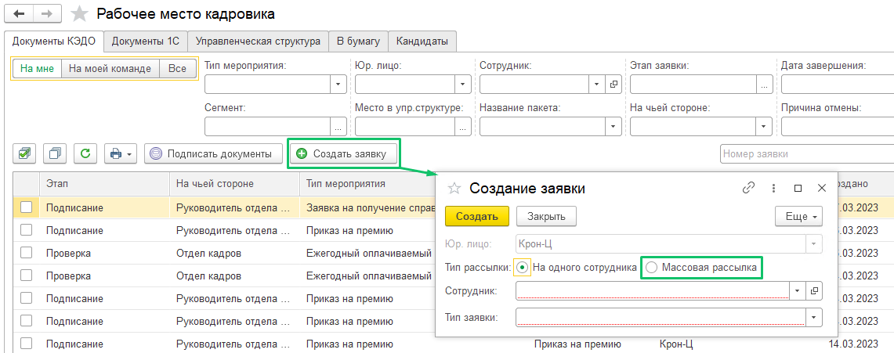
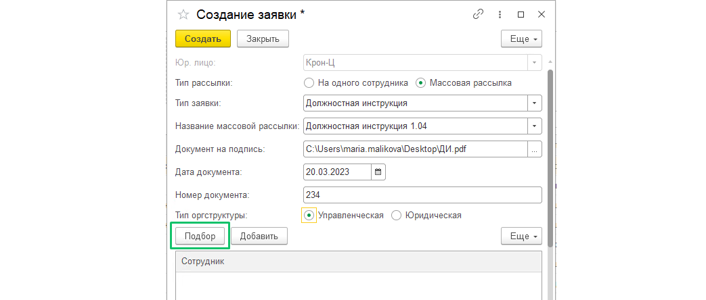
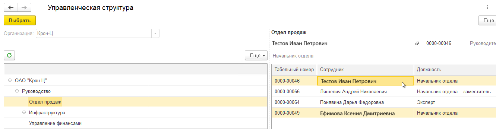
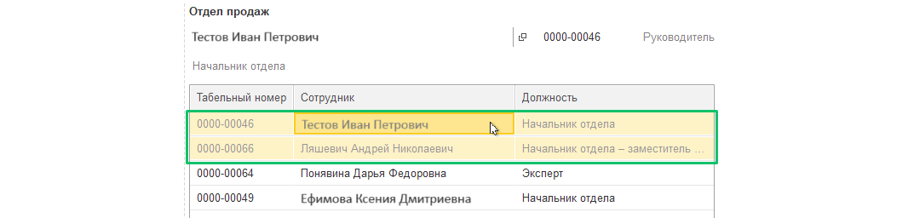
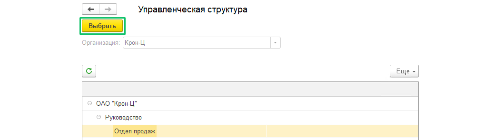
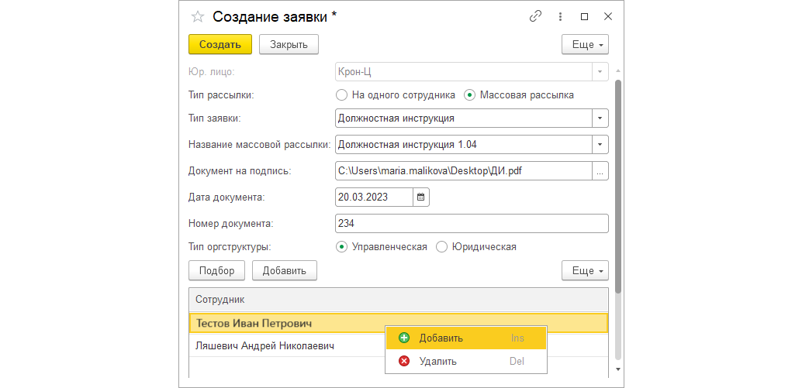

Если вы пользуетесь управленческой или юридической оргструктурой ([см. статью](/ru/1C/organizational_structure)), вы можете отправить любой документ сразу на всех сотрудников выбранного подразделения или подразделений. Для этого перейдите в раздел **КЭДО** → **Рабочее место кадровика** на вкладку **Документы КЭДО** и нажмите кнопку **Создать заявку**.

В форме **Создание заявки** выполните следующие действия:

1. Установите флажок **Массовая рассылка**.

2. Из списка **Тип заявки** выберите один тип заявки. Не все заявки можно отправлять пакетной отправкой, а только те, где прикладываемый документ единый для всех сотрудников, например, должностная инструкция. В коробочном решении КЭДО процессы с пакетной отправкой: **Должностная инструкция**, **Корпоративные документы**.

3. В поле **Название массовой рассылки**  введите название рассылки, по которому вы позже сможете отслеживать статистику количества сотрудников, которые подписали или не подписали документ. При повторной отправке одного и того же документа на другую группу сотрудников вы можете задать предыдущее название, тогда вам будет доступна общая статистика по всем отправленным документам с указанным названием. Например, 01.10 вы отправили ЛНА на подразделение менеджеров, а 02.10 вы отправили тот же ЛНА на кадровое подразделение. Если указать одинаковое название рассылки, вы увидите общую сводную статистику по заявкам, созданным и 01.10 и 02.10.

4. В поле **Документ на подпись** загрузите документ на подпись в формате .pdf или .docx. Документы .docx автоматически преобразуются в нужный формат .pdf.

5. В поле **Дата документа** укажите определённую дату или выберите в календаре.

6. В поле **Номер документа** укажите необходимый номер, либо оставьте поле пустым, если у документа отсутствует номер.

7. Выберите тип оргструктуры: управленческую или юридическую — в зависимости от того, как распределены нужные вам подразделения. 

8. Нажмите кнопку **Подбор** для выбора сотрудников. 

9. Например, в форме **Управленческая структура** вы можете добавлять сотрудников в пакетную заявку как по одному, так и выбирать сразу целые подразделения одним из следующих способов: 

* выделить каждого сотрудника отдельно;  
* выделить несколько сотрудников из списка: зажать клавишу *control* (*Ctrl*) и выделять нужные строки (не отпуская *control*);  
* выделить несколько сотрудников подряд: нажать на нужного из списка, зажать клавишу *shift*, нажать на последнего из списка (не отпуская *shift*);  
* выделить всех сотрудников: нажать одновременно клавиши *command+A* (для ОС Windows — *Сtrl+A*).

10. После выделения нужных сотрудников в каждом подразделении дважды нажмите на выделенную строку, чтобы строки с сотрудниками стали светло-серыми. Таким образом, вы закрепляете свой выбор и можете перейти к следующему подразделению. Выбранные сотрудники сохранятся, даже если вы закроете форму. 

11. После добавления всех сотрудников или подразделений в пакетную заявку в форме **Управленческая структура** нажмите кнопку **Выбрать**.

Выбранные сотрудники отобразятся в списке **Сотрудник** формы **Создание заявки**.

12. При необходимости вы сможете скорректировать список сотрудников. Для этого нажмите правой кнопкой мыши на строку с сотрудником и выберите команду **Добавить** или **Удалить**.

13. После проверки нажмите кнопку **Создать** в форме **Создание заявки** и перейдите к следующим шагам в зависимости от бизнес-процесса. На каждого сотрудника будет создана отдельная заявка. 