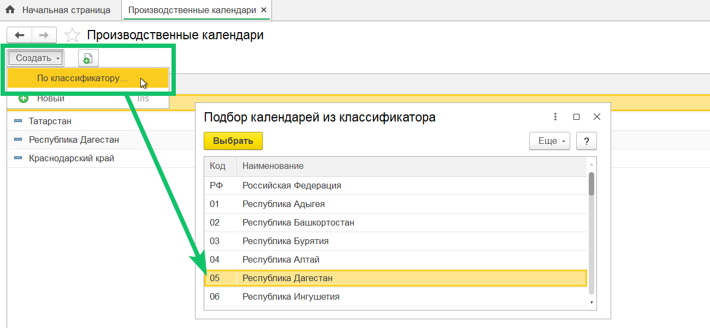
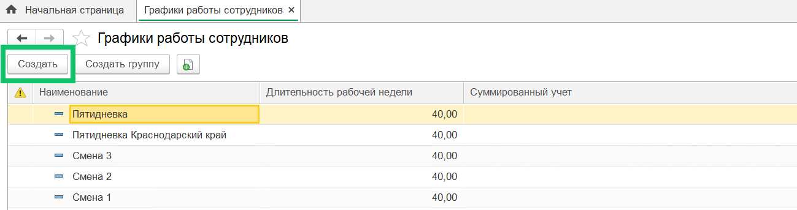
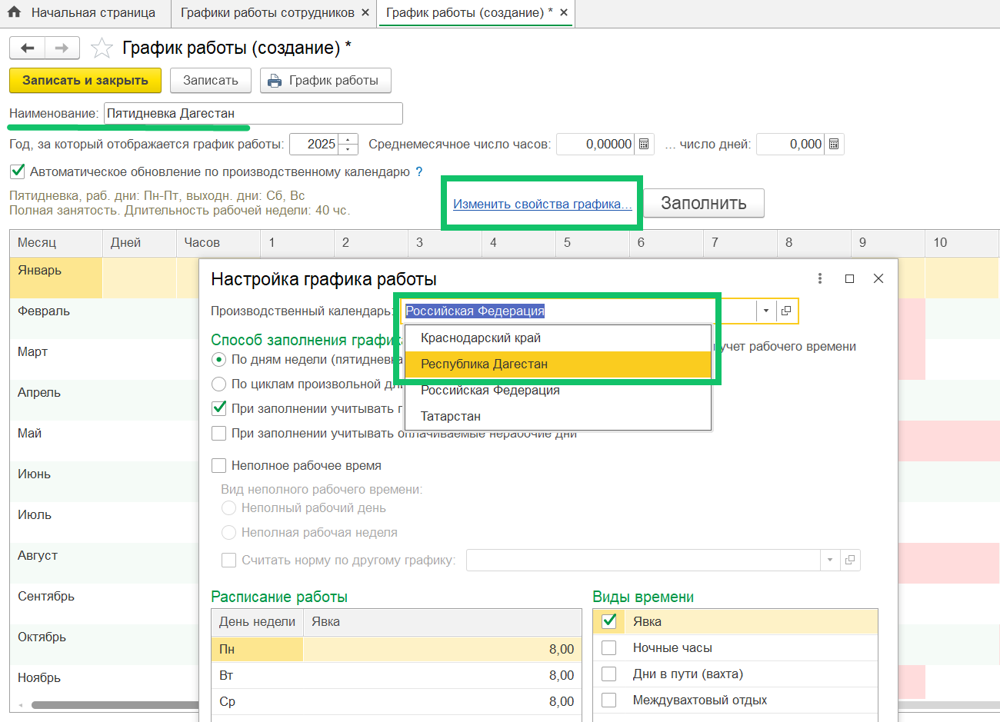
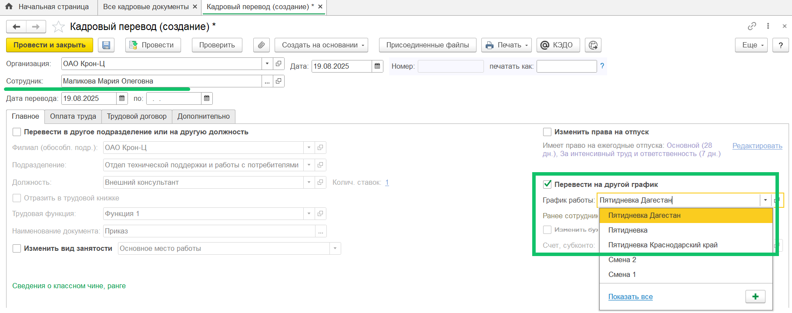
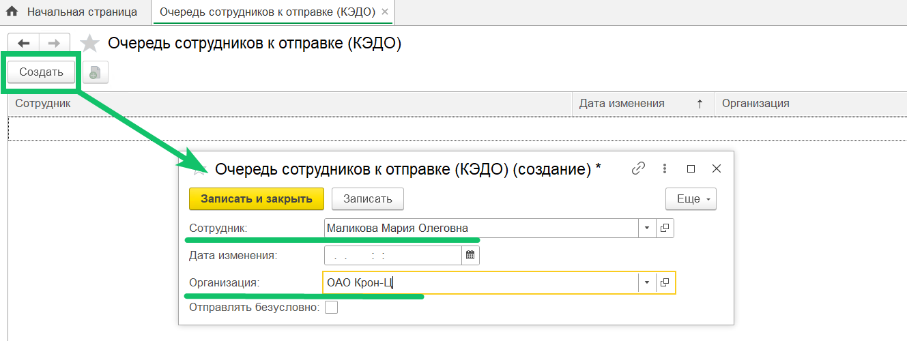
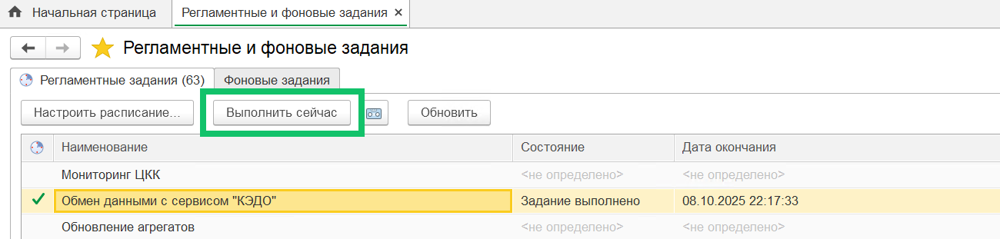

Данные о региональных производственных календарях по компании передаются из 1С в веб-сервис VK HR Tek один раз в сутки по регламентному заданию. 

<info>

Для передачи данных о региональных календарях из 1С в веб-сервис VK HR Tek должна быть включена настройка импорта на стороне компании. Для подключения настройки обратитесь в [поддержку VK HR Tek](/ru/hr/support/contact_channels).

</info>

Чтобы добавить региональный производственный календарь или проверить его наличие в 1С, перейдите в справочник **Производственные календари** и нажмите кнопку **Создать → По классификатору...** В открывшейся форме выберите название календаря.

Прежде чем импортировать данные из регионального производственного календаря в веб-сервис, необходимо добавить в 1С график работы с региональным календарем или перепроверить, что график работы с таким календарем был создан ранее. 

 

Для добавления календаря в график работы:
1. Перейдите в справочник **Графики отпусков сотрудников** и нажмите кнопку **Создать**. 

 

2. Укажите наименование графика, заполните или проверьте остальные параметры и нажмите кнопку **Изменить свойства графика**.  
3. В форме **Настройка графика работы** выберите производственный календарь из выпадающего списка. При необходимости заполните остальные параметры и сохраните настройки.
4. Сохраните график работы.

 

Чтобы импортировать данные из регионального календаря для отдельных сотрудников, необходимо:  

1. Создать документ «Приём на работу», «Кадровый перевод» или «Кадровый перевод (списком)». 
2. В документе заполнить сотрудника, выбрать график работы из списка и при необходимости заполнить остальные данные.
3. Провести документ и отправить в КЭДО. График работы будет обновлён в карточке сотрудника.

 

4. Чтобы не дожидаться, пока региональный календарь для отдельного сотрудника автоматически импортируется в веб-сервис по регламентному заданию, перейдите в раздел **Очередь сотрудников к отправке (КЭДО)** и добавьте сотрудника компании в очередь на отправку его данных.

 

5. Перейдите в раздел **Регламентные и фоновые задания**, выделите задание **Обмен данными с сервисом "КЭДО"** и нажмите кнопку **Выполнить сейчас**.

 

После выполнения вышеописанных действий в кабинете сотрудника веб-срвиса будет отображаться региональный производственный календарь.

<warn>

Синхронизация изменений может занимать несколько минут. Если региональный календарь так и не отобразился в веб-сервисе, проверьте наличие ошибок в передаваемых данных по сотруднику в разделе **Исходящие пакеты (КЭДО)**.

</warn>