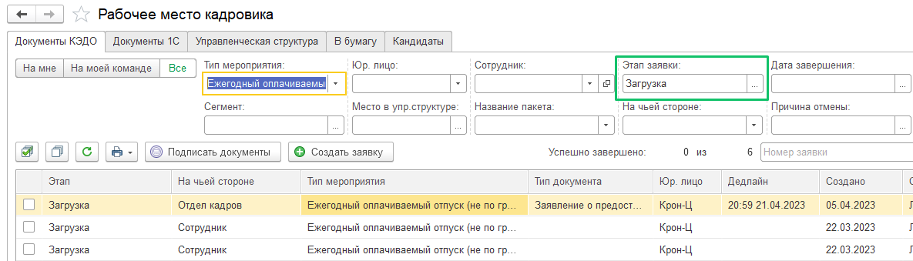
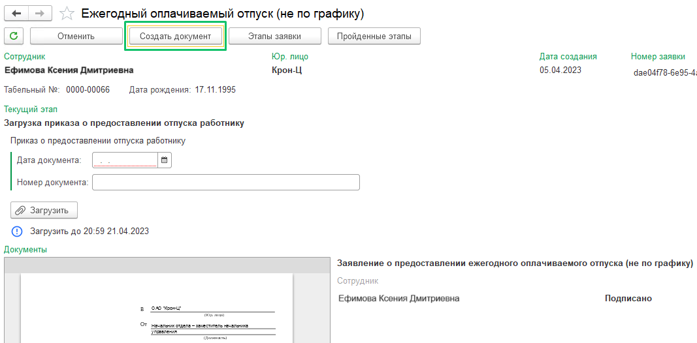
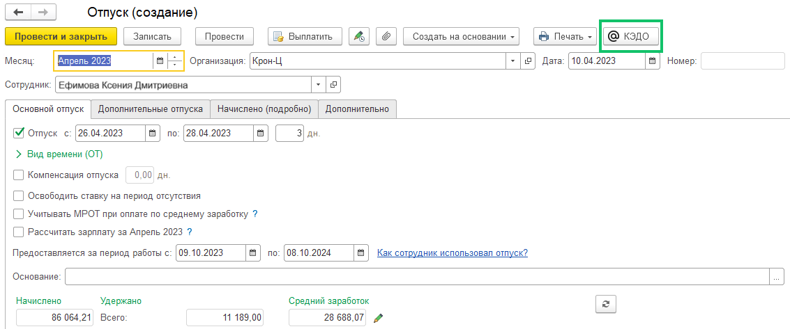
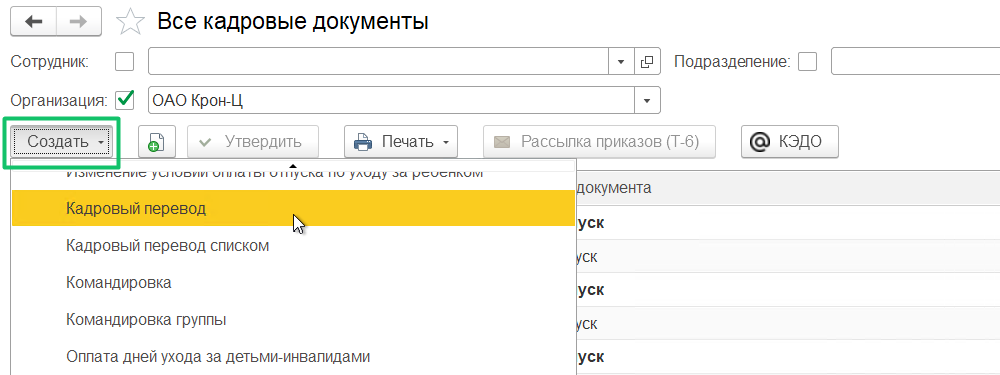
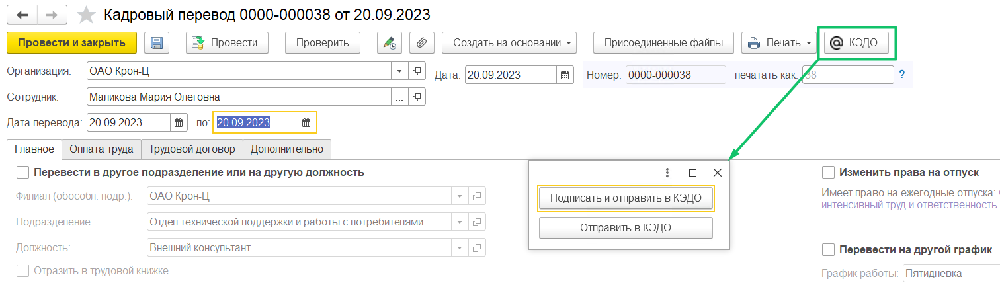
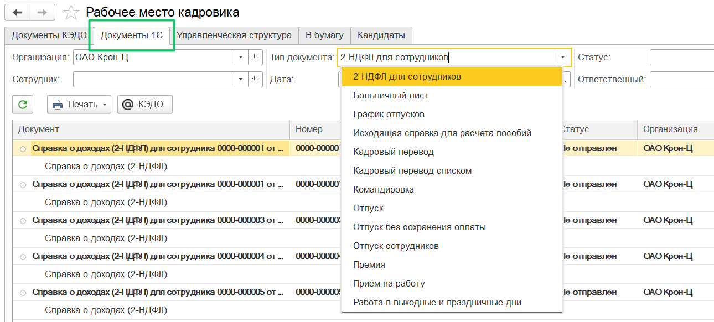

## **Создание документа 1С из заявки**

В разделе **КЭДО → Рабочее место кадровика** дважды нажмите на строку с заявкой, которая находится на этапе «Загрузка» (в столбце «Этап»):

 

Откроется форма заявки, в которой вы сможете создавать нужный документ 1С. 

Проверьте, что настроен маппинг документов 1С и документов КЭДО в разделе **КЭДО → Начальная настройка → Соответствие документов** ([см. Настройка соответствия документов 1С и документов КЭДО](/ru/1C/user/mapping)). 

В открывшейся заявке доступна кнопка «Создать документ», после нажатия на которую вы перейдете к документу 1С. Чтобы увидеть кнопку «Создать документ» пролистайте страницу заявки в самый верх:

 

Нажмите на кнопку «Создать документ». Система направит вас на форму создания того документа 1С, который был указан при начальной настройке соответствия документов. Например, для данной заявки на ежегодный оплачиваемый отпуск настроено соответствие документа 1С «Отпуск», то есть нажав на кнопку «Создать документ», вы перейдете в 1С документ «Отпуск», где уже будут предзаполнены даты отпуска сотрудника из заявки в КЭДО.

 

После заполнения всех данных и проведения документа 1С останется только отправить документы по кнопке «КЭДО», и они отобразятся в той же самой заявке в КЭДО. 

## **Создание и отправка документа в сервис VK HR Tek**

Чтобы создать новый документ, перейдите в раздел **Кадры → Все кадровые документы**, нажмите кнопку **Создать** и выберите нужное название процесса из выпадающего списка, например, «Кадровый перевод». Также создать документ 1С можно из заявки.

Далее в форме документа заполните обязательные данные, проверьте (по кнопке **Проверить**) и проведите документ (по кнопке **Провести**). 

Перед отправкой документа в КЭДО должны быть соблюдены условия:

* у пользователя 1С должна быть роль (группа), позволяющая отправлять документы в КЭДО;   
* сотрудник, которому отправляется документ, должен быть подключен к КЭДО.

Чтобы отправить документ в КЭДО:

1. Нажмите кнопку **КЭДО**.  
2. Выберите тип мероприятия в КЭДО (для кадрового перевода — «Изменение оклада» и «Приказ на кадровый перевод»).  
3. Если перед отправкой в КЭДО требуется подписать документ, нажмите кнопку **Подписать и отправить в КЭДО**.  
4. Если требуется только отправить документ в КЭДО (без подписи), нажмите кнопку **Отправить в КЭДО**.  
   

Возможна отправка любого документа в КЭДО. В том числе это документы, которых нет в регистре **Состав документов зарплата кадры**, и документы с реквизитом типа «Физическое лицо» вместо «Сотрудник».

## **Вывод некадровых документов**

В **КЭДО → Рабочее место кадровика** на вкладке «Документы 1С» добавлен вывод некадровых документов: «2-НДФЛ для сотрудников», «Премия», «Исходящая справка для расчета пособий» и других документов, отсутствующих в разделе **Кадры → Все кадровые документы**.

