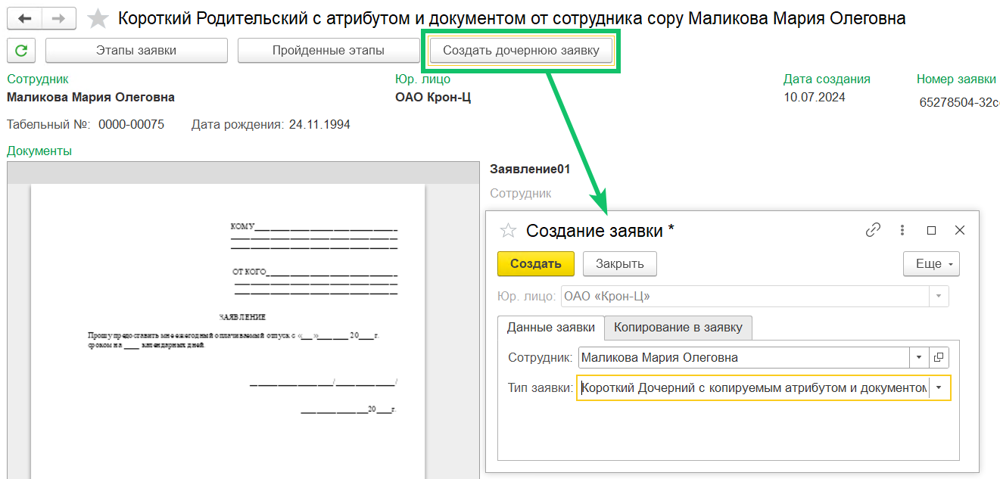
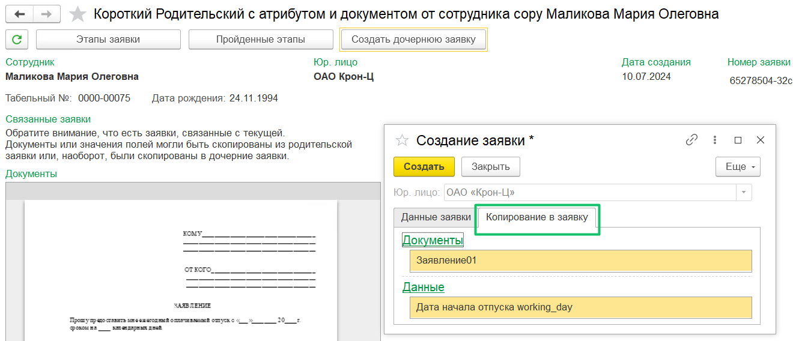
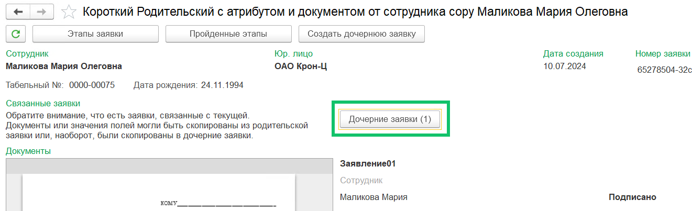
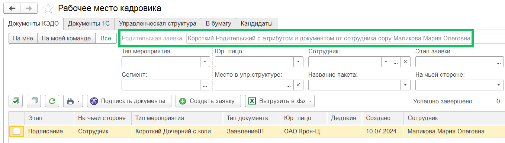

Для заявок определённых бизнес-процессов предусмотрено создание новых заявок, которые будут иметь связь с исходной и в которые можно скопировать данные и/или документы из исходной.

Дочерние заявки можно создавать только:

* из успешно завершённых заявок;  
* заявок, завершённых с отказом от подписания.

Чтобы создать новую заявку из родительской, перейдите в **Рабочее место кадровика**, откройте завершённую заявку, нажмите кнопку **Создать дочернюю заявку** и заполните форму создания.

 

В зависимости от БП в дочернюю заявку могут быть скопированы документы и/или данные из родительской заявки. Настройка связи родительского БП с дочерним и опций копирования задаётся в административной панели веб-сервиса.

 

Для просмотра дочерних заявок нажмите кнопку **Дочерние заявки** в родительской заявке.

 

Список дочерних заявок будет отфильтрован по родительской заявке.

 

Настройка бизнес-процесса с опцией создания связанных заявок является платной. Для подключения функции обратитесь к вашему менеджеру внедрения VK HR Tek.