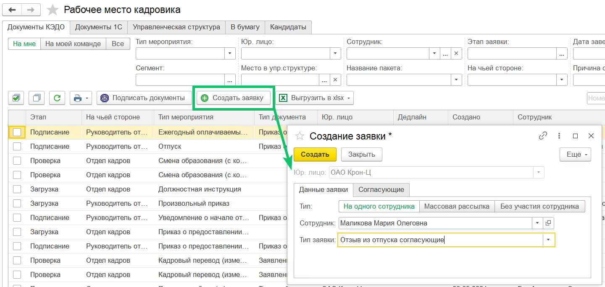
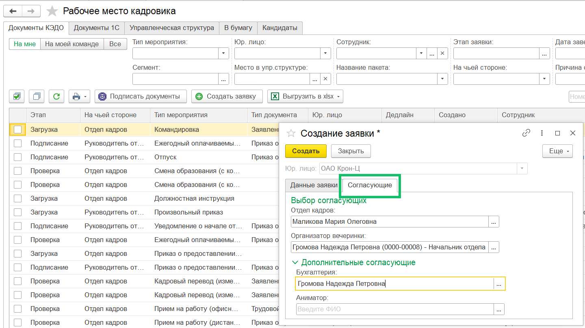

## Общие сведения

При создании заявки можно указывать одного или нескольких согласующих в бизнес-процессе. Для выбора согласующих может быть доступен список всех неуволенных сотрудников в рамках компании/аккаунта или группы в компании.

В зависимости от бизнес-процесса для опции выбора согласующих предусмотрены следующие условия: 

- согласующих может быть несколько (по количеству этапов, где указана возможность выбора);
- если опция предоставлена, то обязательно выбрать хотя бы одного согласующего;
- список для выбора: список всех неуволенных сотрудников в рамках компании/аккаунта или группы в компании;
- опция может быть доступна для любого исполнителя стартового этапа заявки.

В любом бизнес-процессе (БП) для любой роли можно разрешить выбирать конкретного сотрудника для выполнения этапа в создаваемой заявке.

Выбор согласующих происходит в момент создания заявки. Если на этапе заявки потребуется добавить или изменить согласующих — это возможно только через отмену текущей и создание новой заявки.

Выбирать согласующих можно из множеств:

- Все неуволенные сотрудники компании или всех компаний аккаунта, где создается заявка. 
- Все пользователи, у которых есть группа, связанная с этой ролью, в компании, где создается заявка.

Выбор согласующего может быть обязательным — при создании заявки пользователь должен обязательно выбрать исполнителя. Выбрать можно только одного исполнителя для роли. Пользователи с ролями могут выполнять как последовательные, так и параллельные этапы. Выбирать согласующих можно как для единичных заявок, так и для массовых рассылок.

Если исполнитель не назначен для этапов с необязательным выбором и множеством «все сотрудники компании аккаунта», то этап будет пропущен в последовательности этапов заявки.

При необязательном выборе в рамках группы вне зависимости от того, был ли выбран конкретный пользователь с группой или нет, этап пропущен не будет — его сможет выполнить любой пользователь с такой же группой в компании.

Совместно с аналитиками сервиса VK HR Tek можно создавать различные типы БП с выбором согласующих в зависимости от потребностей компании.

Аналитики в json-файле БП прописывают роль, которая будет согласовывать этап заявки. Для роли с таким свойством можно указать опции:

- множество для выбора: компания/аккаунт/группа (обязательно);
- обязательность выбора, если опция не заполнена — выбор согласующего необязательный (необязательно).

## Выбор согласующих в заявках 1С
При создании заявки в 1С можно указывать одного или нескольких согласующих. Для выбора согласующих доступен список всех неуволенных сотрудников в рамках компании/аккаунта или группы в компании.

<warn>
Выбрать согласующих в заявке, создаваемой из 1С, можно в случае если согласующие предусмотрены бизнес-процессом.
</warn>

**1.** Перейдите в **КЭДО → Рабочее место кадровика** и нажмите на кнопку **Создать заявку**. В форме **Создание заявки** в зависимости от выбранного типа отправки (на одного сотрудника, массовая рассылка или без участия сотрудника) выберите нужный тип заявки, в котором предусмотрен выбор согласующих сотрудников.

   

    

**2.** Перейдите на вкладку **Согласующие**. Укажите сотрудника из группы компании (в данном примере группа — Отдел кадров) и ответственного из списка сотрудников всех отделов компании (Организатор вечеринки). В блоке **Выбор согласующих** введите ФИО сотрудников, от которых обязательно должно быть получено согласование этапа заявки.

   

    

**3.** В блоке **Дополнительные согласующие** можно указать сотрудников, которые будут дополнительно согласовывать заявку с основными исполнителями из блока **Выбор согласующих**. 

   Поля блока **Дополнительные согласующие** необязательны для заполнения. В этом случае если не выбран согласующий, представляющий группу, то этап сможет выполнить любой сотрудник с такой группой в компании. А если не выбраны согласующие из списка всех сотрудников компании, то этапы будут исключены из заявки. 

**4.** Нажмите кнопку **Создать**.

<info>
 Для компаний, которые используют облачное решение VK HR Tek, настройка этой функции является платной. Для подключения обратитесь в поддержку VK HR Tek support@hrtek.ru. 
</info>
