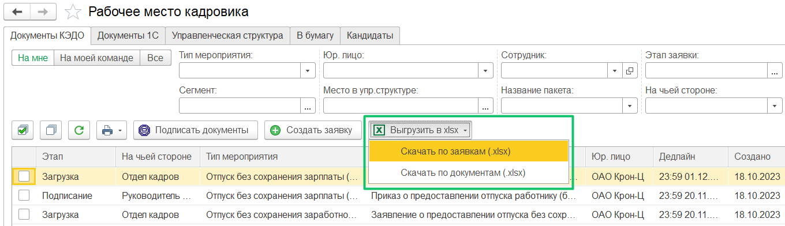

Список заявок можно скачать в виде таблицы формата .xlsx в **КЭДО** → **Рабочее место кадровика**.

При выгрузке списка заявок доступны опции компоновки внутри таблицы:

* по заявкам — в одной строке данные по одной заявке;  
* по документам — в одной строке данные по одному документу из заявки, поэтому может быть несколько строк по одной заявке.

Все результаты выгружаются с учётом установленных фильтров.

