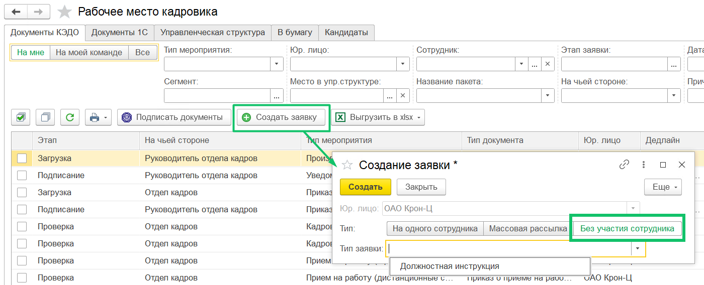
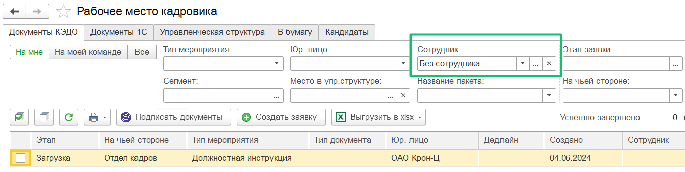

В **КЭДО** → **Рабочее место кадровика** представители компании могут создавать и просматривать заявки, в которых не требуется участия сотрудников. Это актуально для документов, которые должны быть подписаны только со стороны компании, например, ЛНА, ПВТР и т.п.

Настройка бизнес-процесса без участия сотрудника является платной. Для подключения бизнес-процесса обратитесь к вашему менеджеру внедрения VK HR Tek.