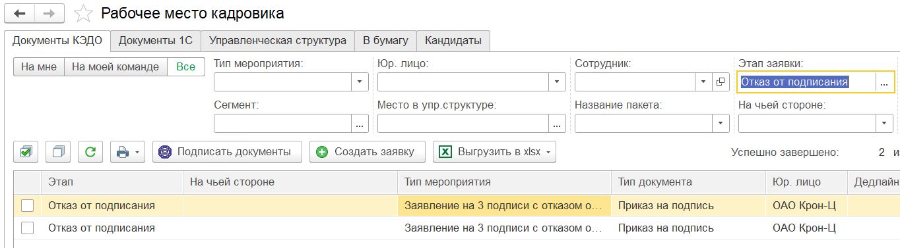
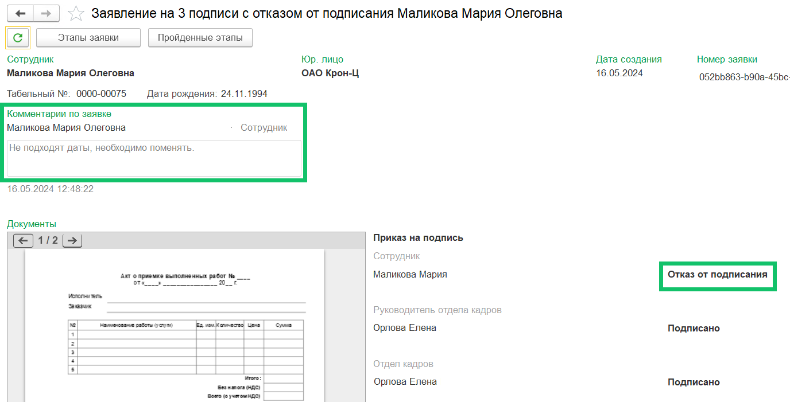

В форме просмотра заявки КЭДО может отображаться статус подписи «Отказ от подписания».

Этот статус предусмотрен для случаев, когда сотрудник может отказаться от подписания документа в заявке, если он ознакомился с документом, но по какой-то причине не согласен его подписывать.

В **Рабочем месте кадровика** выберите этап заявки «Отказ от подписания», чтобы отфильтровать заявки с данным этапом. 

Настройка отказа от подписания документа является платной функцией. Чтобы подключить функцию для конкретного типа заявки, необходимо прописать данную настройку в JSON-файле бизнес-процесса. Для подключения обратитесь к вашему менеджеру внедрения VK HR Tek.