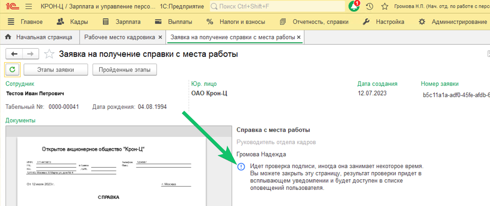
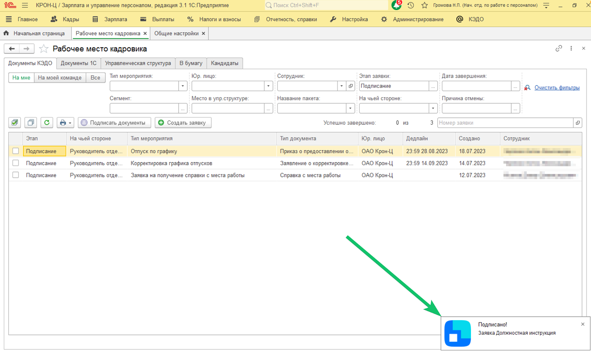
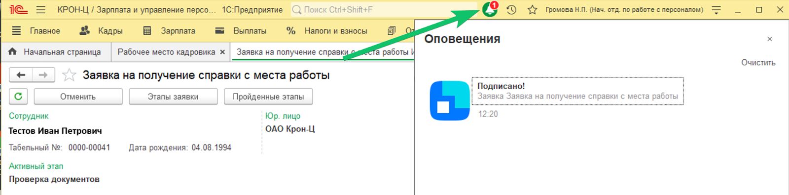

Для проверки сервис отправляет полученную подпись в УЦ, поэтому ожидание результата занимает некоторое время. До получения результата заявка не будет переходить на следующий этап. Уведомления о результате будут показаны в всплывающем окне, а также размещены в списке оповещений.

## **Подписание документов в заявках без СМС** 

В **КЭДО** → **Рабочее место кадровика** пользователи могут подписывать документы УНЭП Контур в заявках без подтверждения вторым фактором — без кода из СМС.

Настройка этой функции является платной. Чтобы подключить подписание без СМС для конкретного типа заявки, необходимо указать данную опцию в JSON-файле бизнес-процесса на этапе подписания. Для подключения обратитесь к вашему менеджеру внедрения VK HR Tek.