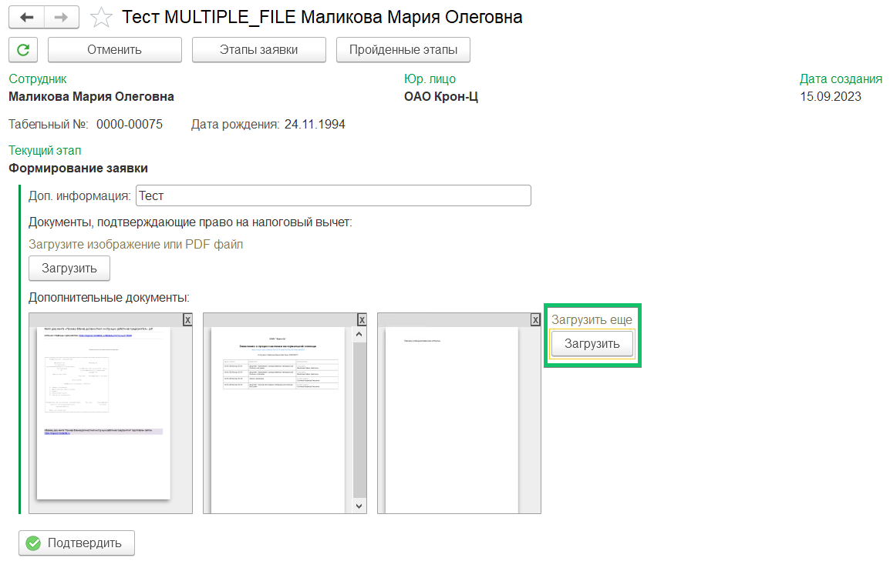
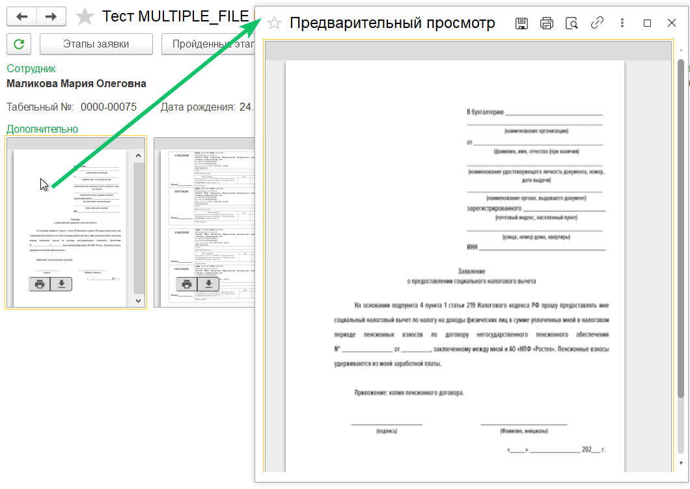

На этапе создания заявки (**Рабочее место кадровика** → кнопка **Создать заявку**), в форме заявки можно загружать несколько документов в одно поле. Вложенные файлы имеют компактное представление для предварительного просмотра, скачивания и печати. Мультифайловая загрузка документов предусмотрена не для всех мероприятий и заявок. 

Возможно перезапустить загрузку файлов в заявках со статусам *Завершено*, если предыдущая загрузка документов завершилась с ошибками (например, ошибки ответа от сервера КЭДО).

В форме заявки можно открывать вложенные файлы с компактным представлением в отдельном окне предпросмотра.

