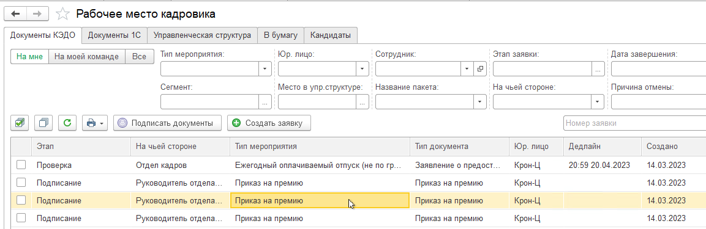
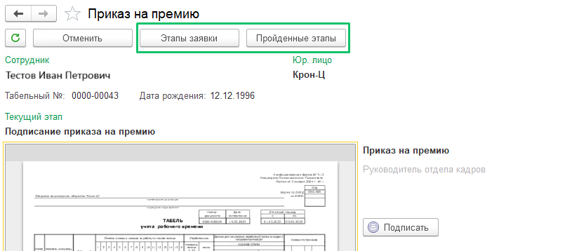
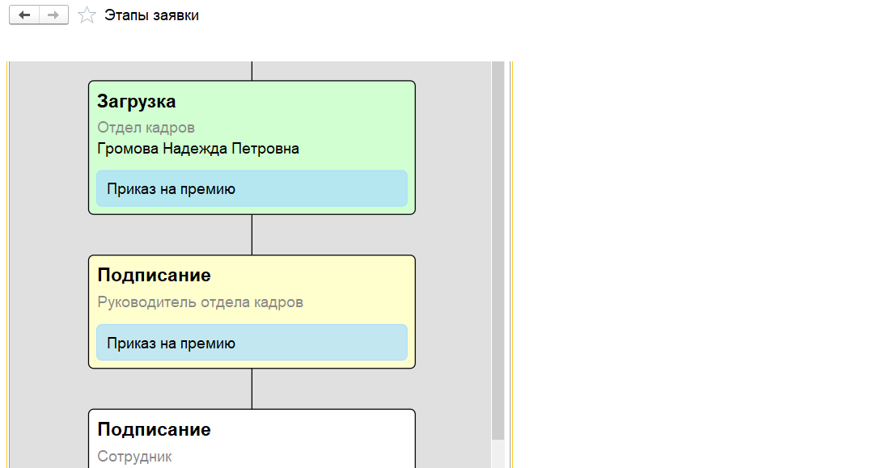
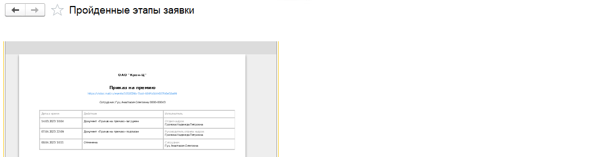
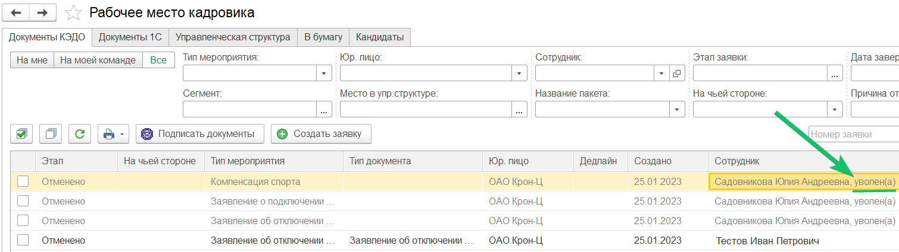
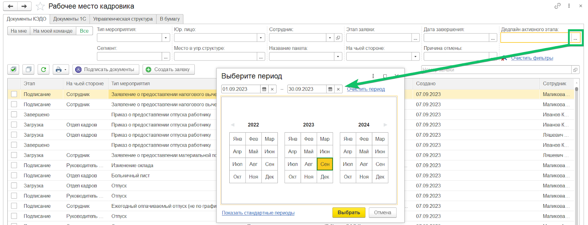

В разделе **КЭДО**  → **Рабочее место кадровика** перейдите на вкладку **Документы КЭДО** и выберите необходимую заявку из общего списка.

 

В форме просмотра заявки доступны кнопки **Этапы заявки** и **Пройденные этапы**, открывающие визуализацию бизнес-процесса заявки. 

 

Нажмите кнопку **Этапы заявки**, чтобы просмотреть этапы всего бизнес-процесса. Зелёными блоками выделены те этапы, которые уже пройдены участниками процесса. Бежевым выделен текущий этап заявки, который требует определённого действия от Пользователя, например, подписания. Белые блоки означают, что данные этапы заявки еще не пройдены. Красный блок означает, что заявка была отменена на данном этапе.

Ниже представлен пример этапов заявки бизнес-процесса **Приказ на премию**.

 

Чтобы получить отчёт с пройденными этапами по процессу, где выводится информация об исполнителях на пройденных этапах и времени прохождения этапа, нажмите кнопку **Пройденные этапы** в нужной заявке. Полученный отчет в табличном виде можно скачать или распечатать. 

 

В Рабочем месте кадровика (РМК) можно просматривать заявки по уволенным сотрудникам. В списке документов КЭДО и в форме просмотра заявки уволенным сотрудникам добавлена отметка **уволен(а)**.

 

Также заявки можно фильтровать по дате окончания дедлайна активного этапа в **КЭДО** → **Рабочее место кадровика**. Это позволит просмотреть список сотрудников, по которым есть риск автоматической отмены заявки.

