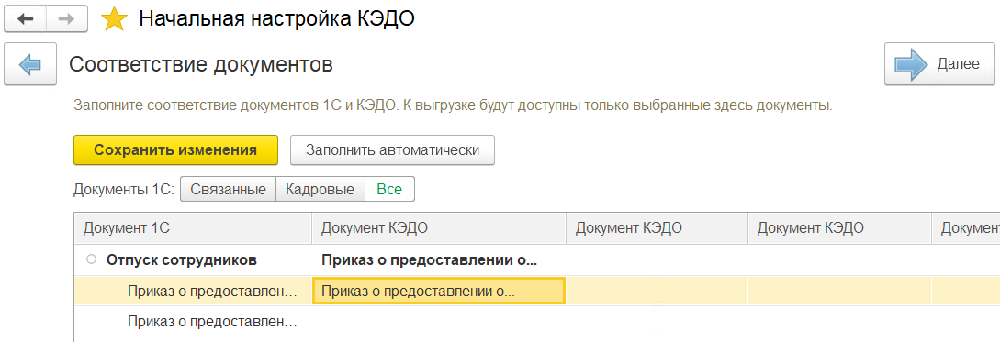
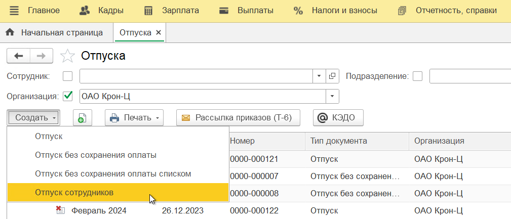
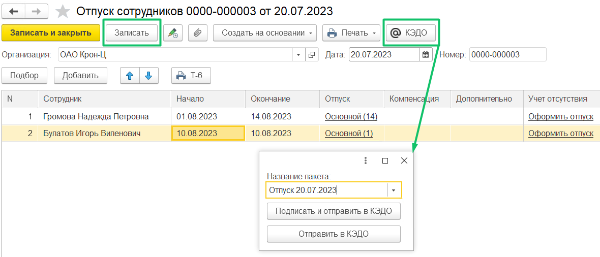

Пакетная рассылка позволяет отправлять отдельные приказы на отпуск разным сотрудникам в КЭДО из одного документа **Отпуск сотрудников**. Перед отправкой необходимо проверить соответствие документа КЭДО **Приказ о предоставлении отпуска работнику** для документа **Отпуск сотрудников** в **КЭДО** → **Начальная настройка** → **Соответствие документов**. 

 

Для рассылки пакета перейдите в **Кадры** → **Отпуска**, нажмите кнопку **Создать** → **Отпуск сотрудников**.

 

В заявку **Отпуск сотрудников** добавьте сотрудников, заполните даты и нажмите кнопку **Записать**. Далее нажмите кнопку **КЭДО**, укажите название пакета, подпишите и отправьте в КЭДО.

