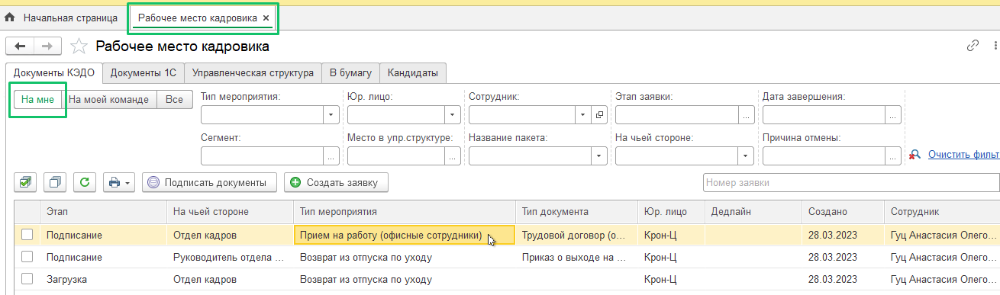
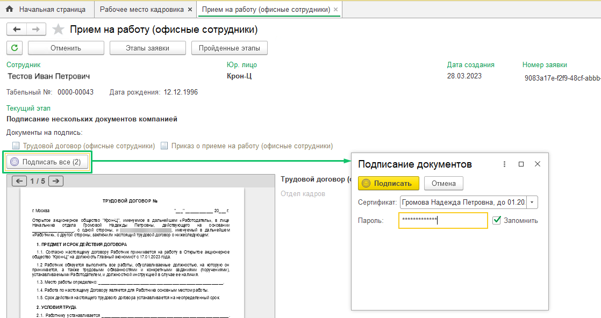
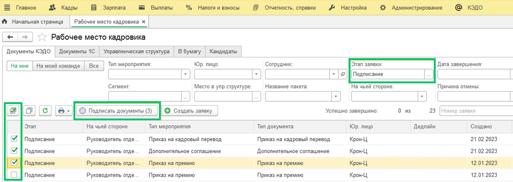
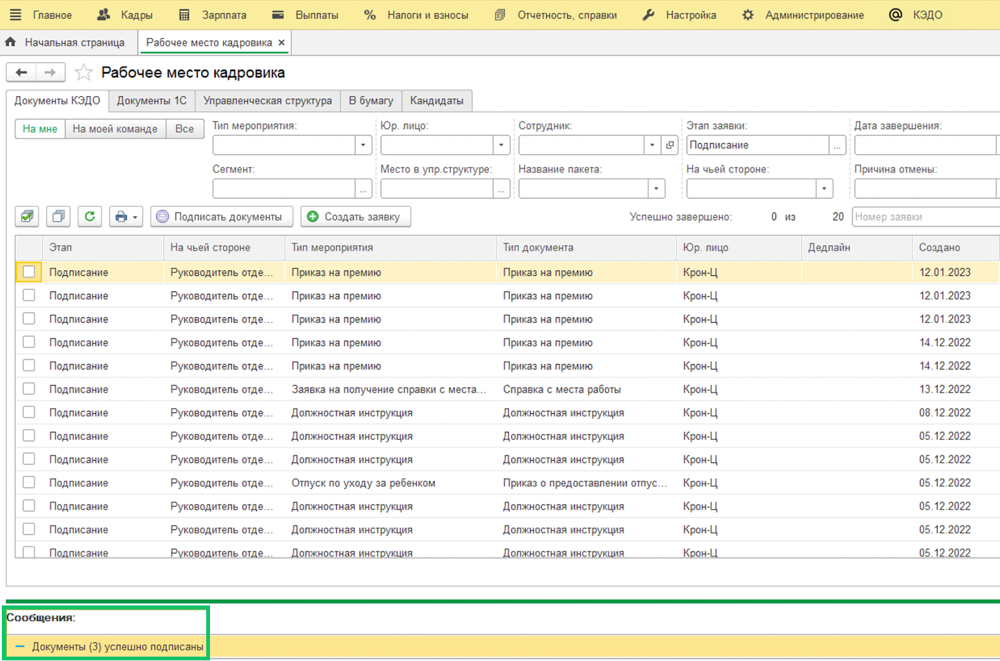

Массово подписать документы в заявке возможно в том случае, если в одной заявке прикреплено больше одного документа. Чтобы сотрудник Отдела кадров смог подписать документы в заявке, Администратор должен заранее добавить сертификат электронной подписи для данного сотрудника (см. статью [Добавление сертификата электронной подписи](/ru/1C/admin/initial_setup#dobavlenie_sertifikata_elektronnoy_podpisi)).

## **Массовое подписание документов в одной заявке**

В разделе **КЭДО** → **Рабочее место кадровика** на вкладке **На мне** дважды нажмите на строку с заявкой, которая находится на этапе **Подписание** (в столбце **Этап**).  

 

В открывшейся заявке нажмите кнопку **Подписать все**. В форме **Подписание документов** введите пароль к сертификату электронной подписи и нажмите кнопку **Подписать**.

## **Массовое подписание документов в нескольких заявках**

Для подписания документов в нескольких заявках одновременно перейдите в раздел **КЭДО** → **Рабочее место кадровика**.

Для удобства в общем списке заявок выберите в фильтре по этапу заявки значение **Подписание**.

Установите флажок напротив тех заявок, которые нужно подписать, и нажмите кнопку **Подписать документы**.

 

Подтвердите подписание выбранных документов. Для этого в форме **Подписание документов** введите пароль к сертификату электронной подписи и нажмите кнопку **Подписать**.

 

Дождитесь сообщения об успешном подписании под списком заявок.

