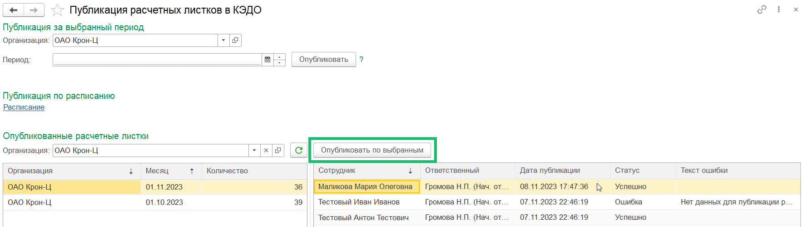

Раздел **Опубликованные расчетные листки** состоит из фильтра по организации и таблицы с информацией по месяцам и количеству опубликованных расчетных листков. Для просмотра сотрудников, которым отправлены расчетные листки, выделите строку с нужным месяцем в таблице. 

В таблице с подробной информацией по выбранному месяцу указаны:

1. Сотрудники, которым отправлены расчетные листки.
1. Ответственный за публикацию (тот, кто публиковал).
1. Дата публикации. Дата и время публикации расчетных листков, отправленных либо вручную, либо по расписанию. 
1. Статус публикации. Возможные статусы: *Успешно* или *Ошибка.*
1. Текст ошибки. В случае если получен статус *Ошибка*. 

Ошибка с текстом «Нет данных для публикации расчетных листков» появляется в случае, если для сотрудника в выбранном месяце не рассчитывалась / не выплачивалась заработная плата. Для расчета заработной платы специалист расчетного отдела создает начисление в разделе **Зарплата**. 

Чтобы запустить повторную отправку расчетного листка, выделите одного, нескольких (нажмите правую кнопку мыши и клавишу *Ctrl*) или всех сотрудников (выделите любую строку и нажмите *Ctrl+A*) и нажмите кнопку **Опубликовать по выбранным**.

