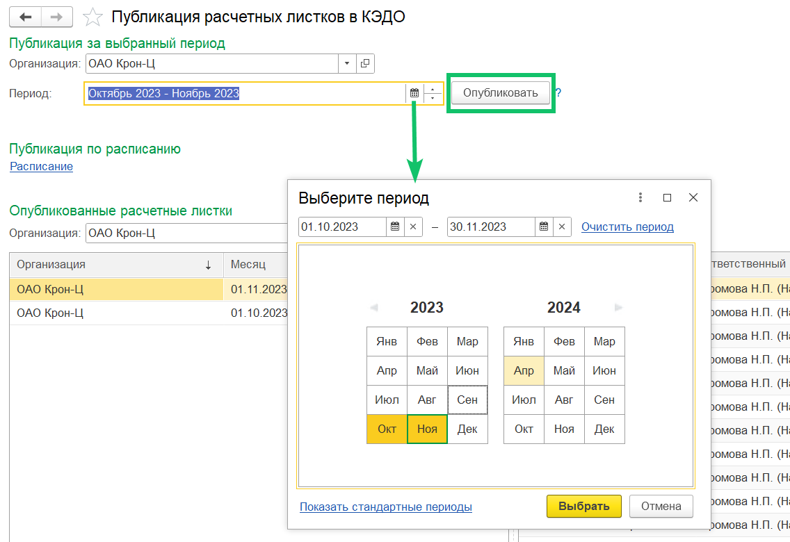
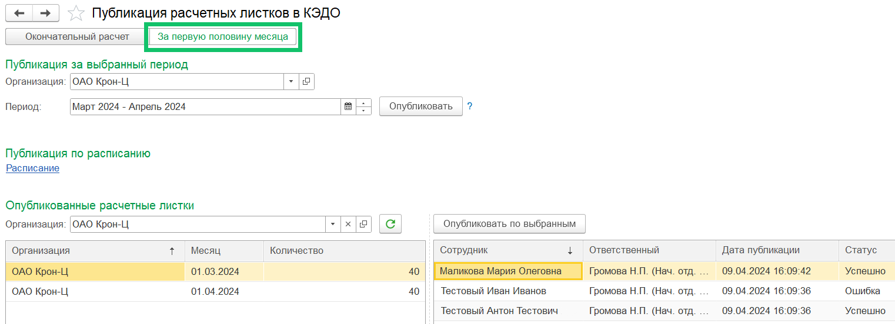

Чтобы сотрудники могли получать расчетные листки, кадровому сотруднику в 1С:ЗУП необходимо проверить, что сотрудники подключены к КЭДО в разделе **КЭДО *→* Подключение сотрудников**.

Для публикации расчетных листков по всем сотрудникам компании в **КЭДО *→* Публикация расчетных листков *→* Публикация за выбранный период**:

1. Выберите свою организацию из выпадающего списка.
1. Выберите период: месяц или несколько месяцев. Нажмите кнопку **Выбрать**.
1. Нажмите кнопку **Опубликовать**. Расчетные листки будут сформированы и отправлены в КЭДО за выбранный период по всем сотрудникам организации, а именно:  
- подключенным к КЭДО;
- работавшим в выбранном периоде;
- если сотрудник был подключен к КЭДО после публикации расчетного листка, то для него листок опубликован не будет.

Компании могут отправлять расчётные листки своим сотрудникам за первую половину месяца. 

