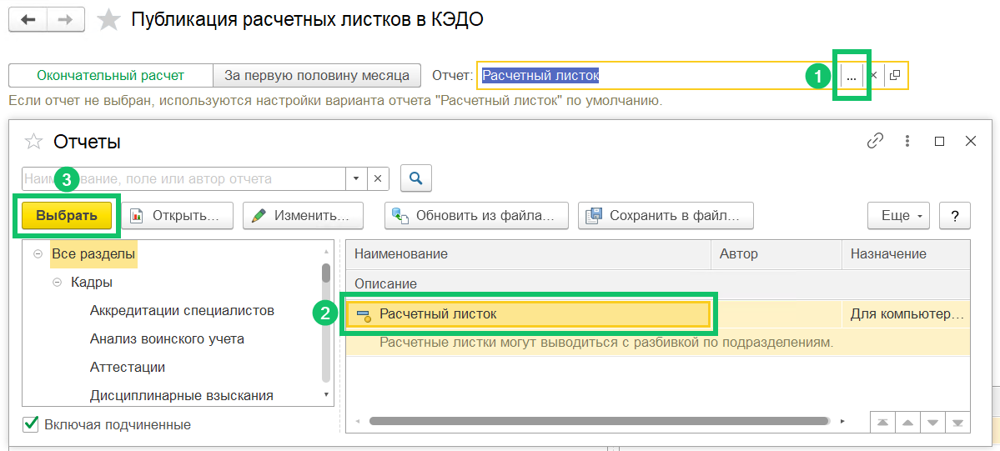
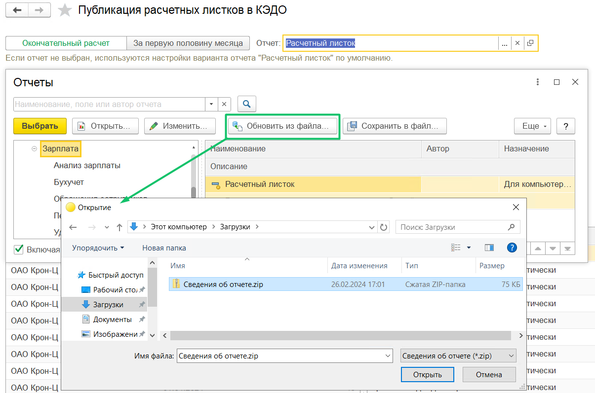

В разделе **КЭДО** → **Публикация расчетных листков** можно выбирать отчёт, если в компании есть своя форма расчётного листка, загруженная в программу. Если вариант отчёта не выбран, то по умолчанию используются настройки отчёта **Расчетный листок** или **Расчетный листок (за первую половину месяца)** в зависимости от типа выбранного периода.

1. В поле **Отчет** нажмите на , откроется форма с отчётами.   
2. Выберите и нажмите на название необходимой формы отчёта в блоке справа. В блоке слева перечислены папки, где расположены печатные формы отчётов.  
3. Нажмите кнопку **Выбрать** для сохранения выбранного отчёта. 

Чтобы обновить имеющиеся формы отчётов, нажмите кнопку **Обновить из файла…**.

Настройка отчётов расчётных листков является типовой, подробную информацию можно найти в инструкциях по работе в 1С.