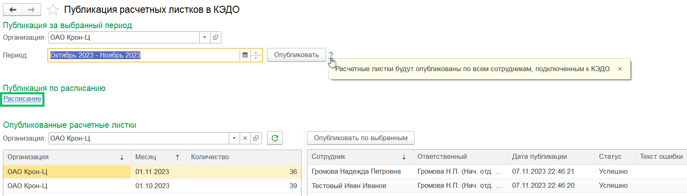
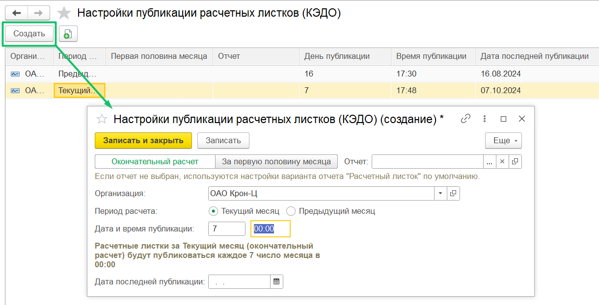

Для публикации расчетных листков по всем сотрудникам компании по расписанию в **КЭДО *→* Публикация расчетных листков *→* Публикация по расписанию**:

1. Нажмите кнопку **Расписание**.
1. В разделе **Настройки публикации расчетных листков** **(КЭДО)** нажмите кнопку **Создать.**
1. В форме **Настройки публикации расчетных листков** выберите тип расчета: *Окончательный расчет* или *За первую половину месяца*.
1. В форме **Настройки публикации расчетных листков** заполните поля:
- **Организация**. Выберите нужное название компании из списка. Для одной организации доступно создание не более 2-х расписаний. 
- **Период расчета**. Выберите один из вариантов: *Текущий месяц* или *Предыдущий месяц*.
- **Дата и время публикации**. Для даты укажите любое значение от 1 до 31. Для времени: значение от 00:00 до 23:59.
- **Дата последней публикации**. Оставьте поле пустым. После сохранения настройки это поле будет автоматически заполняться датой публикации, указанной в расписании.

Если в месяце отсутствует значение поля **Дата и время публикации** (например, нет 31 числа в месяце) — расписание запускается в последний день месяца.

4. Нажмите кнопку **Записать и закрыть**.

