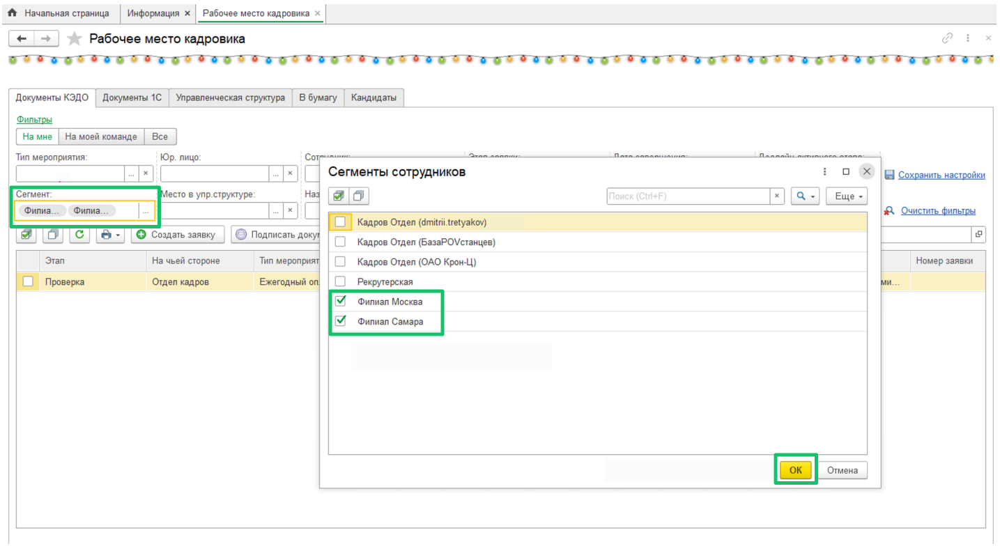
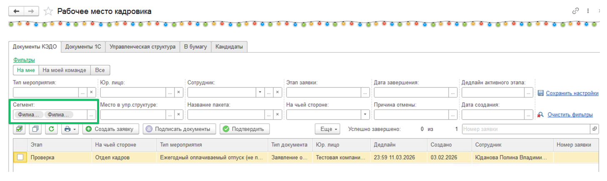

## **Работа с сотрудниками, распределёнными по сегментам**

После распределения сотрудников по сегментам (см. статью [Распределение сотрудников по сегментам](/ru/1C/user/employees/segment)) можно отфильтровать заявки по своему сегменту сотрудников (например, Филиал Москва и Филиал Самара). 

Чтобы отфильтровать заявки по сегментам сотрудников, выполните следующие действия:

1. Перейдите в раздел **КЭДО** → **Рабочее место кадровика**.

2. Нажмите на фильтр **Сегмент**, выберите в форме **Сегменты сотрудников** необходимые сегменты и для сохранения установленного фильтра нажмите кнопку **OK**.

В Рабочем месте кадровика все заявки будут отфильтрованы по выбранным сегментам, можно приступать к обработке заявок.

