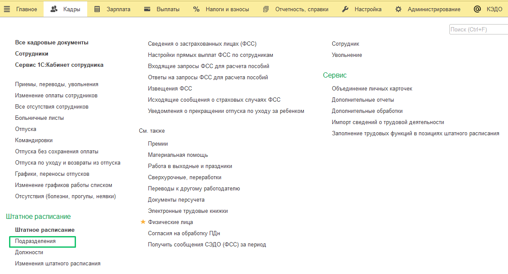
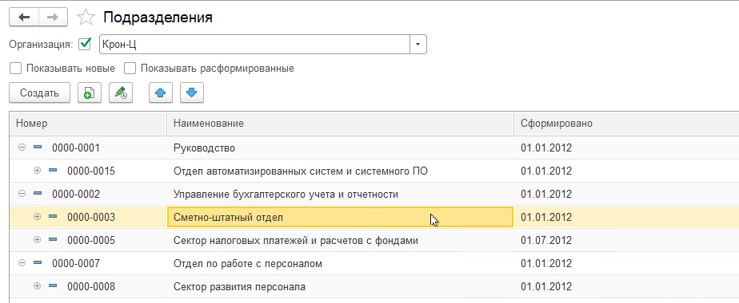
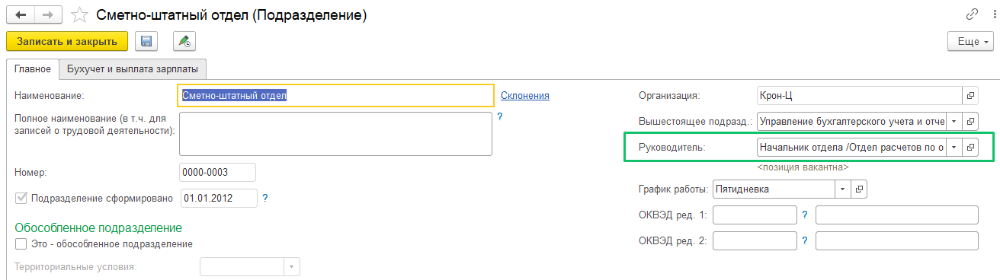
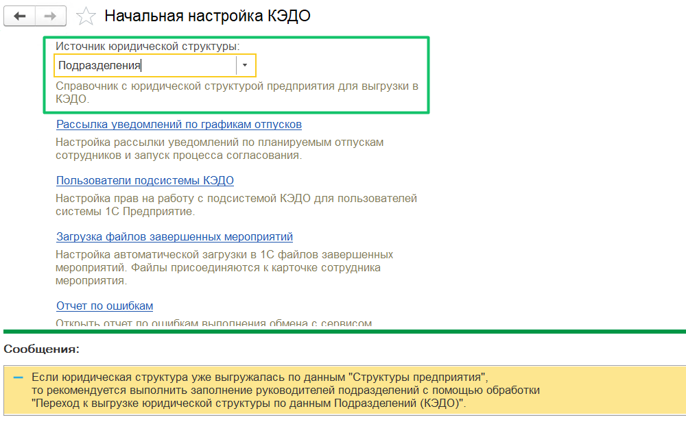
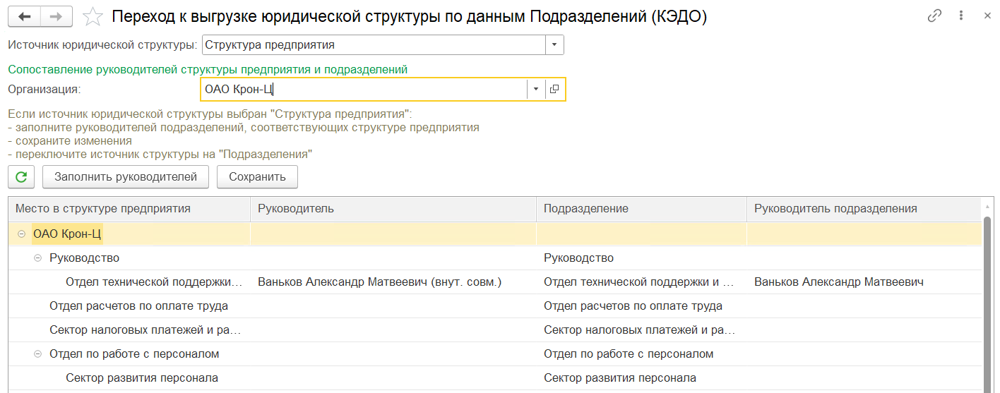
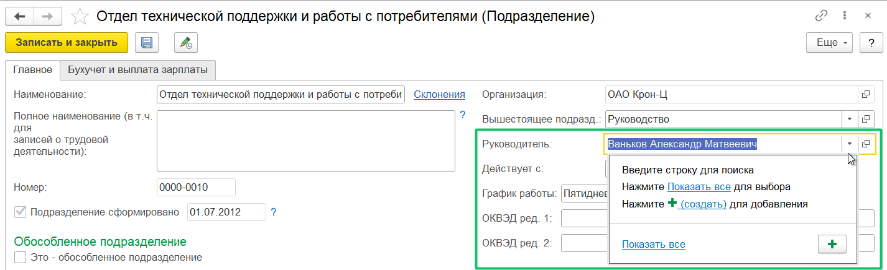

Юридическая структура 1С выгружается в КЭДО, только если в сервисе VK HR Tek, в разделе **Настройки компании**, в блоке **Работа с оргструктурами** включен импорт юридической структуры из 1С расширения. Администратор веб-сервиса настраивает импорт из 1С.

При экспорте юридической оргструктуры из 1С в КЭДО есть условие о запрете выгружать расформированные подразделения. Юридическая оргструктура компании передаётся в КЭДО один раз в сутки по регламентному заданию.

После установки расширения в 1С:ЗУП в подразделениях появится поле **Руководитель**.

1. Откройте раздел **Кадры** → **Подразделения**.

2. Откройте любое подразделение. Для этого дважды нажмите на ячейку с наименованием подразделения.

3. В форме открытого подразделения, в поле **Руководитель** выберите позицию руководителя из списка.

<warn>

Если руководитель находится в подразделении как сотрудник, то его заявка уйдёт на согласование вышестоящему руководителю

</warn>

Юридическая оргструктура выгружается в КЭДО из справочника **Структура предприятия**, поэтому на стороне клиента нужно проверить, что штатное расписание и структура предприятия одинаковы.

Юридическая структура компании может выгружаться в КЭДО по данным справочника **Подразделения**. Если оргструктура уже выгружалась ранее по данным справочника **Структура предприятия**, то в **КЭДО** → **Начальная настройка** → **Настройки функциональности** установите **Источник юридической структуры** = **Подразделения**.

Для компаний, у которых оргструктура ранее выгружалась по структуре предприятия, добавлена обработка **Переход к выгрузке юридической структуры по данным Подразделений (КЭДО)**, которую можно найти в форме **Функции для технического специалиста**. Обработка помогает автоматически заполнить руководителей подразделений по данным из источника юридической структуры – **Структуры предприятия**.

Порядок действий на форме обработки:

1. Проверить, что выбран источник юридической структуры **Структура предприятия**.  
2. Выбрать организацию и дождаться заполнения дерева со структурой предприятия.  
3. Нажать кнопку **Заполнить руководителей** для заполнения таблицы руководителями подразделений, соответствующими элементам структуры предприятия. Будут заполнены физические лица сотрудников, выбранных руководителями мест в структуре предприятия.  
4. Вручную можно изменить значения руководителей подразделений. Для этого напротив нужного подразделения дважды нажать на ФИО в столбце **Руководитель** и внести изменение.  
5. Сохранить изменения.  
6. Когда руководители заполнены, поменять источник юридической структуры на **Подразделения**.  
7. Далее можно менять руководителя в справочнике **Подразделения**. Для этого дважды нажать на название подразделения и выбрать руководителя из списка сотрудников.

