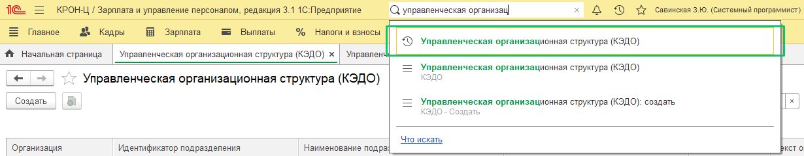
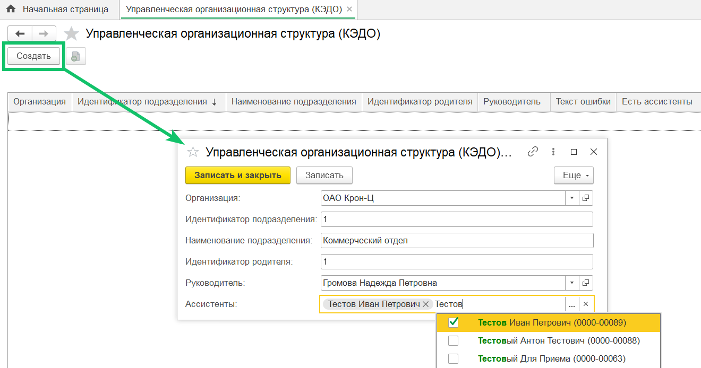
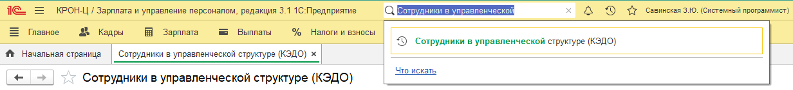
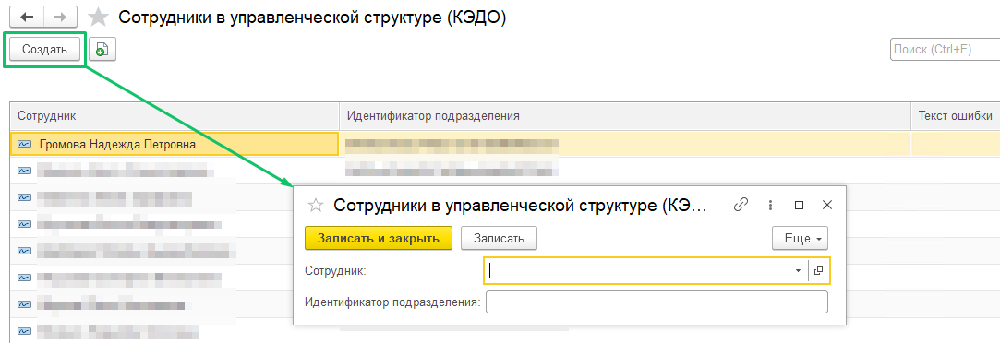
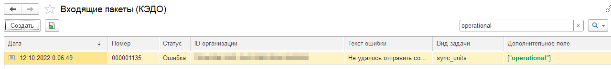
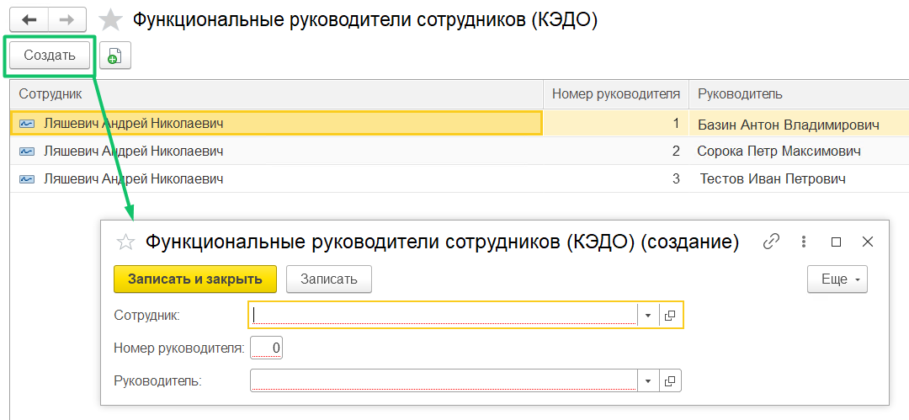

Если оргструктура из штатного расписания не подходит для настройки маршрута согласований, то рекомендуем выгрузить в КЭДО управленческую оргструктуру из 1С. Для этого необходимо заполнить два регистра сведений:

* Управленческая организационная структура (КЭДО);  
* Сотрудники в управленческой структуре (КЭДО).

По необходимости можно заполнить регистр **Функциональные руководители сотрудников (КЭДО)**, который позволит поддерживать наличие у сотрудника нескольких функциональных руководителей. Сотруднику можно добавить от 1 до 20 функциональных руководителей, каждому руководителю будет добавлен номер от 1 до 20. Функциональных руководителей дополнительно можно прописать в бизнес-процессе — это платная донастройка, обратитесь к менеджеру внедрения VK HR Tek.

## **Регистр сведений «Управленческая организационная структура (КЭДО)»**

В расширении реализован регистр сведений **Управленческая организационная структура (КЭДО)** для заполнения данных управленческой структуры предприятия, которая хранится в сторонней системе. Регистр имеет структуру, описанную в таблице **Структура регистра Управленческая организационная структура (КЭДО)**.

Таблица — Структура регистра **Управленческая организационная структура (КЭДО)**

| Наименование | Тип | Комментарий |
| :---- | :---- | :---- |
| **Измерения** |  |  |
| Организация | СправочникСсылка.Организации | Организация, по которой заполнена управленческая структура |
| Идентификатор подразделения | Строка(36) | Идентификатор подразделения в управленческой структуре |
| **Ресурсы** |  |  |
| Наименование подразделения | Строка(150) | Название подразделения |
| Идентификатор родителя | Строка(36) | Идентификатор родительского подразделения в управленческой структуре |
| Руководитель | СправочникСсылка.Сотрудники | Ссылка в 1С на руководителя подразделения управленческой структуры |
| Ассистенты | ХранилищеЗначения с массивом элементов  СправочникСсылка.Сотрудники | Массив ассистентов подразделения |

Администратор в компании самостоятельно заполняет регистр, если в КЭДО включена настройка **Импорт из регистров 1С расширения КЭДО**. Данные регистра передаются в КЭДО автоматически. 

Перейдите в раздел **Управленческая организационная структура (КЭДО)**. Для этого найдите в строке поиска **Управленческая организационная структура (КЭДО)**.

В разделе **Управленческая организационная структура (КЭДО)** нажмите кнопку **Создать**. В форме **Управленческая организационная структура (КЭДО) (создание)** заполните обязательные поля (описаны в таблице **Структура регистра Управленческая организационная структура (КЭДО)**) и нажмите кнопку **Записать и закрыть**.

Поле **Ассистенты** является необязательным для заполнения.

## **Регистр сведений «Сотрудники в управленческой структуре (КЭДО)»**

В расширении реализован регистр сведений **Сотрудники в управленческой структуре (КЭДО)** для заполнения связей сотрудников с подразделениями управленческой структуры предприятия, которая хранится в сторонней системе. Регистр имеет структуру, описанную в таблице **Структура регистра Сотрудники в управленческой структуре (КЭДО)**.

Таблица – Структура регистра **Сотрудники в управленческой структуре (КЭДО)**

| Наименование | Тип | Комментарий |
| :---- | :---- | :---- |
| **Измерения** |  |  |
| Сотрудник | СправочникСсылка.Сотрудники | Сотрудник из 1С |
| **Ресурсы** |  |  |
| Идентификатор подразделения | Строка(36) | Идентификатор подразделения из регистра «Управленческая организационная структура (КЭДО)». Подразделение, к которому относится сотрудник |

Администратор 1С в компании самостоятельно заполняет регистр, если в КЭДО включена настройка **Импорт из регистров 1С расширения КЭДО**. Данные регистра передаются в КЭДО автоматически.

Необходимо убедиться, что после заполнения управленческой структуры на формах регистров отсутствуют ошибки, см. столбец **Текст ошибки** в разделе **Сотрудники в управленческой структуре (КЭДО)**.

Перейдите в раздел **Сотрудники в управленческой структуре (КЭДО)**. Для этого найдите в строке поиска **Сотрудники в управленческой структуре (КЭДО)**.  

В разделе **Сотрудники в управленческой структуре (КЭДО)** нажмите кнопку **Создать**. В форме **Сотрудники в управленческой структуре (КЭДО) (создание)** заполните все поля (описаны в таблице **Структура регистра Сотрудники в управленческой структуре (КЭДО)**) и нажмите кнопку **Записать и закрыть**.

Оргструктура в КЭДО выгружается ночью, и на следующий день после заполнения клиенту нужно проверить, что в разделе **Входящие пакеты (КЭДО)** (см. статью [Входящие и исходящие пакеты данных](/ru/1C/user/packages)) отсутствуют ошибки у пакетов с типом **sync_units["operational"]**.

Если ошибок нет и пакет обработан успешно, то оргструктура выгрузилась в КЭДО. Если есть ошибки, то нужно проверить правильность заполнения регистров.

## **Регистр сведений «Функциональные руководители сотрудников (КЭДО)»**

В расширении реализован регистр сведений **Функциональные руководители сотрудников (КЭДО)** для заполнения нескольких руководителей для сотрудников. Регистр имеет структуру, описанную в таблице **Структура регистра Функциональные руководители сотрудников (КЭДО)**.

Таблица — Структура регистра **Функциональные руководители сотрудников (КЭДО)**

| Наименование | Тип | Комментарий |
| :---- | :---- | :---- |
| **Измерения** |  |  |
| Сотрудник | СправочникСсылка.Сотрудники | Ссылка в 1С на сотрудника |
| Номер руководителя | Число(2) | Номер руководителя от 1 до 20 |
| **Ресурсы**   |  |  |
| Руководитель | СправочникСсылка.Сотрудники | Ссылка в 1С на руководителя |

Администратор 1С в компании самостоятельно заполняет регистр. Данные регистра передаются в КЭДО автоматически вместе с пакетом данных по сотруднику. В КЭДО передаются данные только подключенных и работающих руководителей. 

В **КЭДО** → **Функциональные руководители сотрудников (КЭДО)** нажмите кнопку **Создать**. В форме **Функциональные руководители сотрудников (КЭДО) (создание)** заполните все поля (описаны в таблице **Структура регистра Функциональные руководители сотрудников (КЭДО)**) и нажмите кнопку **Записать** или **Записать и закрыть**.

В расширении и сервисе VK HR Tek информация о функциональных руководителях сотрудников обновляется один раз в сутки. Также в 1С, в разделе **Функциональные руководители сотрудников (КЭДО)** можно обновить список — нажмите кнопку **Еще** → **Обновить**.

