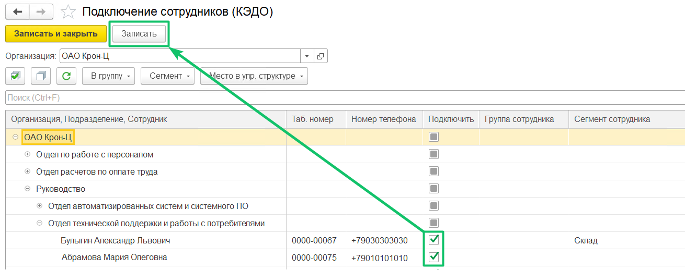

**Руководитель подразделения** — обязательное поле при создании подразделения управленческой структуры в сервисе VK HR Tek. Структура создается и хранится в КЭДО, поэтому в ней можно указать только подключенных к КЭДО и неуволенных сотрудников.

Для подключения руководителей перейдите в 1С, в раздел **КЭДО → Подключение сотрудников**. Выберите свою организацию, установите флажок в столбце **Подключить** напротив руководителей и нажмите на кнопку **Записать**:

Подробнее о подключении сотрудников в 1С описано в [статье «Подключение сотрудников компании к КЭДО»](/ru/1C/user/employees/connect). 