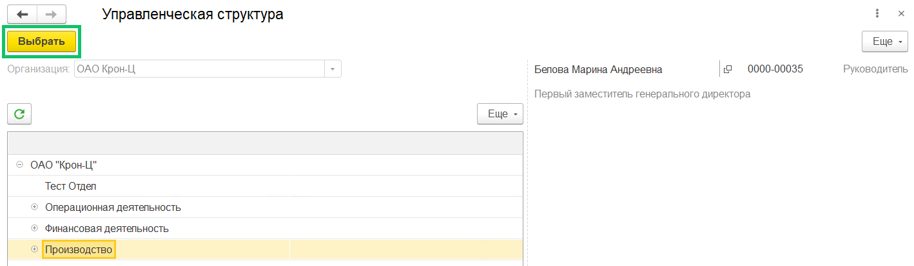

Для распределения сотрудников в управленческой структуре:

1. Перейдите в 1С, в раздел **КЭДО → Подключение сотрудников**. Выберите свою организацию.
1. Выделите необходимого сотрудника или подразделение.
1. Нажмите на кнопку **Место в упр. структуре → Заполнить**.

4. В форме **Управленческая структура** выделите нужное подразделение и нажмите на кнопку **Выбрать**.

5. Нажмите **Записать**, когда заполните места в упр. структуре для всех сотрудников.

Подробнее о распределении сотрудников описано в [статье «Управленческая оргструктура (web-интерфейс HR Tek)»](/ru/1C/organizational_structure/web_management).