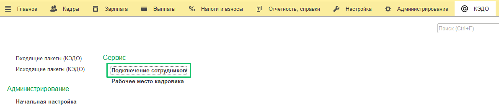
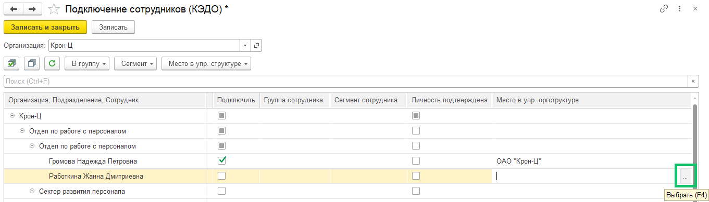
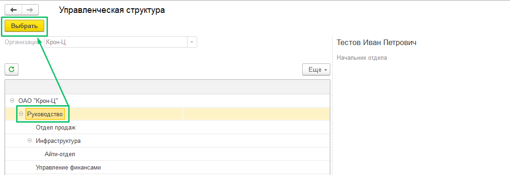
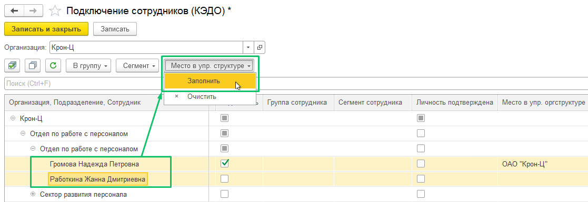
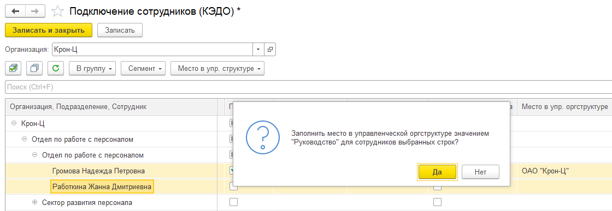

Если варианты с выгрузкой юридической или управленческой структуры из 1С (см. статью [Юридическая оргструктура из 1С (справочник «Структура предприятия»)](/ru/1C/organizational_structure/legal) и статью [Управленческая оргструктура из 1С](/ru/1C/organizational_structure/management)) не могут быть использованы, то рекомендуется ручное создание оргструктуры в web-интерфейсе VK HR Tek. 

Сотрудник с ролью **Администратор** может создать оргструктуру в web-интерфейсе VK HR Tek кабинета компании, в разделе **Компания**.

После создания дерева оргструктуры в разделе **Компания** перейдите к распределению сотрудников по созданным подразделениям в 1С:ЗУП: 

1. Перейдите в раздел **КЭДО** → **Подключение сотрудников**.

 

2. В форме **Подключение сотрудников (КЭДО)** должен появиться столбец **Место в упр. оргструктуре**. 

Чтобы отдельно распределить каждого сотрудника по подразделениям, дважды нажмите на необходимую ячейку в столбце **Место в упр. оргструктуре**.

3.  В форме **Управленческая структура** выберите соответствующее подразделение и нажмите кнопку **Выбрать**.

Для проставления подразделения сразу нескольким сотрудникам: 

1. Выделите нужных сотрудников с помощью клавиши **control (Ctrl)** и нажмите кнопку **Место в упр. структуре** → **Заполнить**.

2. В форме **Управленческая структура** выберите в какое подразделение записать выбранных сотрудников. Выделите наименование подразделения и нажмите кнопку **Выбрать**.

3. Подтвердите распределение для выбранных сотрудников — нажмите кнопку **Да**.

 

4. Повторите вышеперечисленные действия с остальными сотрудниками, пока они не будут распределены по подразделениям.

5. Чтобы сохранить изменения, нажмите кнопку **Записать и закрыть** или **Записать**.  
