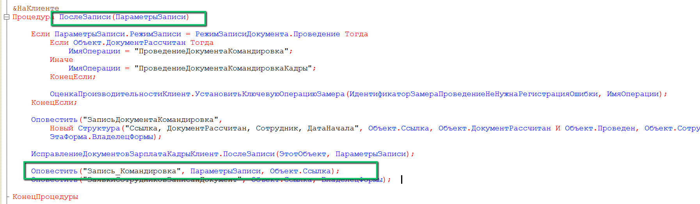

У печатных форм, которые могут быть отправлены в КЭДО, есть некоторые ограничения. 

**1.** Для стандартных и внешних печатных форм, которые преобразуются в pdf: 
- доступен только серверный вызов;
- печатная форма возвращает табличный документ;
- должна отображаться в командах печати выбранного документа;
- внешние печатные формы списочных документов пока не обрабатываются.

Пример печатной формы, которая преобразуется в pdf — [Лист ознакомления с ЛНА ](https://cloud.mail.ru/public/ggMk/7hAwN2QGT/%D0%9B%D0%B8%D1%81%D1%82%20%D0%BE%D0%B7%D0%BD%D0%B0%D0%BA%D0%BE%D0%BC%D0%BB%D0%B5%D0%BD%D0%B8%D1%8F%20%D1%81%20%D0%9B%D0%9D%D0%90%20(1).epf).

**2.** Для стандартных и внешних печатных форм, которые преобразуются в docx:
- форма возвращается в таблице в поле «Офисные документы».

Для этого необходимо вызвать ```УправлениеПечатью.СформироватьПечатныеФормы``` и получить сформированные печатные формы. 

Далее нужно проверить колллекцию ```ПечатныеФормы.КоллекцияПечатныхФорм[0].ОфисныеДокументы```, и если в этой коллекции есть сформированный документ Word, то забрать его. 

Иначе считаем, что в 1C была прислана обычная печатная форма, которая преобразуется в pdf.

В данном случае разница заключается в получении строки Base64 для передачи на бэкенд. Документы Word и pdf по-разному сохраняются в 1С. Поэтому важно знать, где расположены печатные формы разных форматов.   

<warn>
КЭДО принимает только формат docx.
</warn>

При формировании печатных форм в docx, подписание при отправке работать не будет. Печатная форма будет только отправляться в КЭДО, а подписание пройдет уже в заявке. Это связано с тем, что docx сначала конвертируется в pdf, а подписать можно документы только в формате pdf.

**3.** Для конструктора печатных форм: 
- доступен вызов клиентского метода;
- доступно открытие формы конструктора;
- при закрытии форма возвращает структуру по примеру:
```
Закрыть(Новый Структура("ЭтоДокументWord, ДвоичныеДанные", ЭтоДокументWord, ДвоичныеДанные);
```
где:

```ЭтоДокументWord``` (Булево) — признак, является ли печатная форма документом Word;

```ДвоичныеДанные``` (ДвоичныеДанные) — двоичные данные табличного документа или документа Word;

- форма должна отображаться в командах печати выбранного документа; 
- форма подключена как внешняя печатная форма документа;
- внешние печатные формы списочных документов пока не обрабатываются.

[Шаблон внешней обработки с конструктором ](https://cloud.mail.ru/public/ggMk/7hAwN2QGT/%D0%A8%D0%B0%D0%B1%D0%BB%D0%BE%D0%BD%20%D0%B2%D0%BD%D0%B5%D1%88%D0%BD%D0%B5%D0%B9%20%D0%BE%D0%B1%D1%80%D0%B0%D0%B1%D0%BE%D1%82%D0%BA%D0%B8%20%D1%81%20%D0%BA%D0%BE%D0%BD%D1%81%D1%82%D1%80%D1%83%D0%BA%D1%82%D0%BE%D1%80%D0%BE%D0%BC%20(1).epf).

<warn>

В расширении КЭДО 1С можно работать только с одной печатной формой, которая генерируется через конструктор печатных форм при отправке в заявку. 

При необходимости вы можете самостоятельно скорректировать расширение 1С или сами печатные формы.

</warn>

## Требования к кастомным документам

Чтобы кастомный документ работал с КЭДО, необходимо в форме этого документа добавить код процедур ```ПослеЗаписи()``` и ```Оповестить()``` с событием "Запись_ИмяДокумента". Пример:



Процедуры ```ПослеЗаписи()``` и ```Оповестить()``` должны присутствовать в форме кастомного документа, если он будет создаваться по кнопке «Создать документ» из заявки в Рабочем месте кадровика. Иначе система не узнает, что документ записался, и не сможет связать его с заявкой КЭДО и отправить его печатные формы в КЭДО.