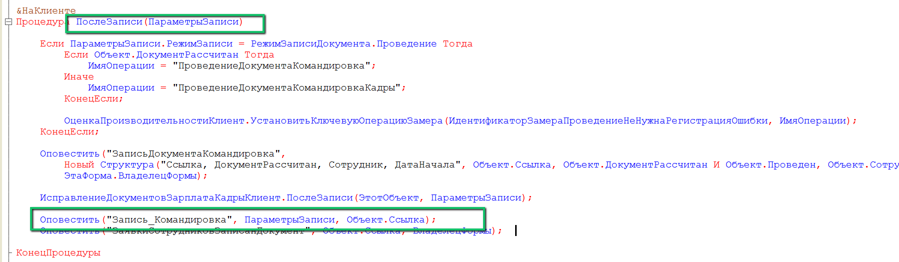

<info>

У печатных форм, которые могут быть отправлены в КЭДО, есть некоторые ограничения. Для корректной работы печатных форм рекомендуем соблюдать требования, перечисленные в этой статье

</info>

**1.** Для стандартных и внешних печатных форм, которые преобразуются в pdf: 
- доступен только серверный вызов;
- печатная форма возвращает табличный документ;
- должна отображаться в командах печати выбранного документа;
- внешние печатные формы списочных документов пока не обрабатываются.

Пример печатной формы, которая преобразуется в pdf — [Лист ознакомления с ЛНА](https://cloud.mail.ru/public/2NKM/wZarRZzJK/1.%20%D0%A0%D0%B0%D1%81%D1%88%D0%B8%D1%80%D0%B5%D0%BD%D0%B8%D0%B5%201%D0%A1%20%2B%20%D0%B8%D0%BD%D1%81%D1%82%D1%80%D1%83%D0%BA%D1%86%D0%B8%D1%8F%20%D0%BF%D0%BE%20%D1%83%D1%81%D1%82%D0%B0%D0%BD%D0%BE%D0%B2%D0%BA%D0%B5/%D0%9F%D1%80%D0%B8%D0%BC%D0%B5%D1%80%20%D0%BF%D0%B5%D1%87%D0%B0%D1%82%D0%BD%D1%8B%D1%85%20%D1%84%D0%BE%D1%80%D0%BC/%D0%9B%D0%B8%D1%81%D1%82%20%D0%BE%D0%B7%D0%BD%D0%B0%D0%BA%D0%BE%D0%BC%D0%BB%D0%B5%D0%BD%D0%B8%D1%8F%20%D1%81%20%D0%9B%D0%9D%D0%90%20(1).epf).

**2.** Для стандартных и внешних печатных форм, которые преобразуются в docx:
- форма возвращается в таблице в поле «Офисные документы».

Для этого необходимо вызвать ```УправлениеПечатью.СформироватьПечатныеФормы``` и получить сформированные печатные формы. 

Далее нужно проверить колллекцию ```ПечатныеФормы.КоллекцияПечатныхФорм[0].ОфисныеДокументы```, и если в этой коллекции есть сформированный документ Word, то забрать его. 

Иначе считаем, что в 1C была прислана обычная печатная форма, которая преобразуется в pdf.

В данном случае разница заключается в получении строки Base64 для передачи на бэкенд. Документы Word и pdf по-разному сохраняются в 1С. Поэтому важно знать, где расположены печатные формы разных форматов.   

<warn>
КЭДО принимает только формат docx
</warn>

При формировании печатных форм в docx, подписание при отправке работать не будет. Печатная форма будет только отправляться в КЭДО, а подписание пройдет уже в заявке. Это связано с тем, что docx сначала конвертируется в pdf, а подписать можно документы только в формате pdf.

**3.** Для конструктора печатных форм: 
- тип команды печати должен быть `ВызовКлиентскогоМетода` или `ОткрытиеФормы` (см. `ДополнительныеОтчетыИОбработки.СведенияОВнешнейОбработке` поле `Использование`);
- доступно открытие формы конструктора;
- при закрытии форма возвращает структуру по примеру:
```
Закрыть(Новый Структура("ЭтоДокументWord, ДвоичныеДанные", ЭтоДокументWord, ДвоичныеДанные);
```
где:

```ЭтоДокументWord``` (Булево) — признак, является ли печатная форма документом Word;

```ДвоичныеДанные``` (ДвоичныеДанные) — двоичные данные табличного документа или документа Word;

- форма должна отображаться в командах печати выбранного документа; 
- форма подключена как внешняя печатная форма документа;
- внешние печатные формы списочных документов пока не обрабатываются.

[Шаблон внешней обработки с конструктором](https://cloud.mail.ru/public/2NKM/wZarRZzJK/1.%20%D0%A0%D0%B0%D1%81%D1%88%D0%B8%D1%80%D0%B5%D0%BD%D0%B8%D0%B5%201%D0%A1%20%2B%20%D0%B8%D0%BD%D1%81%D1%82%D1%80%D1%83%D0%BA%D1%86%D0%B8%D1%8F%20%D0%BF%D0%BE%20%D1%83%D1%81%D1%82%D0%B0%D0%BD%D0%BE%D0%B2%D0%BA%D0%B5/%D0%9F%D1%80%D0%B8%D0%BC%D0%B5%D1%80%20%D0%BF%D0%B5%D1%87%D0%B0%D1%82%D0%BD%D1%8B%D1%85%20%D1%84%D0%BE%D1%80%D0%BC/%D0%A8%D0%B0%D0%B1%D0%BB%D0%BE%D0%BD%20%D0%B2%D0%BD%D0%B5%D1%88%D0%BD%D0%B5%D0%B9%20%D0%BE%D0%B1%D1%80%D0%B0%D0%B1%D0%BE%D1%82%D0%BA%D0%B8%20%D1%81%20%D0%BA%D0%BE%D0%BD%D1%81%D1%82%D1%80%D1%83%D0%BA%D1%82%D0%BE%D1%80%D0%BE%D0%BC%20(1).epf).

<info>

В расширении КЭДО 1С можно работать более чем с одной печатной формой, которая генерируется через конструктор печатных форм при отправке в заявку. Т.е. при отправке документа из 1С в КЭДО можно отправлять печатные формы из нескольких конструкторов печатных форм. 

Под конструкторами подразумеваются печатные формы, которые открывают форму настроек печатной формы. При закрытии формы настроек возвращаются двоичные данные печатной формы в структуре, которую ожидает КЭДО. 

При необходимости вы можете самостоятельно скорректировать расширение 1С или сами печатные формы.

</info>

## Требования к кастомным документам

Чтобы кастомный документ работал с КЭДО, необходимо в форме этого документа добавить код процедур ```ПослеЗаписи()``` и ```Оповестить()``` с событием "Запись_ИмяДокумента". Пример:



Процедуры ```ПослеЗаписи()``` и ```Оповестить()``` должны присутствовать в форме кастомного документа, если он будет создаваться по кнопке «Создать документ» из заявки в Рабочем месте кадровика. Иначе система не узнает, что документ записался, и не сможет связать его с заявкой КЭДО и отправить его печатные формы в КЭДО.

## «Распил» документов
Информация предназначена для **Специалиста 1С** со стороны клиента.

Для работы с дополнительными списочными документами на вашей стороне необходимо редактировать обработку, которая формирует и обрабатывает отправку печатной формы в КЭДО, то есть по аналогии с типовыми печатными формами, которые 1С умеет «распиливать», например, «Кадровый перевод списком».

Для этого требуется в коде обработки скорректировать печатную форму. Рекомендуем смотреть в коде, начиная с фрагмента `vkd_ОбработкаДанныхСервер.ПечатныеФормыСписочныхДокументовПоСотрудникам`, или с иных функций/процедур, перечисленных в описании «распила» ниже.  

На стороне КЭДО должна быть добавлена только массовая рассылка в бизнес-процесс, заявки по которому хотите отправлять сотрудникам.

Как работает «распил» внутренней печатной формы:

1. Функция **ПечатныеФормыСписочныхДокументовПоСотрудникам**

Эта функция вызывается не напрямую из интерфейса, а как фоновая многопоточная задача из `vkd_КомандыКЭДОСервер`. Функция делит сотрудников на порции и каждую порцию отправляет в `vkd_ОбработкаДанныхСервер.ПечатныеФормыСписочныхДокументовПоСотрудникам`.

Основная функция: цикл по сотрудникам и их командам.

Что делает функция:
-	для каждого сотрудника ищет его строки в `КомандыПечатиПоСпискуСотрудников`;
-	для каждой строки вызывает фабрику формы `ПечатнаяФормаДокументаИзКомандыПечати(...)`;
-	если форма получена — конвертирует в PDF (binary) и располагает в `СтруктураКоманды.ПечатнаяФормаДвоичныеДанные`;
-	возвращает только успешные команды.

Если печатная форма не получена — пишет ошибку в сообщения пользователя и журнал регистрации и продолжает цикл дальше (не «валит» всю порцию сотрудников).

2. Функция **ПечатнаяФормаДокументаИзКомандыПечати**

Функция определяет, каким способом получить печатную форму для конкретного типа документа.


<u>**Ветка A.**</u> Если требуется печатная форма для списочных документов «Кадровый перевод списком», «Премия» и т.п., то выполняется: 
```1c
Процедура СформироватьПечатнуюФормуСВыборомВариантаФормирования(...)
```

Если печатная форма формируется с помощью отчёта СКД, то вызывается типовой отчёт, в который передается дополнительный отбор по сотруднику.

Проверка осуществляется через функцию `ЭтаПечатнаяФормаДокументаФормируетсяОтчетомСКД(...)` (набор ID печатных форм Т1а/Т5а/Т6а/Т8а/Т11 и др.).

Далее:
-	строится отбор по сотруднику через `ПараметрыОтбораПриФормированииПечатнойФормы`;
-	задаются параметры конкретного отчета через процедуру `ЗаполнитьПараметрыПечати`;
-	выводится в коллекцию печатных форм;
-	берётся первый `ТабличныйДокумент`.

<br>

<u>**Ветка B.**</u> Если требуется печатная форма для других типов списочных документов, то создаётся временный документ под одного сотрудника, из этого документа извлекается печатная форма с помощью:

```1c
Процедура СформироватьПечатнуюФормуДокумента(...)
```

Важный внутренний механизм для «распила»:
```1c
Функция ПечатныеФормыСозданногоДокумента(...)
```

Алгоритм:
-	берётся исходный списочный документ;
-	определяется главная табличная часть (`Сотрудники` или `ДанныеОВремени` для табеля);
-	если у сотрудника нет строк в этой табличной части — `Неопределено`;
-	стартует транзакция;
-	документ копируется через `Скопировать()`, у копии очищаются все табличные части;
-	табличные части заполняются только строками нужного сотрудника через  процедуру `ЗаполнитьТабличныеЧастиДокумента(...)`;
-	копия записывается;
-	формируется печатная форма (внешняя обработка или обычный `УправлениеПечатью.СформироватьПечатныеФормы`);
-	транзакция отменяется (данные в базе не остаются).

Получается «чистый» печатный результат по сотруднику. Технический документ не сохраняется в базе данных.

<br>

«Распил» на уровне содержимого документа реализован через:

```1c
Процедура ЗаполнитьТабличныеЧастиДокумента(...)
```

Что важно:
-	поле связи по сотруднику не всегда `Сотрудник`, для ряда документов используется `ИдентификаторСтрокиСотрудника`;
-	запросом берётся набор ключей-строк по выбранному сотруднику;
-	выполняется проход по всем табличным частям исходного документа и перенос найденных строк в копию;
-	специальные табличные части (`ДополнительныеРеквизиты`, `ФизическиеЛица`) исключены из общего цикла;
-	блок `ФизическиеЛица` добавляется отдельно и сворачивается по физическому лицу.

<br>

<u>**Ветка C.**</u> Если требуется печатная форма для графика отпусков, то выполняется:

```1c
Процедура СформироватьПечатнуюФормуДокументаГрафикОтпусков(...)
Функция ПечатьТ7(...)
```

Для формы Т7 используется отдельная логика через отчёт `Отчеты.ГрафикОтпусков`:
-	выставляется отбор по сотруднику;
-	собирается табличный документ;
-	возвращается готовая форма.
