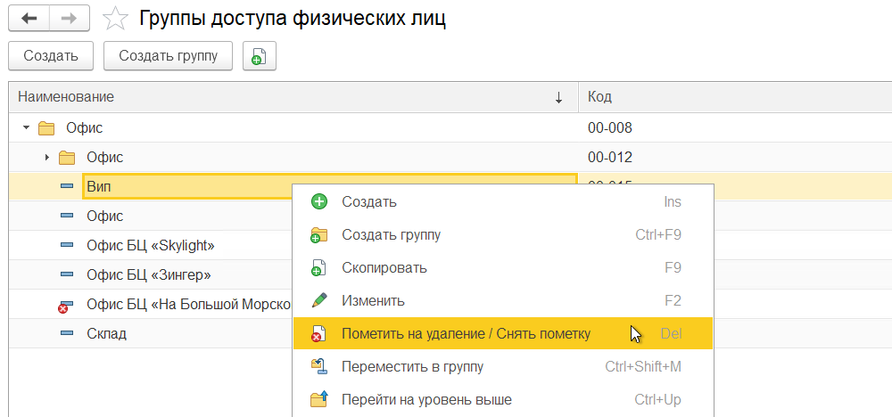
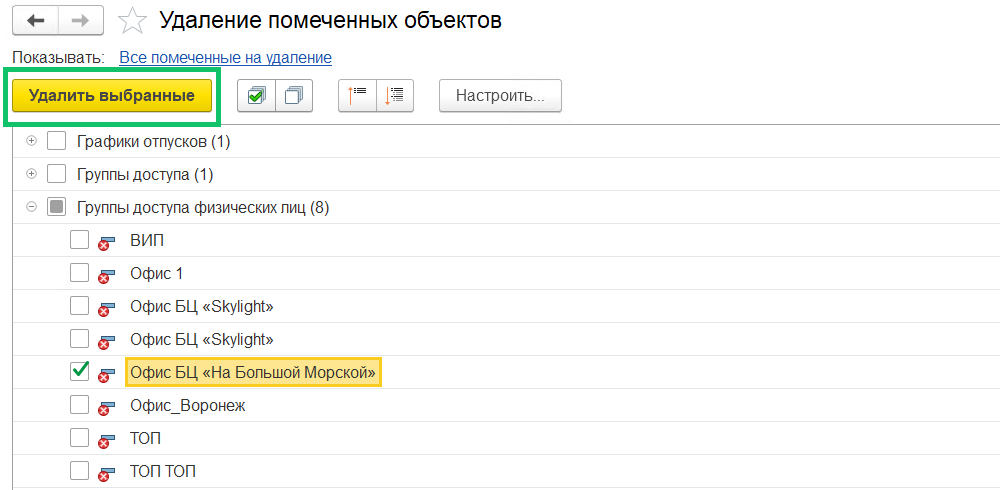
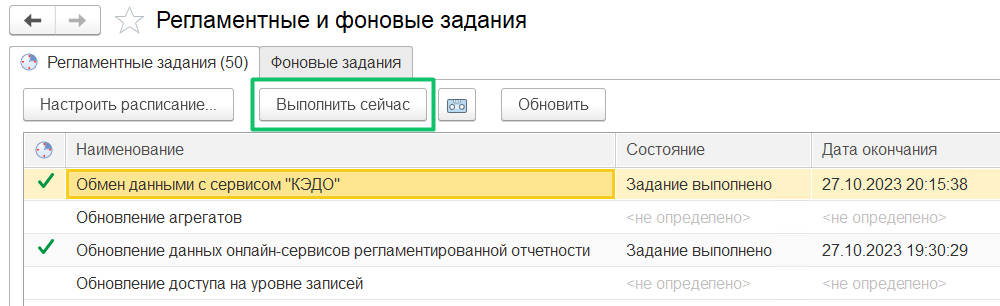

Если требуется удалить какую-то группу доступа (профиль) из списка в КЭДО, ее необходимо удалить в 1С. 

Перейдите в раздел **Группы доступа физических лиц**, выделите нужную группу, нажмите правую кнопку мыши и в контекстном меню выберите команду **Пометить на удаление / Снять пометку**.

Далее Администратор 1С должен перейти в раздел **Удаление помеченных объектов**, установить флажки для помеченных групп доступа и нажать кнопку **Удалить выбранные**. 

Удаленные из 1С группы доступа автоматически удалятся из веб-сервиса через несколько минут (время зависит от настроек регламентных заданий конкретной компании).

Чтобы вручную обновить список групп доступа в веб-сервисе (не дожидаясь автоматической синхронизации), перейдите в раздел **Администрирование → Обслуживание → Регламентные операции → Регламентные и фоновые задания**. Проверьте, что регламентное задание «Обмен данными с сервисом “КЭДО”» включено и нажмите кнопку **Выполнить сейчас**.

