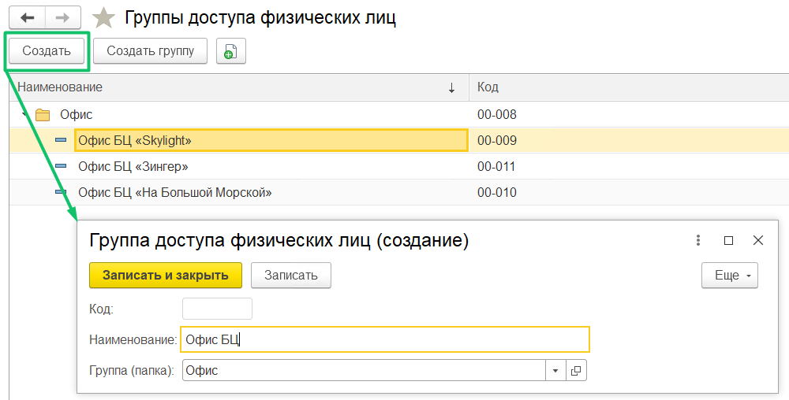
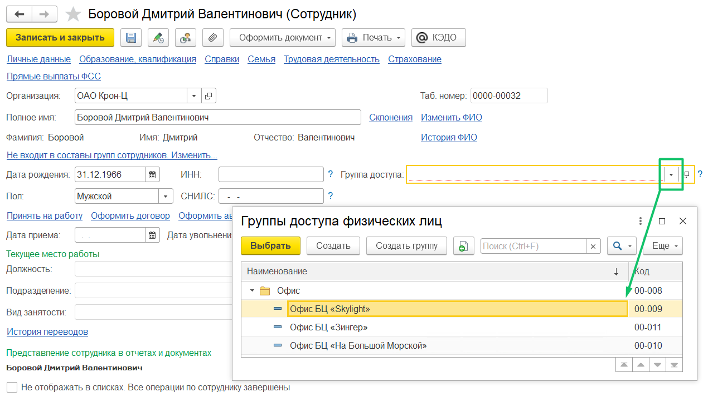

Кадровый сотрудник назначает группу доступа в 1С при приеме на работу / восстановлении сотрудника.

Проверьте, что необходимый профиль (профиль — это группа доступа в 1С) добавлен в разделе **Группы доступа физических лиц**. В случае если требуемый профиль отсутствует в списке, то добавьте новую группу доступа по нажатию кнопки **Создать**.

Далее введите наименование группы и выберите папку, в которой будет расположена группа. Нажмите кнопку **Записать и закрыть**.

Чтобы назначить группу доступа для сотрудника, необходимо:

1. Перейти в **Кадры → Сотрудники**.
1. Открыть карточку нужного сотрудника или создать карточку для нового сотрудника.
1. В поле **Группа доступа** выделить нужное название профиля и нажать кнопку **Выбрать**.
1. Записать внесенные изменения. 

При увольнении сотрудника записанное значение группы доступа сохраняется.