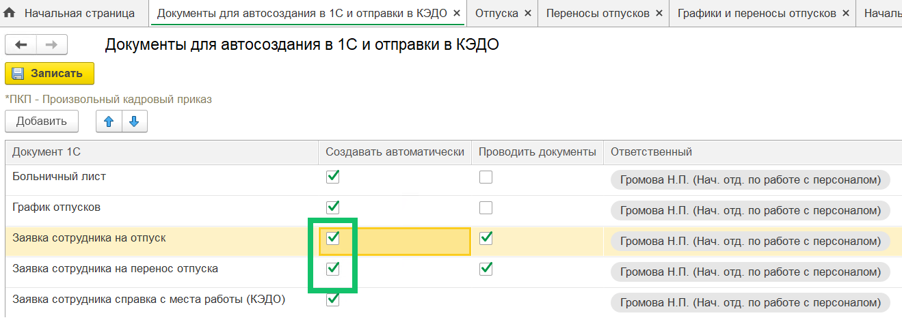
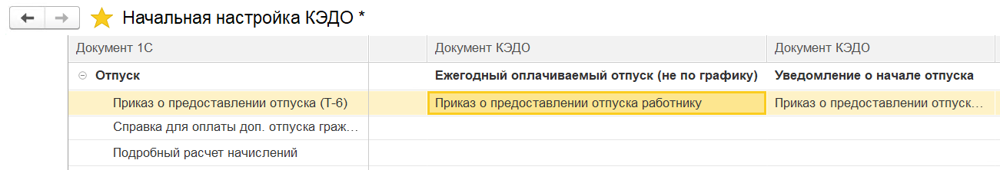
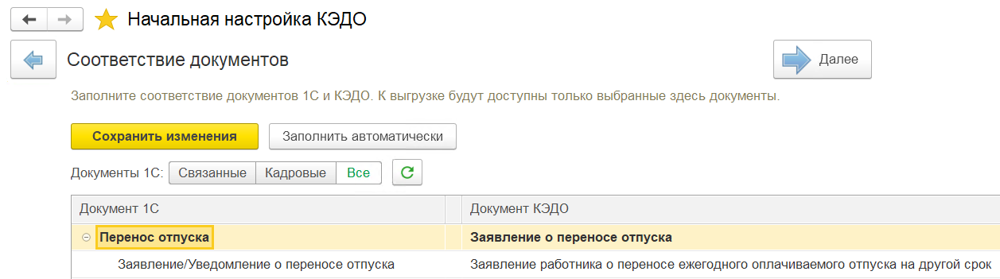
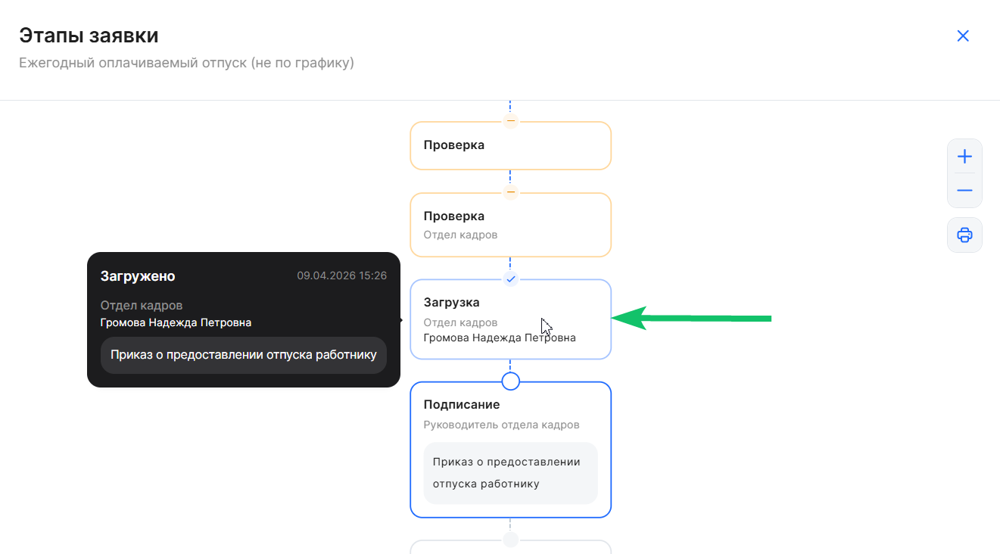
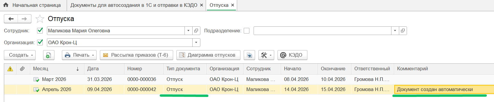
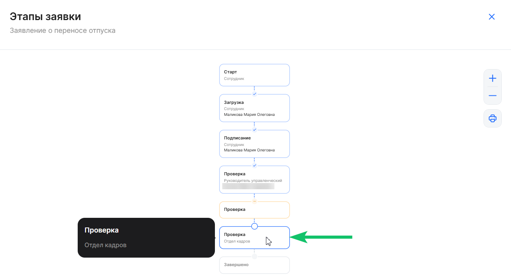
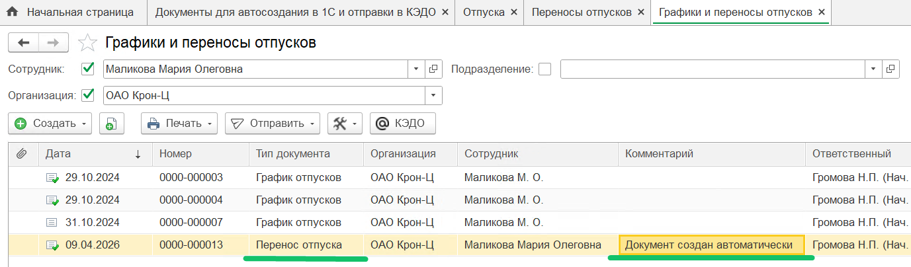
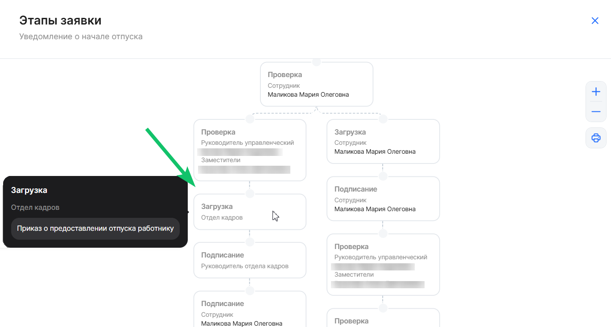
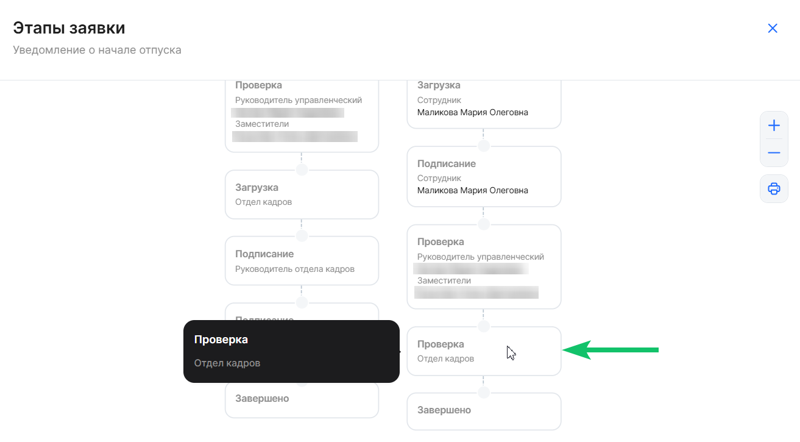

<info>

В преднастроенных бизнес-процессах «Уведомление о начале отпуска», «Ежегодный оплачиваемый отпуск (не по графику)» и «Заявление о переносе отпуска» включена настройка для автосоздания документов

</info>

Для автосоздания документов «Отпуск» и «Перенос отпуска» выполните действия:

1.  Включите настройку автосоздания в 1С и отправки в КЭДО для **_Заявки сотрудника на отпуск_** и **_Заявки сотрудника на перенос отпуска_**.
2.  Настройте соответствие документов 1С и документов КЭДО для бизнес-процессов «Уведомление о начале отпуска», «Ежегодный оплачиваемый отпуск (не по графику)» и «Заявление о переносе отпуска».

В результате выполненных действий по каждой заявке в зависимости от бизнес-процесса будут созданы документы 1С «Отпуск» и «Перенос отпуска», а также документ «Приказ о предоставлении отпуска» в заявке КЭДО.

## **Настройка автосоздания документов**

В 1С настройте автоматическое создание документа «Приказ о предоставлении отпуска» (о переносе отпуска) в заявках КЭДО. При включении этой настройки документ будет подгружаться в заявку автоматически, не нужно создавать документ в заявке, заявка автоматически перейдёт на следующий этап.

Для включения настройки перейдите в **КЭДО** → **Начальная настройка** → **Настройки функциональности** → **Настройка автоматического создания документов** и установите флажок **Создавать автоматически** для **_Заявки сотрудника на отпуск_** и **_Заявки сотрудника на перенос отпуска_**. Далее нажмите кнопку **Записать**.

При включении опции в 1С должны быть заполнены обязательные атрибуты, передаваемые из заявки КЭДО:

**Отпуск:**

- Дата начала отпуска;
- Дата окончания отпуска;
- Тип отпуска.

**Перенос отпуска:**

- Дата начала отпуска;
- Дата окончания отпуска;
- Новая дата начала;
- Новая дата окончания;
- Тип отпуска.

После авто-обработки приказ на отпуск (приказ на перенос отпуска) и информация о датах начала и окончания отпуска (о новых датах начала и окончания отпуска при переносе), типе отпуска загрузятся в заявку КЭДО. Этап заявки в КЭДО будет выполнен автоматически — без участия кадрового сотрудника.

Важно соблюдать количество дней, которое имеется в изначально запланированном отпуске (как указано в графике отпусков), иначе перенос не сработает.

## **Соответствие документов 1С и КЭДО**

В **КЭДО** → **Начальная настройка** → **Соответствие документов** настройте сопоставление 1С документов с бизнес-процессами (БП) отпуска в КЭДО: 

- 1С документ **Отпуск** с БП **Ежегодный оплачиваемый отпуск (не по графику)**;
- 1С документ **Отпуск** с БП **Уведомление о начале отпуска**;
-  1С документ **Перенос отпуска** с БП **Заявление о переносе отпуска**.

 

<warn>

На шаге автосоздания документа рекомендуем подождать около 2-х минут, пока обновятся регламентные задания. В этот момент не нужно нажимать кнопку **Создать документ** или **Проверка**

</warn>

## **Ежегодный оплачиваемый отпуск (не по графику)**

Инициатор заявки «Ежегодный оплачиваемый отпуск (не по графику)» — Сотрудник.

На этапе **Загрузка приказа** происходит автосоздание документа 1С «Отпуск» и подгрузка **Приказа о предоставлении отпуска работнику** в заявку.

В списке документов **Отпуска** напротив нужного документа появится комментарий о том, что документ создан автоматически.

## **Заявление о переносе отпуска**

Инициатор заявки «Заявление о переносе отпуска» — Сотрудник.

На этапе **Проверка документов** происходит автосоздание документа «Перенос отпуска» в 1С.

В списке документов **Графики и переносы отпусков** напротив нужного документа появится комментарий о том, что документ создан автоматически.

## **Уведомление о начале отпуска**

Инициатор заявки «Уведомление о начале отпуска» — Отдел кадров.

Если сотрудник планирует пойти в отпуск, то заявка пойдёт по ветке «Иду в отпуск».

На этапе **Загрузка приказа** происходит автосоздание документа 1С «Отпуск» и подгрузка **Приказа о предоставлении отпуска работнику** в заявку.

 

Если сотрудник планирует перенести отпуск, то заявка пойдёт по ветке «Перенос отпуска».

На этапе **Проверка документов** происходит автосоздание документа «Перенос отпуска» в 1С.

