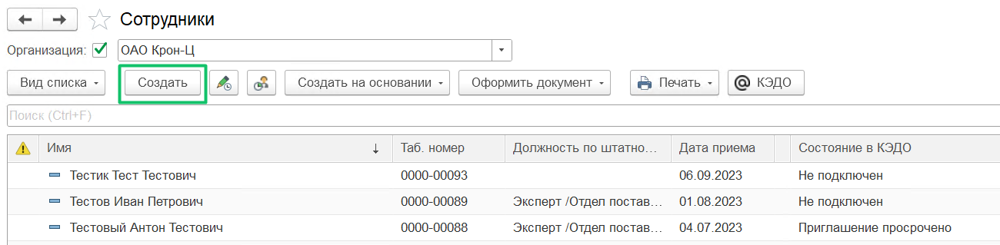
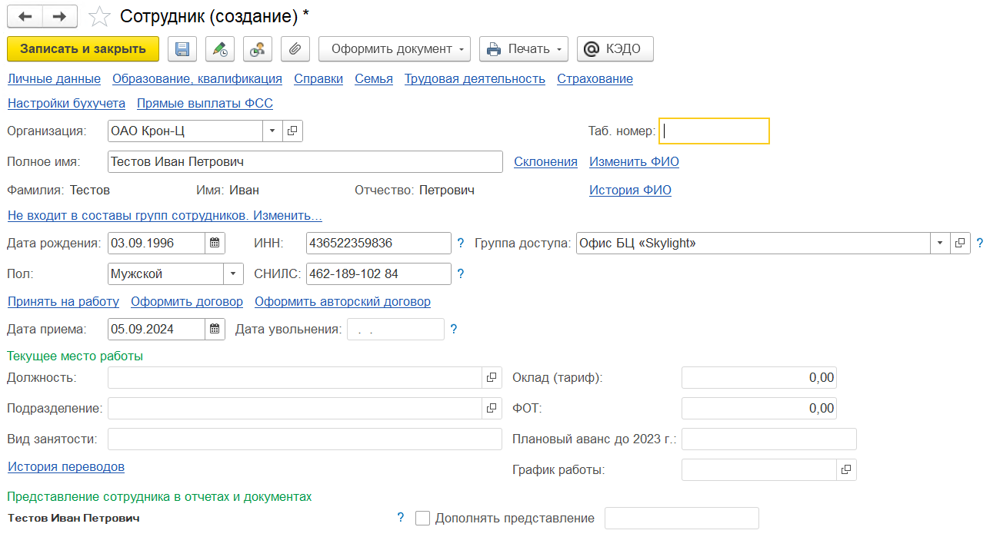
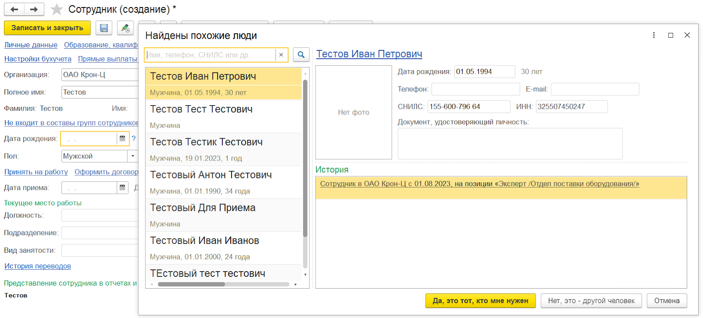
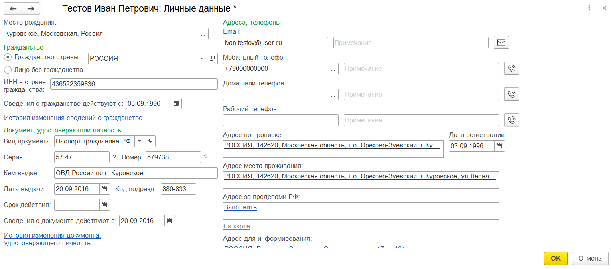
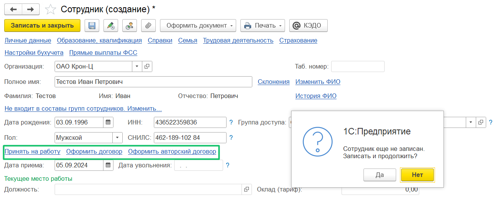

В процессе приёма на работу кадровый специалист добавляет личные данные нового сотрудника в разделе **Кадры** → **Сотрудники**. Для этого нажмите кнопку **Создать**.

В форме **Сотрудник (создание)** заполните обязательные поля:

* **Полное имя** — заполните ФИО сотрудника в именительном падеже, как указано в документе, удостоверяющем личность;  

* **Дата рождения** — заполните дату рождения, как указано в в документе, удостоверяющем личность;  

* **Пол** — заполните пол, как указано в в документе, удостоверяющем личность;  

* **ИНН** — введите ИНН, присвоенный в РФ. ИНН обязателен для выпуска УНЭП и для формирования отчётности по форме 2-НДФЛ. Если в компании предусмотрены другие варианты подписания или без УНЭП, то поле **ИНН** можно не заполнять;  

* **СНИЛС** —  введите СНИЛС — страховой номер в ПФР;  

* **Дата приема** — введите дату приёма на работу. Вы можете указать дату в пределах 30 дней от проведения документа о приёме на работу.

Остальные поля заполните при необходимости. 

Если табельный номер не заполнен, он присвоится сотруднику автоматически после сохранения данных и проведения документа о приёме на работу.

Данные из блока **Текущее место работы** заполняются на этапе создания документа о приёме на работу.

В случае если сотрудник уже был внесён в программу или в списке сотрудников есть его однофамилец, то в форме **Найдены похожие люди** выберите нужный вариант — да или нет.

Далее перейдите на вкладку **Личные данные**. Заполните обязательные поля:

* **Место рождения** — выберите место рождения (город, область, страна), как указано в документе, удостоверяющем личность; 

* **Гражданство страны** — выберите страну, в которой выдали документ, удостоверяющий личность;  

* **ИНН в стране гражданства** — заполните ИНН, присвоенный в стране гражданства;   

* **Сведения о гражданстве действуют с** — введите дату, когда стали действовать сведения о гражданстве;  

* **Вид документа** — в выпадающем списке выберите только одно из значений:  

- **Паспорт гражданина РФ**, если у сотрудника есть паспорт РФ;  

- **Иностранный паспорт**, если сотрудник является иностранным гражданином;

если выбрать иное значение из списка, то сотрудник не сможет подключиться к КЭДО;

* **Серия** — введите серию документа, удостоверяющий личность;  

* **Номер** — введите номер документа, удостоверяющий личность;  

* **Кем выдан** — укажите уполномоченный орган, выдавший документ, удостоверяющий личность;  

* **Дата выдачи** — введите дату выдачи документа, удостоверяющий личность;  

* **Код подразделения** — введите код подразделения из документа, удостоверяющий личность;  

* **Email** — укажите рабочую электронную почту, на которую будут приходить уведомления сервиса VK HR Tek. Поле обязательно только в случае, если все сотрудники компании будут получать приглашение на электронную почту. При этом Email должен быть обязательно заполнен у всех сотрудников, иначе приглашение не придёт;  

* **Мобильный телефон** — укажите мобильный телефон, который будут приходить уведомления от сервиса VK HR Tek и сообщения об электронной подписи, в формате +7.

Остальные поля заполните при необходимости. 

Нажмите кнопку **OK** для записи личных данных.

Перед тем как провести документ о приёме на работу или другой документ, запишите данные сотрудника.

