Перейдите в раздел **КЭДО** → **Подключение сотрудников**

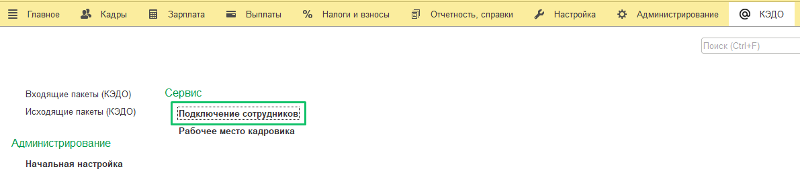

В форме **Подключение сотрудников (КЭДО)**, в поле **Организация** выберите наименование организации. Далее отобразится дерево верхнеуровневых подразделений организации.

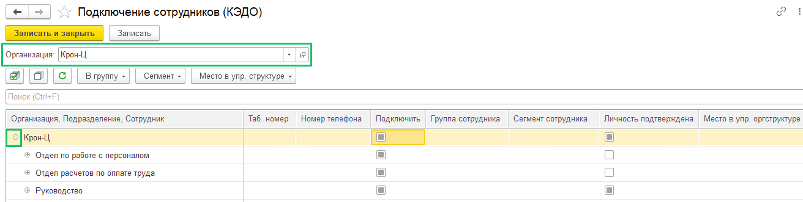

Если необходимо сразу раскрыть дерево со всеми подразделениями и сотрудниками выбранной организации — сначала нажмите на «-» в строке с названием организации, чтобы свернуть список верхнеуровневых подразделений. 

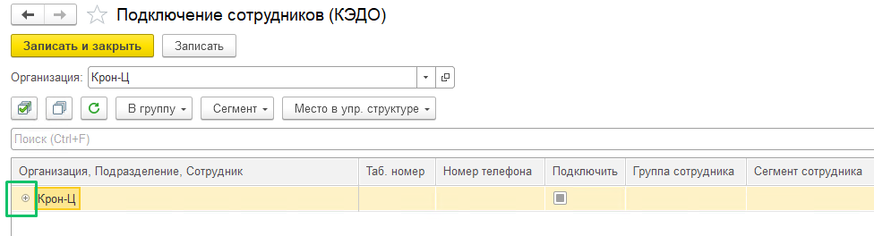

Затем одновременно нажмите клавишу *Ctrl* (или *control* для ОС macOS) и «+» в строке с названием организации.   

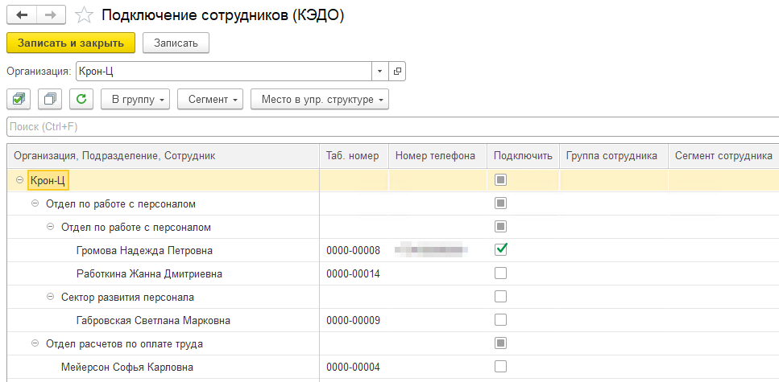

Чтобы подключить всех сотрудников сразу или по отдельности, установите флажок в столбце **Подключить** напротив необходимых сотрудников и нажмите кнопку **Записать**.

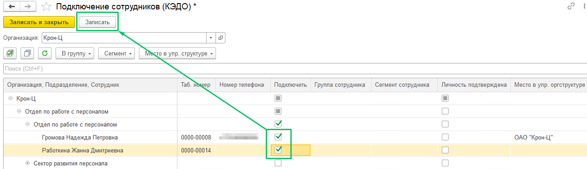

Для примера установите флажок в столбце **Подключить** напротив имени сотрудника, у которого отсутствует номер телефона в соответствующем столбце. Нажмите кнопку **Записать**. Появится красная надпись ошибки подключения. Чтобы просмотреть ошибки, допущенные при заполнении данных  сотрудника, нажмите на ссылку **Ошибки заполнения**.

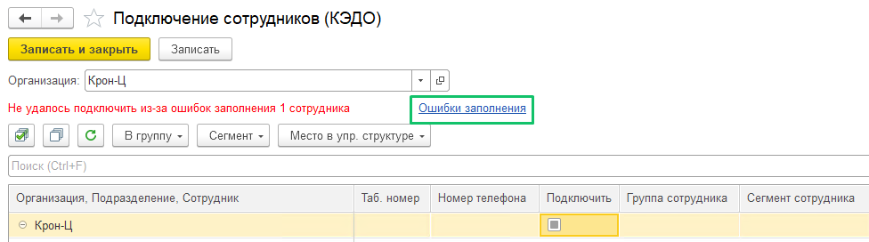

На странице **Ошибки заполнения физического лица (КЭДО)** вы сможете увидеть, какие именно ошибки есть в карточке сотрудника и что нужно исправить.

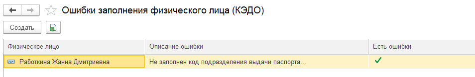

После успешного подключения в 1С сотрудникам необходимо пройти удалённое подтверждение выпуска электронной подписи через ЕСИА. После регистрации в Личном кабинете сервиса VK HR Tek сотрудник переходит в Госуслуги и там подтверждает выпуск сертификата электронной подписи. При этом у него должна быть подтвержденная учётная запись на Госуслугах.

Если у подключаемого сотрудника отсутствует подтвержденная учётная запись на Госуслугах, вы можете подключить сотрудника в 1С:ЗУП. Для этого необходимо:

* в **КЭДО** → **Начальная настройка** [включить опцию](/ru/1C/user/functionality_settings#podtverzhdenie_lichnosti_sotrudnika) **Подтверждение личности пользователя отделом кадров**, чтобы в разделе **КЭДО** → **Подключение сотрудников** выводилась колонка **Личность подтверждена**; 

* в форме **Подключение сотрудников (КЭДО)** установить флажок в столбце **Личность подтверждена**. Устанавливая данный флажок, работодатель берёт на себя полную ответственность и сопутствующие этому обязательства за идентификацию личности сотрудника и подтверждает, что личность подключаемого сотрудника была им проверена. 

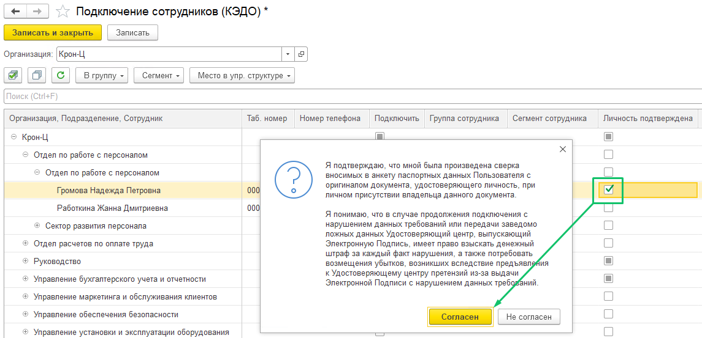 

Для сохранения изменений нажмите кнопку **Записать** или **Записать и закрыть**.

Для быстрого поиска сотрудника в дереве подразделений можно воспользоваться строкой поиска либо комбинацией клавиш *Ctrl+F* (или *command+F* для ОС macOS).

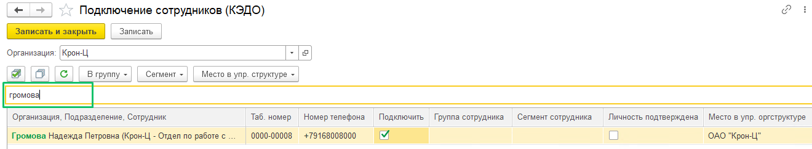

В **КЭДО** → **Подключение сотрудников** доступна информация о количестве используемых и доступных лицензий в компании. Чтобы посмотреть цифры, выберите нужную организацию из списка.  

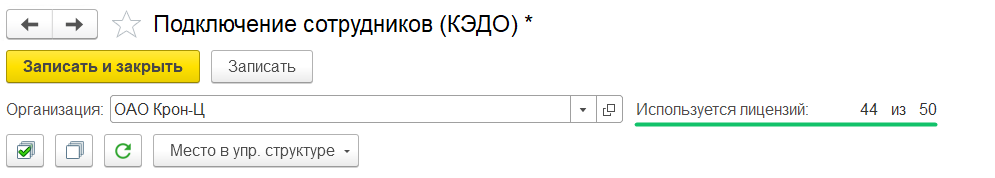

Также в разделе **КЭДО** → **Подключение сотрудников** реализованы:

* кнопки сортировки по возрастанию и убыванию подразделений и сотрудников; 

* колонка с датой приёма сотрудника; 

* фильтр по дате приёма.

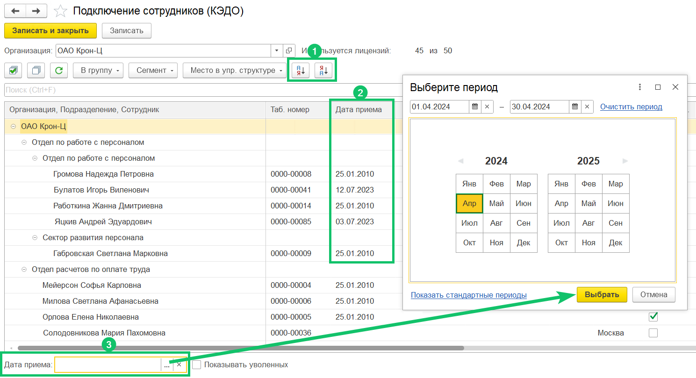

В разделе **КЭДО** → **Подключение сотрудников** можно просматривать и сохранять данные подключенных к КЭДО сотрудников. Для этого нажмите кнопку **Вывести список**, а затем нажмите кнопку для сохранения списка в файле (.xlsx, .docx, .pdf или др.).

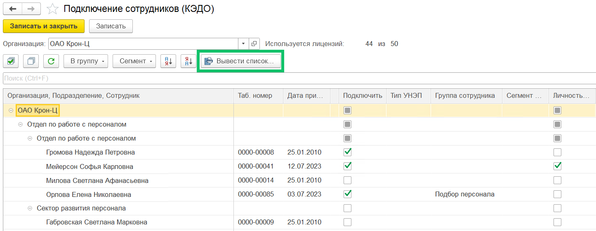

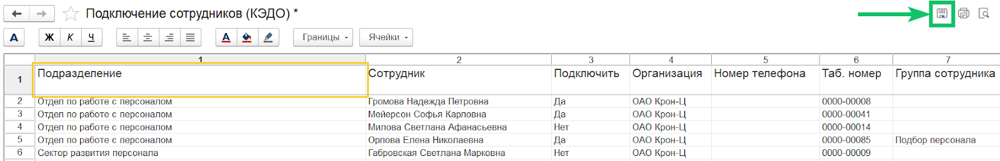

##  **Отправка данных уволенных сотрудников в сервис VK HR Tek**

Данные уволенных сотрудников передаются в КЭДО только в течение недели после даты увольнения.

В дальнейшем документы по уволенным сотрудникам можно будет найти в **КЭДО** → **Рабочее место кадровика**. У уволенных сотрудников напротив их ФИО будет отмечен статус **Уволен**. 

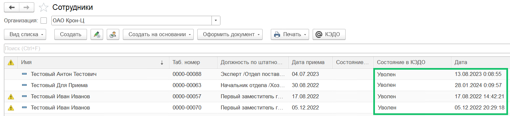

