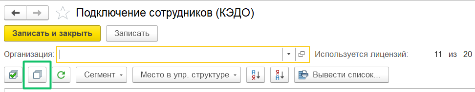
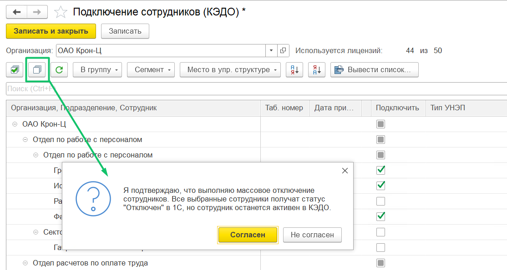
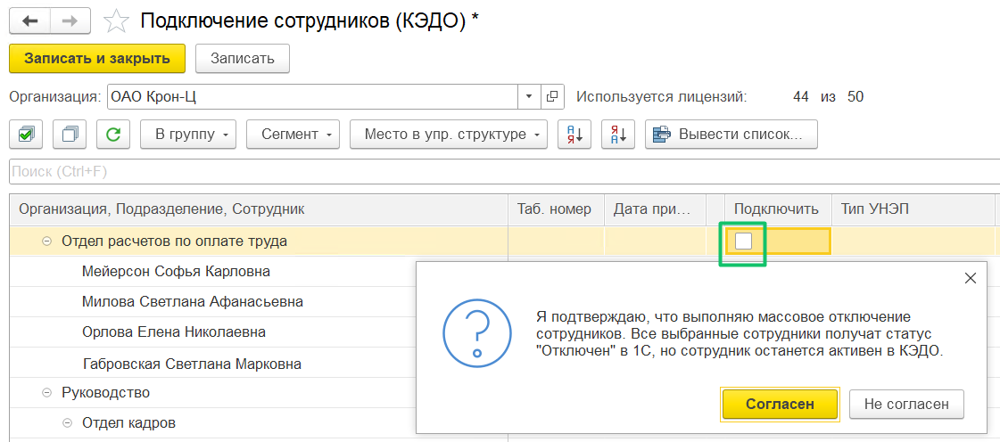

## **Массовое отключение сотрудников**

Чтобы отключить всех сотрудников компании от КЭДО, выберите организацию и нажмите кнопку **Снять отметку со всех**.

При массовом отключении всех сотрудников компании или отдельного подразделения на форме **КЭДО** → **Подключение сотрудников** появится вопрос-подтверждение выполняемых действий пользователя.

