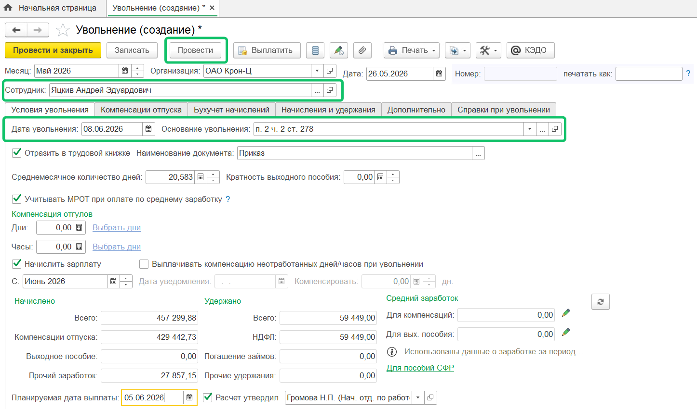
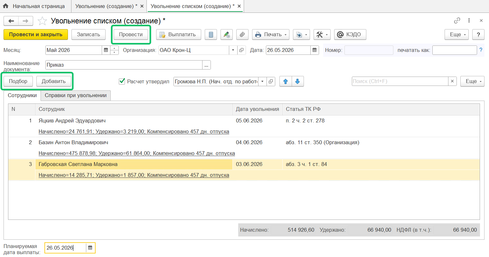

Чтобы уволить сотрудников в 1С:ЗУП, необходимо заполнить и провести документы «Увольнение» или «Увольнение списком».

Выполнить действия, связанные с увольнением, можно в одном из разделов:

- **Кадры → Приемы, переводы, увольнения** → кнопка **Создать** → **Увольнение (Увольнение списком)**;
- **Кадры → Увольнения (Увольнения списком)** → кнопка **Создать**;
- **Кадры → Сотрудники** → карточка сотрудника → кнопка **Оформить документ** → пункт **Кадры** → пункт **Увольнение**.

## **Документ «Увольнение»**

Кадровый специалист заполняет документ «Увольнение» на основании сведений о сотруднике и его доходах.

На вкладке **Условия увольнения** заполните обязательные поля:

- **Организация**. Проверьте, что выбрана верная организация, если к 1С подключено несколько компаний.
- **Сотрудник**. Выберите ФИО из справочника.
- **Дата увольнения**. Соответствует дате прекращения трудового договора (указана в заявлении сотрудника, соглашении, приказе).
- **Основание увольнения**. Выберите из списка статью трудового кодекса (собственное желание, сокращение и т. д.).

Большая часть реквизитов заполняется автоматически. При необходимости внесите изменения: проставьте галочки, уточните виды удержаний, пособий, прочие параметры.

Также заполните необходимые сведения на вкладках **Компенсация опуска**, **Начисления и удержания**, **Дополнительно**.

После заполнения всех необходимых значений нажмите кнопку **Провести**.

## Документ «Увольнение списком»

Документ «Увольнение списком» позволяет оформить увольнение для группы сотрудников. Нажмите кнопку **Подбор** или **Добавить**, чтобы выбрать из справочника сотрудников, которых нужно уволить. При этом для каждого создается свой документ, который откроется, если нажать на строку списка.

После заполнения всех необходимых значений по каждому сотруднику в списке нажмите кнопку **Провести**.

Увольнение выбранных сотрудников производится по одному приказу (с одним номером и датой) и в одном месяце расчета, а даты увольнения и причины могут быть разными.

Документ «Увольнение списком» удобно использовать при массовых увольнениях в одном месяце, сокращении штата, ликвидации.