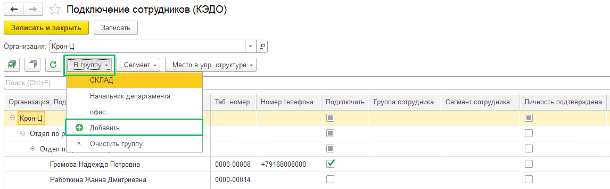
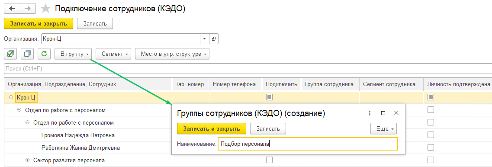
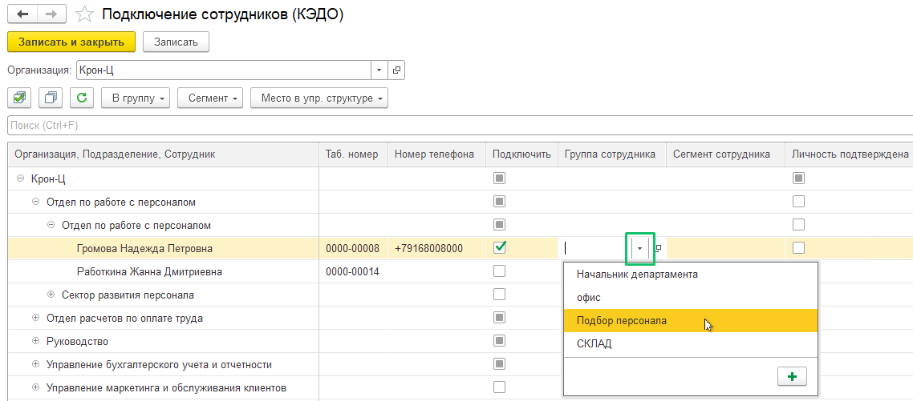

## **Распределение сотрудников в группы**

Разделение сотрудников по группам осуществляется на форме **Подключения сотрудников**, если это было предусмотрено в бизнес-процессах. Чтобы добавить группу к сотруднику, выполните следующие действия: 

1. Нажмите кнопку **В группу** и выберите **Добавить**.

2. В форме **Группы сотрудников (КЭДО) (создание)** укажите наименование группы. Нажмите кнопку **Записать** или **Записать и закрыть**.

3. В столбце **Группа сотрудника** дважды нажмите на ячейку и выберите название группы.

4. Нажмите кнопку **Записать** или **Записать и закрыть**.

