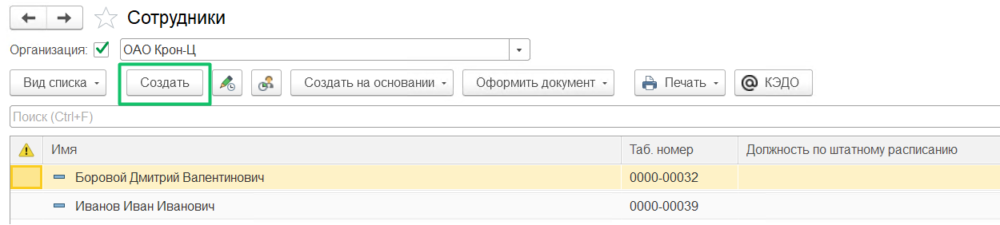
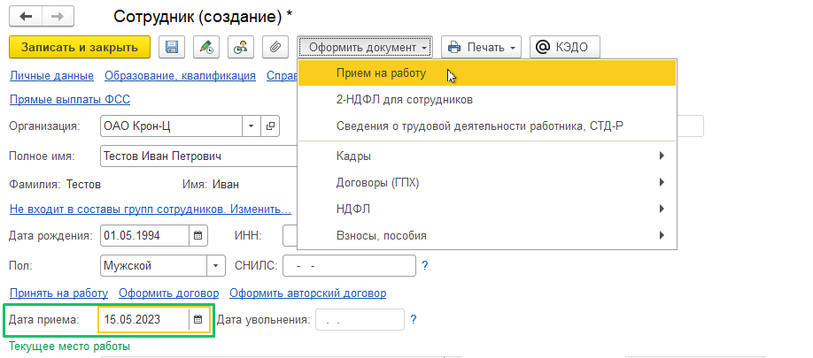
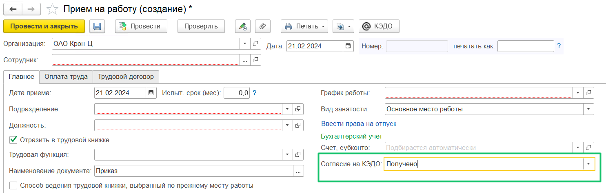
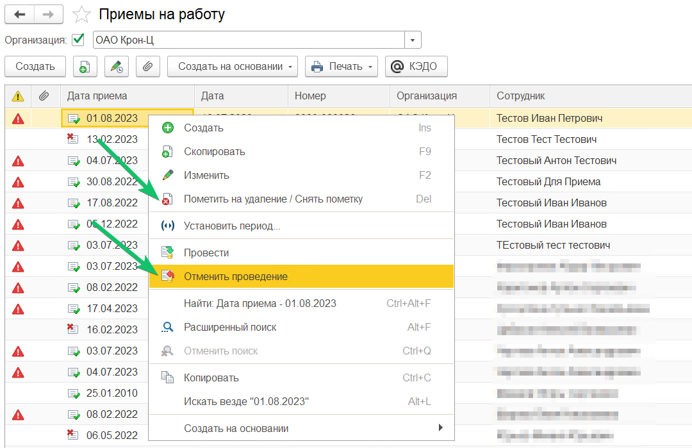

В расширении можно подключать новых сотрудников к КЭДО, не дожидаясь даты их выхода на работу. Это ускорит выпуск УНЭП и подключение сотрудника к КЭДО в первые дни работы. 

Чтобы создать нового сотрудника, перейдите в раздел **Кадры** → **Сотрудники**, нажмите кнопку **Создать**. 

В форме **Сотрудник (создание)** заполните информацию о новом сотруднике, в поле **Дата приема** вы можете указать дату в пределах 30 дней от проведения документа. Далее нажмите кнопку **Оформить документ**/**Прием на работу**.

Если в разделе **КЭДО** → **Начальная настройка КЭДО** → **Настройки функциональности** установлено автоподключение новых сотрудников к КЭДО, то в документе **Прием на работу** появится обязательное поле **Согласие на КЭДО**.

Новый сотрудник будет подключен автоматически, только если в поле **Согласие на КЭДО** будет выбрано **Получено**.

Подробнее о настройке автоподключения новых сотрудников можно ознакомиться в статье [Автоматическое подключение новых сотрудников](/ru/1C/user/functionality_settings#avtomaticheskoe_podklyuchenie_novyh_sotrudnikov).

## **Отключение сотрудников при отмене приёма на работу**

Сотрудники автоматически отключаются от КЭДО при отмене проведения или пометке на удаление приказа о приёме на работу. Чтобы отменить проведение или пометить на удаление, для необходимого приказа выберите одну соответствующую команду в контекстном меню. 

