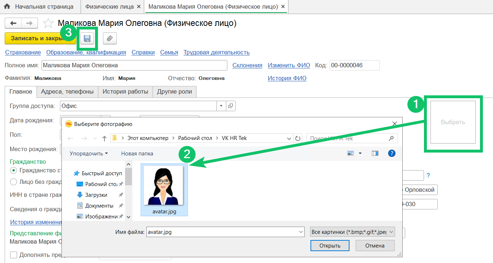
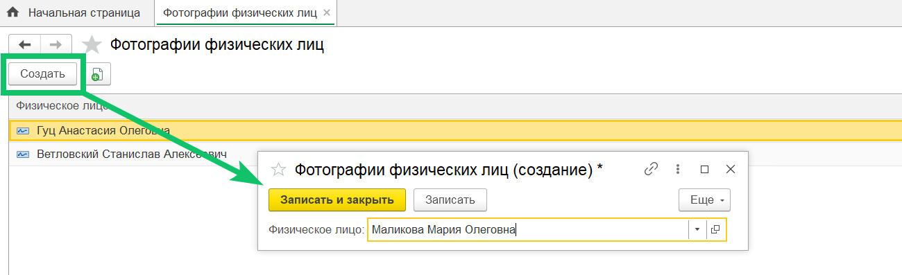

Чтобы добавить фотографию сотрудника в 1С:ЗУП, откройте справочник **Физические лица** и выполните следующие действия:
1. Из справочника откройте карточку физического лица, для которого нужно загрузить фотографию, и нажмите на квадратное поле со словом **Выбрать**. Если требуется изменить ранее добавленную фотографию, нажмите на поле с этой фотографией.
2. Выберите нужную фотографию на компьютере. 
3. Сохраните загруженную фотографию и другие изменения, внесённые в карточку физического лица.

 

4. Чтобы фотография отображалась в **Профиле** пользователя в веб-сервисе, перейдите в 1С справочник **Фотографии физических лиц** и создайте запись о фотографии выбранного физического лица. 

 

После выполнения всех этих действий в **Профиле** пользователя будет отображаться фотография сотрудника.

<warn>

Синхронизация изменений может занимать несколько минут. Если фотография так и не отобразилась в **Профиле**, проверьте наличие ошибок в передаваемых данных по сотруднику в разделе **Исходящие пакеты (КЭДО)**.

</warn>

 

Если требуется убрать фотографию из **Профиля** пользователя, в 1С справочнике **Фотографии физических лиц** выделите запись нужного физического лица, нажмите на правую кнопку мыши и выберите команду удаления в контекстном меню.