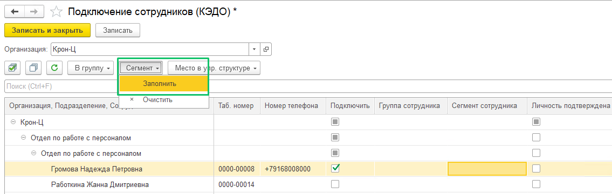
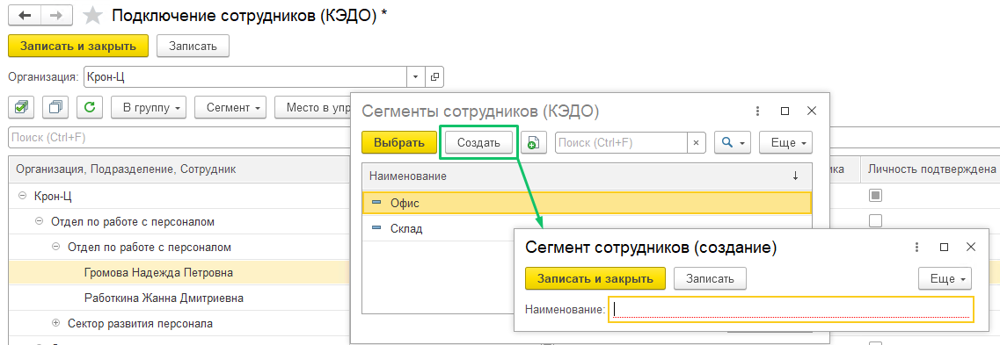
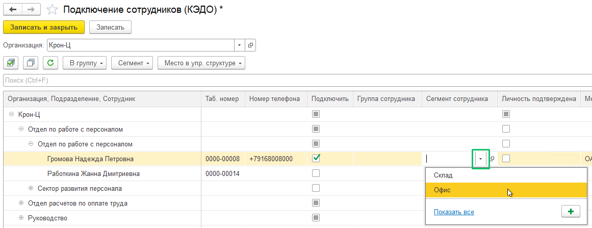
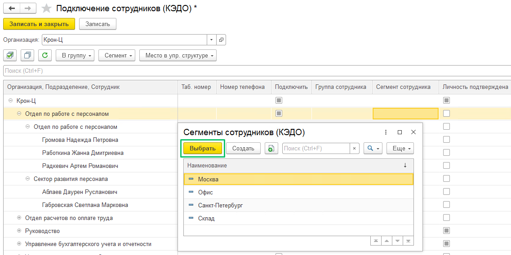

## **Распределение сотрудников по сегментам**

Распределить сотрудников по сегментам необходимо на форме подключения сотрудников, если данная функция была включена в разделе **КЭДО** → **Начальная настройка** → **Настройки функциональности**  (см. статью [Сегменты сотрудников](/ru/1C/user/functionality_settings#segmenty_sotrudnikov)). 

Чтобы создать новый сегмент с любым требуемым названием, выполните следующие действия:

1. Нажмите кнопку **Сегмент** и выберите **Заполнить**.

2. В форме **Сегменты сотрудников (КЭДО)** нажмите кнопку **Создать** и укажите наименование сегмента. Нажмите кнопку **Записать** или **Записать и закрыть**.

3.  Чтобы добавить сегмент к конкретному сотруднику, в столбце **Сегмент сотрудника** дважды нажмите на ячейку и выберите название сегмента.

4. Чтобы заполнить сегмент для всех сотрудников подразделения, выделите строку с названием подразделения и нажмите кнопку **Сегмент** → **Заполнить**. В форме **Сегменты сотрудников (КЭДО**) выделите необходимое название сегмента и нажмите кнопку **Выбрать**.

5. Нажмите кнопку **Записать** или **Записать и закрыть**.

6. Если требуется очистить ячейки с сегментами, то выделите строки с сотрудниками или подразделениями и нажмите кнопку **Сегмент** → **Очистить**.