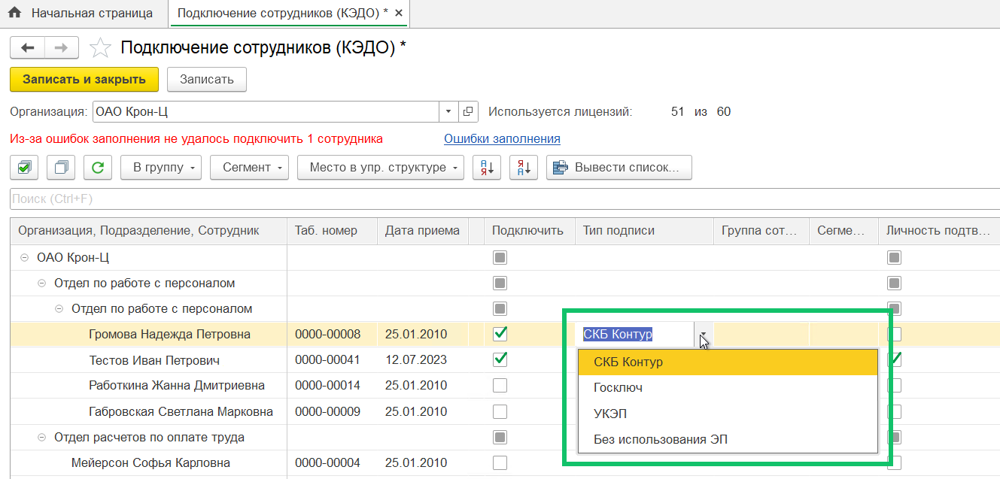
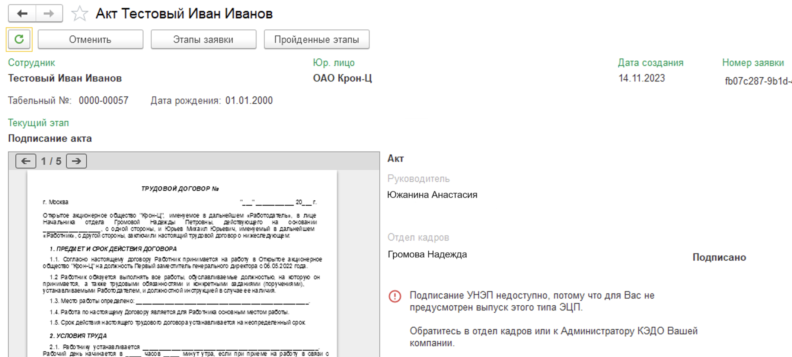
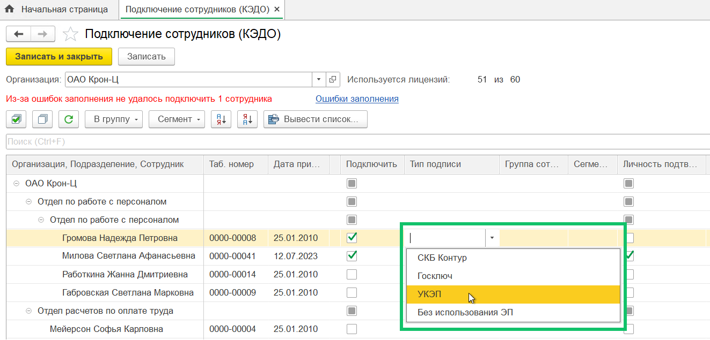

Компании, в которых выпуск усиленной неквалифицированной электронной подписи (УНЭП) для сотрудников не обязателен, могут указать, каким сотрудникам не нужен выпуск ЭП.

<warn>

Эта же настройка используется, если в типе заявки выбрано подписание документа УНЭП со стороны компании. Пример: у сотрудника Х не выпущен УНЭП Контур, но он является  руководителем в компании, где есть бизнес-процесс с подписанием документа УНЭП от лица руководителя. Сотрудник Х не сможет подписать этот документ.

</warn>

Каждому сотруднику можно указать только одно значение в настройке. Сейчас это выбор из вариантов:

- СКБ Контур;
- Госключ;
- УКЭП;
- Без использования ЭП.

При подключении компании менеджер VK HR Tek указывает: 

- доступные для выбора типы УНЭП;
- один тип УНЭП по умолчанию для подписания документов на всю компанию;
- источник УНЭП сотрудников.

Список событий, при которых проверяется статус необходимости выпуска УНЭП для сотрудника:

- подключение к КЭДО;
- изменение списка УНЭП, разрешенных компании;
- переключение УНЭП для подписания для всей компании;
- истёк срок действия УНЭП.

Источником данных о том, нужен ли отдельному сотруднику УНЭП или нет, может быть один из трёх интерфейсов:

- Веб-интерфейс (сервис «VK HR Tek»),
- 1С,
- API.

При получении нового значения настройки (к примеру, **СКБ Контур** или **Без использования ЭП**) для сотрудника предыдущее значение перезаписывается, в том числе если пришло пустое значение, предыдущее значение будет удалено. В том случае, если в настройке сотрудника пусто, используется значение, выбранное для всей компании.

После того, как в веб-сервисе, в разделе **Настройки** *→* **Типы ЭЦП** будет выбран и сохранён вариант **1С** в качестве источника данных об УНЭП для отдельных сотрудников, в 1С:ЗУП, **КЭДО** *→* **Подключение сотрудников**  станет доступен выбор типа УНЭП в столбце **Тип подписи**.

Когда сотрудники, которым не требуется УНЭП, будут выбраны и записаны, тогда это значение для сотрудников станет приоритетным над значением для всей компании.

Если ячейка **Тип подписи** у сотрудника не заполнена, тогда применяется значение УНЭП по умолчанию для всей компании. Таким образом, нужно заполнить ячейки только у тех сотрудников, у которых УНЭП отличается от всей компании.

Если было заполнено значение, которого нет в актуальном списке типов УНЭП — значение в ячейке сотрудника сбрасывается и применяется значение УНЭП по умолчанию для всей компании.

Для заявок на этапе подписания у представителей компании, не подключенных к УНЭП, появится сообщение о недоступности подписать документ УНЭП.

## Усиленная квалифицированная электронная подпись

В **КЭДО** *→* **Подключение сотрудников** можно выбрать тип подписи документов — **УКЭП**.

<warn>

 В настройках компании должен быть включен тип подписания **УКЭП**

 </warn>

Перед выбором УКЭП проверьте, что на форме **Подключение сотрудников** доступна колонка **Тип подписи**. Для отображения колонки Администратор VK HR Tek должен выбрать источник данных **1С** в разделе **Настройки** *→* **Типы ЭЦП**.

