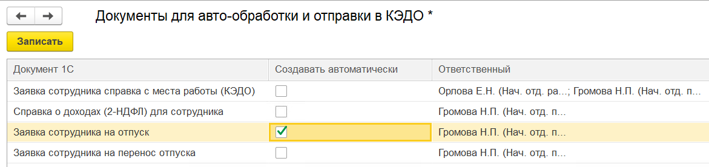
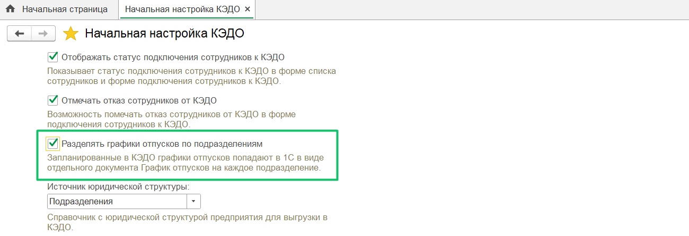

В разделе **КЭДО** → **Начальная настройка** → **Настройки функциональности** пользователь заполняет настройки, необходимые для корректной работы КЭДО. 

## Авто-обработка и отправка документов в сервис VK HR Tek

Расширение может автоматически создавать справку с места работы и справку 2-НДФЛ на основании заявления сотрудника в КЭДО. Для этого на этапе настроек функциональности выполните действия:

1. В разделе **Настройки функциональности** перейдите в подраздел **Настройка автоматического создания документов**.

2. Настройте правила обработки заявок сотрудников. Для этого в форме **Документы для авто-обработки и отправки в КЭДО** установите флажок в столбце **Создавать автоматически** напротив того вида документа, который будет создаваться автоматически без участия сотрудников отдела кадров.

3. Назначьте ответственного сотрудника. Для этого в столбце **Ответственный** дважды нажмите в необходимой ячейке. В форме **Ответственные пользователи** выберите сотрудника и нажмите кнопку **ОК**.  

Также можно выбрать сразу нескольких сотрудников, которые будут заниматься справками. У выбранного ответственного сотрудника должна быть соответствующая роль в КЭДО (например, Отдел кадров или Бухгалтерия) и должен быть заполнен токен Пользователя КЭДО в разделе **Рабочее место кадровика**. Если у выбранного сотрудника не будет данной роли, тогда справка не будет сформирована автоматически.

 

Справка 2-НДФЛ для сотрудников не будет отправляться в КЭДО, поскольку в эту справку поступают данные физлица из справочника **Физические лица**, а не **Сотрудники**. Поэтому со справкой можно работать только через автоматическое создание на основании заявки от сотрудника или ручной подгрузки.

### Документ «Приказ на отпуск»/«Приказ на перенос отпуска» для авто-обработки и отправки в сервис VK HR Tek

В 1С можно настроить автоматическое создание документа **Приказ на отпуск** и **Приказ на перенос отпуска** в заявках КЭДО. При включении этой настройки документ будет подгружаться в заявку автоматически, не нужно создавать документ в заявке, заявка автоматически перейдёт на следующий этап. 

Для включения настройки перейдите в **КЭДО** → **Начальная настройка** → **Настройки функциональности** → **Настройка автоматического создания документов**  и установите флажок **Создавать автоматически** для ***Заявки сотрудника на отпуск*** и ***Заявки сотрудника на перенос отпуска***. Далее нажмите кнопку **Записать**.

Проставьте флажок **Формирование и отправку документов в КЭДО** при автоматической обработке заявок КЭДО.

Также проверьте соответствие процессов отпуска в КЭДО с 1С документами **Отпуск** и **Перенос отпуска** в **КЭДО** → **Начальная настройка** → **Соответствие документов**.

При включении опции в 1С должны быть заполнены обязательные атрибуты, передаваемые из заявки КЭДО:

**Перенос отпуска:**
* Дата начала отпуска;
* Дата окончания отпуска;
* Новая дата начала;
* Новая дата окончания;
* Тип отпуска.

**Приказ на отпуск:**
* Дата начала отпуска;
* Дата окончания отпуска;
* Тип отпуска.

После авто-обработки приказ на отпуск (приказ на перенос отпуска) и информация о датах начала и окончания отпуска (о новых датах начала и окончания отпуска при переносе), типе отпуска загрузятся в заявку КЭДО. Этап заявки в КЭДО будет выполнен автоматически — без участия кадрового сотрудника.

<warn>

Важно соблюдать количество дней, которое имеется в изначально запланированном отпуске (как указано в графике отпусков), иначе перенос не сработает.

</warn>

### Автосоздание документа «Отпуск»

Реализовано автоматическое создание документа **Отпуск** на основании заявки сотрудника на компенсацию дней отпуска из КЭДО.

Чтобы включить настройку, перейдите в **КЭДО** → **Начальная настройка** → **Настройки функциональности** → **Настройка автоматического создания документов**, выберите ответственных и установите флажок **Создавать автоматически** для строки ***Заявка сотрудника на отпуск***. Далее нажмите кнопку **Записать**.

Настройте соответствие документа 1С **Отпуск** и печатной формы с процессом **Компенсация отпуска** и приказом о компенсации отпуска.

Перед отправкой заявки сотрудника о компенсации на отпуск из КЭДО в 1С, в справочнике **Виды отпусков** должен быть создан вид отпуска, указанный в процессе.  
Чтобы добавить вид отпуска в 1С, перейдите в раздел **Виды отпусков**, нажмите кнопку **Создать**, укажите название и дополнительные настройки.

### Автосоздание документа «Отпуск без сохранения оплаты»

Также в 1С:ЗУП автоматически создается документ **Отпуск без сохранения оплаты** на основании заявки сотрудника из КЭДО.

Чтобы включить настройку, перейдите в **КЭДО** → **Начальная настройка** → **Настройки функциональности** → **Настройка автоматического создания документов**, выберите ответственных и установите флажок **Создавать автоматически** для строки ***Отпуск без сохранения оплаты***. Далее нажмите кнопку **Записать**.

Проверьте, что настроено соответствие документа 1С **Отпуск без сохранения оплаты** и печатной формы с процессом **Отпуск без сохранения заработной платы** и приказом о предоставлении отпуска.

### Автосоздание документа «Кадровый перевод»

В 1С:ЗУП может автоматически создаваться документ **Кадровый перевод** по данным заявки в сервисе VK HR Tek. При этом в заявке КЭДО должны быть заполнены обязательные атрибуты:

* дата начала перевода;    
* дата окончания перевода;     
* выберите причину перевода;    
* должность (вакансия);  
* подразделение (вакансия);     
* % занятости;  
* график рабочего времени;    
* оклад.

Проверьте, что в **КЭДО** → **Начальная настройка** → **Соответствие документов** настроено сопоставление документа 1С **Кадровый перевод** с любым доступным типом мероприятия КЭДО.

Для включения автосоздания документа перейдите в **КЭДО** → **Начальная настройка** → **Настройки функциональности** → **Настройка автоматического создания документов**, установите флажок для документа **Кадровый перевод** и выберите ответственного.

В комментариях к документам **Кадровый перевод** будет помечено, что документ создан автоматически.   
 

### Обновление данных сотрудника на основании заявки

Перейдите в **КЭДО** → **Начальная настройка** → **Соответствие документов**. Проверьте соответствие документа 1С **Обновление персональных данных** с документами КЭДО, отвечающими за обновление персональных данных.

Откройте **КЭДО** → **Начальная настройка** → **Настройки функциональности** → **Настройка автоматического создания документов**. Найдите строку **Обновление персональных данных** и включите флажок. Назначьте ответственных сотрудников.

<warn>

Чтобы этап заявки на обновление персональных данных был автоматически пройден, исполнитель, указанный в настройках автоматизации, должен иметь права на выполнение этапа в этом бизнес-процессе.

</warn>

При включении опции в 1С справочник «Физические лица» могут записываться атрибуты, переданные из заявки КЭДО:
* ФИО;
* паспортные данные;
* адрес регистрации;
* адрес места жительства;
* контактная информация (телефон, электронная почта);
* сведения о членах семьи;
* данные об образовании;
* банковские реквизиты.

В рамках каждого блока данных (ФИО, паспортные данные, адрес и др.) все поля блока записываются в 1С, т.е. если поле придет пустым из КЭДО, то оно будет пустым в 1С.

При успешной записи данных из атрибутов система автоматически пройдет этап проверки, назначенный на Отдел кадров. 

Если данные записать не удалось, заявка останется на ручной проверке у Отдела кадров.

## Настройка электронной подписи

В системе можно подписывать кадровые документы с помощью УКЭП из 1С:ЗУП. 

В разделе **Настройки функциональности** установите флажок **Электронная подпись** и перейдите в раздел **Сертификаты и программы электронной подписи**.

В 1С:ЗУП сертификат электронной подписи добавляет Администратор (см. статью [Добавление электронной подписи](/ru/1C/admin/initial_setup#dobavlenie_sertifikata_elektronnoy_podpisi)). 

## Автоматическое подключение новых сотрудников

Система дает возможность автоматически подключать к КЭДО новых сотрудников, принятых на работу. 

Для этого в разделе **Настройки функциональности** установите флажок **Автоматически подключать новых сотрудников**. 

Если в разделе **КЭДО** → **Начальная настройка КЭДО** → **Настройки функциональности** установлено автоподключение новых сотрудников к КЭДО, то в документе **Прием на работу** появится обязательное поле **Согласие на КЭДО**.

Новый сотрудник будет подключен автоматически, только если в поле **Согласие на КЭДО** будет выбрано **Получено**. 

С документом **Прием на работу** можно ознакомиться в статье [Добавление новых сотрудников](/ru/1C/user/employees/add_employees).

## Настройка для использования групп сотрудников

Чтобы распределять сотрудников в разные группы и использовать разные бизнес-процессы в зависимости от группы, в разделе **Настройки функциональности** установите флажок **Использовать разные процессы в зависимости от группы сотрудника**. 

Обратите внимание, что использование разных процессов в зависимости от группы сотрудников нужно предусмотреть на этапе согласования бизнес-процессов (БП). Подробно о добавлении сотрудников в группы описано в статье [Распределение сотрудников в группы](/ru/1C/user/employees/groups).

## Обязательное заполнение документа 1С

Система позволяет привязывать документ 1С к заявке, создаваемой из **Рабочего места кадровика**. Выбор документа 1С доступен для тех типов мероприятий (БП), которые связаны с 1С документами в разделе **КЭДО** → **Начальная настройка** → **Соответствие документов** (см. статью [Настройка соответствия документов 1С и документов КЭДО](/ru/1C/user/mapping/map)). Чтобы документ 1С был обязательным при создании заявки, установите флажок **Обязательно заполнять документ 1С при создании заявки в КЭДО**.

## Работа с кандидатами

Система позволяет автоматизировать работу с кандидатами, а именно: даёт возможность автоматически создавать физических лиц на основании данных из заявок кандидатов. Просмотр списка созданных физлиц доступен в справочнике **Физические лица**.   
Для включения работы с кандидатами установите флажок **Работа с кандидатами**.

## Сегменты сотрудников

Система позволяет создать любой набор групп – сегменты сотрудников для дальнейшей удобной фильтрации их заявок по принадлежности к одной из групп. Так можно разделить заявки двух филиалов одного юрлица: Москва и Санкт-Петербург.

Сегменты сотрудников проставляются в форме подключения сотрудников к КЭДО (см. статью [Распределение сотрудников по сегментам](/ru/1C/user/employees/segment)). Для использования функционала сегментов установите флажок **Используются сегменты сотрудников**.

## Подтверждение личности сотрудника

В разделе **КЭДО** → **Подключение сотрудников** выводится колонка **Личность подтверждена** только при условии, если в **КЭДО** → **Начальная настройка** → **Настройки функциональности** включена опция **Подтверждение личности пользователя отделом кадров**. Личность сотрудника может подтверждать только специалист отдела кадров.

## Настройка рассылки уведомлений по графику отпусков

Для использования автоматической отправки уведомления об отпуске сотруднику необходимо настроить расписание в форме **Настройка рассылки уведомлений по графикам отпусков**.   
Расширение по заранее заданному расписанию проверяет все будущие отпуска сотрудников и формирует для них уведомление об отпуске. Информацию о предстоящем отпуске расширение получает из созданного в 1С графика отпусков. Чтобы график отпусков отрабатывал корректно, в 1С уже должен быть загружен график отпусков и далее должны быть правильно выполнены настройки. 

В разделе **Настройки функциональности** нажмите пункт **Рассылка уведомлений по графику отпусков**. 

В разделе **Настройки рассылки уведомлений по графикам отпусков (КЭДО)** можно автоматизировать рассылку уведомлений по разным типам отпусков, для этого на каждый тип отпуска можно сделать настройку. Чтобы создать рассылку, нажмите кнопку **Создать**.

В форме **Настройка рассылки уведомлений по графикам отпусков** необходимо настроить расписание, по которому расширение будет формировать уведомление об отпуске для сотрудника.

Из списка **Вид отпуска** выберите нужное название типа отпуска. 

Есть два варианта настройки рассылки:

1. **За несколько дней до отпуска, с указанием конкретного количества рабочих или календарных дней** 

В поле **Вид проверки графика отпусков** выберите пункт **за N дней до отпуска**. В поле **Количество дней до отпуска** укажите необходимое число. В поле **Учитывать дни** выберите один из вариантов: рабочие или календарные.

<warn>

Чтобы созданное уведомление не было сразу же отменено, необходимо сопоставить дедлайн, т.е. срок действия заявки, который у вас установлен на конкретный БП и количество дней в сервисе VK HR Tek. Таким образом, если в сервисе установлен дедлайн за 14 календарных дней до начала отпуска, а в поле **Количество дней до отпуска** вы укажете 13 дней – вновь созданное уведомление будет сразу же отменено, потому что количество дней, указанное в настройках 1С, меньше, чем указано в дедлайне

</warn>

2. **Указание конкретного дня месяца** 

В поле **Вид проверки графика отпусков** выберите пункт **в N день месяца**. В поле **День месяца** укажите необходимое число. В поле **Учитывать дни** выберите один из вариантов: рабочие или календарные.

Далее в поле **Исполнители** укажите сотрудника, который будет ответственным за отправку уведомлений об отпуске. В поле **Документ КЭДО** выберите необходимый документ, который будет создаваться автоматически из шаблона.

Нажмите кнопку **Записать и закрыть**.

Можно выбирать больше одного исполнителя. Для этого в форме **Ответственные пользователи** установите флажки напротив необходимых исполнителей и нажмите кнопку **ОК**. Выбранные исполнители обязательно должны иметь роль **Отдел кадров** во всех компаниях, по которым должны формироваться уведомления. Уведомления будут генерироваться автоматически, и если у выбранного сотрудника не будет данной роли в компании, то уведомление не будет сформировано.

Система формирует уведомления автоматически по проведенным документам 1С: **График отпусков** и **Перенос отпуска**.

Уведомление сформируется автоматически только по подключенным к КЭДО сотрудникам.

Список созданных настроек на каждый тип отпуска.

## Пользователи подсистемы КЭДО

На форме начальной настройки можно выдать пользователям 1С права на доступ к КЭДО в пункте настроек **Пользователи подсистемы КЭДО**.

После перехода в настройки можно добавить или удалить пользователей из списка. При добавлении определённой роли пользователь 1С получает права на доступ к КЭДО.

Права доступа для пользователей указывает Администратор (см. статью [Выдача прав пользователям](/ru/1C/admin/initial_setup#vydacha_prav_polzovatelyam)). 

## Загрузка файлов завершённых мероприятий

В 1С можно настроить загрузку документов по завершённым в КЭДО мероприятиям и их сохранение в карточку сотрудника из мероприятия.   
Для этого в **КЭДО** → **Начальные настройки** → **Настройки функциональности** откройте форму **Загрузка файлов завершенных мероприятий** и выберите ответственного сотрудника, под чьими правами будут загружаться завершённые мероприятия. Раз в сутки автоматически загружаются мероприятия, завершённые за предыдущий день. 

Чтобы  загрузить мероприятия за произвольный период в прошлом, на форме настроек установите флаг **Загрузить файлы прошлого периода**, выберите период загрузки и нажмите **Загрузить файлы**. Для завершения настроек нажмите **Записать и закрыть**.

## Статусы подключения сотрудников к сервису VK HR Tek

В разделах **КЭДО** → **Подключение сотрудников** и **Кадры** → **Сотрудники** можно отслеживать статус подключения сотрудников к КЭДО (в колонке **Состояние в КЭДО**). Чтобы включить видимость колонки, в **КЭДО** → **Начальная настройка** → **Настройки функциональности** активируйте настройку **Отображать статус подключения сотрудников к КЭДО**.

Также в колонке **Отказался от КЭДО** можно отмечать отказ сотрудников (в **КЭДО** → **Подключение сотрудников**). После отметки отказа необходимо записать изменения. Для видимости колонки установите флажок **Отмечать отказ сотрудников от КЭДО** (в **КЭДО** → **Начальная настройка** → **Настройки функциональности**).

## Разделение графиков отпусков по подразделениям

Настройка **Разделять графики отпусков по подразделениям** предназначена для создания в 1С отдельных графиков отпусков по каждому подразделению сотрудников (по данным планирования из КЭДО).  
Также ускорено заполнение графиков отпусков в 1С по данным планирования из КЭДО.  

## Источник юридической структуры 

Юридическая структура компании может выгружаться в КЭДО по данным справочника **Подразделения**. Если оргструктура уже выгружалась ранее по данным справочника **Структура предприятия**, то в **КЭДО** → **Начальная настройка** → **Настройки функциональности** установите **Источник юридической структуры** = **Подразделения**.

## Адрес сервера для ссылок на заявки в сервисе VK HR Tek

Для инсталляции можно указать адрес сервера для ссылок на заявки в КЭДО, в разделе **КЭДО** → **Начальная настройка КЭДО** → **Настройки функциональности**. Настройка предназначена для клиентов On-premise решения.

## Блокировка форм документов

Добавлена возможность отключать блокировку на изменение форм 1С документов после отправки в КЭДО с подписанием. Отключение блокировки настраивается в разделе **КЭДО** → **Начальная настройка** → **Настройка функциональности** → **Блокировка документов после отправки в КЭДО**.

## Исходящие данные сотрудников

Для экономии размера базы данных 1С отключено автоматическое формирование документов **Исходящий пакет (КЭДО)** по каждому запросу с данными сотрудников.  
Исходящие пакеты не создаются при выключенной настройке **Логировать пакеты данных по сотрудникам**.

В **КЭДО** → **Начальная настройка** → **Настройки функциональности**:  
1. Чтобы просмотреть отчёт с актуальным исходящим пакетом по сотруднику, нажмите **Исходящие данные сотрудников**.  
2. Для просмотра статуса отправки пакетов по сотрудникам воспользуйтесь формой **Статусы отправки сотрудников в КЭДО**. 
3. При необходимости формирования документов **Исходящий пакет (КЭДО)** можно включить настройку **Логировать пакеты данных по сотрудникам**.  
Компаниям, использующим доп. расширение **Managers (КЭДО)**, нужно обязательно включить настройку **Логировать пакеты данных по сотрудникам**.

## Формирование справки 2-НДФЛ

Автоматическое формирование справки 2-НДФЛ по заявке сотрудника предусматривает способ формирования **В разрезе кодов ОКТМО**. Справки будут сформированы по всем местам работы сотрудника за запрошенный год и соединены в один общий pdf-документ, который будет отправлен в заявку.   
Способ формирования справки **В разрезе кодов ОКТМО** можно выбрать на форме **КЭДО** → **Начальная настройка** → **Настройки функциональности**, по умолчанию установлен вариант **Сводно**.

 

## Отправка справочников в КЭДО

Добавлена возможность подключить отправку справочников **Штатное расписание** и **Подразделения** из 1С:ЗУП в сервис VK HR Tek. Для этого перейдите в **КЭДО** → **Начальная настройка** → **Настройки функциональности**, выберите **Настройка выгрузки справочников КЭДО**.

При выгрузке справочника **Штатное расписание** из 1С:ЗУП в КЭДО теперь не выгружаются элементы-группы.  
Например, **Руководство** — это группа позиций, в рамках которой задаются конкретные позиции как **Генеральный директор**. Системное поле **ГруппаПозицийПодразделения** показывает, является ли запись справочника **Штатное расписание** именно позицией или группой позиций, и заполняется программно при записи.

Также можно выгружать из 1С:ЗУП в КЭДО любой справочник, у которого есть наименование.  
Справочники можно использовать, например, в бизнес-процессе: у участника процесса будет возможность выбрать значение из справочника 1С. Для настройки конкретного бизнес-процесса обратитесь к вашему менеджеру VK HR Tek.

Чтобы добавлять справочник для выгрузки, в форме **Настройка выгрузки справочников** нажмите кнопку **Добавить**. В список можно добавить любой справочник, в том числе кастомный справочник клиента в 1С.  
Затем установите флажок рядом с наименованием справочника и нажмите кнопку **Записать**.  
Для кастомных справочников убрали регистр **Справочники для передачи в КЭДО**, в который раньше эти справочники записывались.

## Чек-лист настроек КЭДО

Чтобы перейти на завершающий этап настроек, в форме **Настройки функциональности** нажмите кнопку **Далее**. Откроется страница с чек-листом, с информацией по выбранным настройкам.

Нажмите кнопку **Завершить настройки**. Начальная настройка сервиса завершена. 

В разделе **КЭДО** → **Начальная настройка** → **Результат начальной настройки** можно просмотреть отправляемую в КЭДО юридическую структуру по ссылке **Открыть структуру**. Если в заполнении структуры обнаружены ошибки, то структуру можно будет открыть после выбора названия организации.

