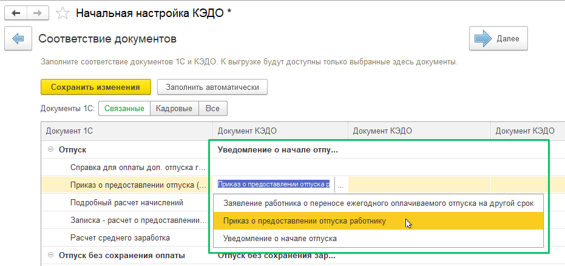
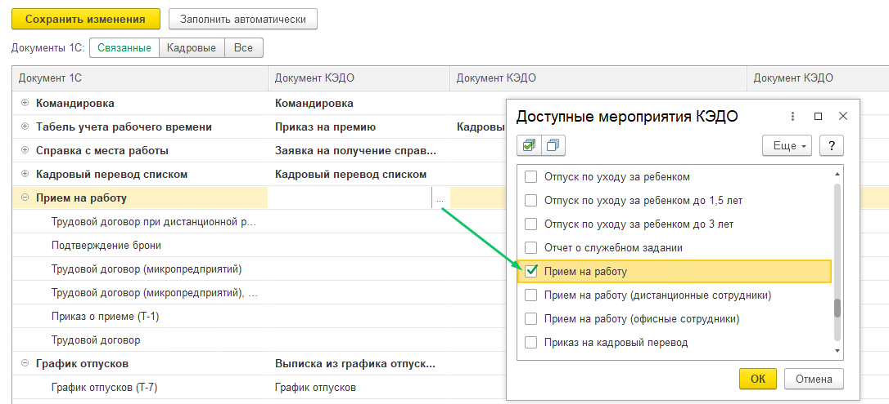
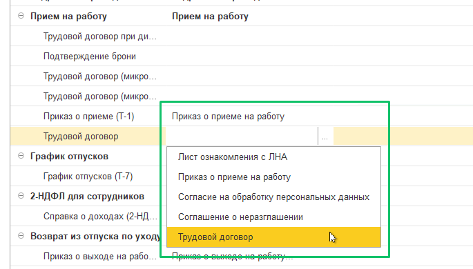
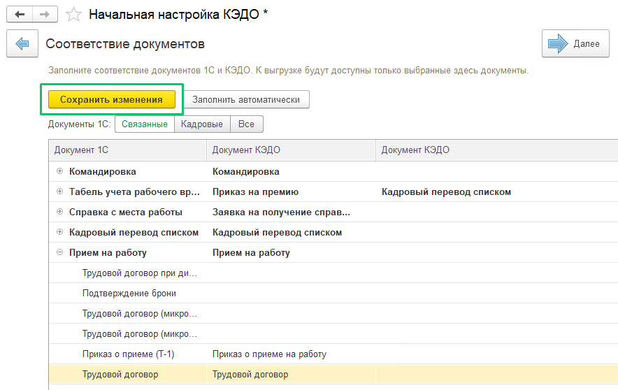
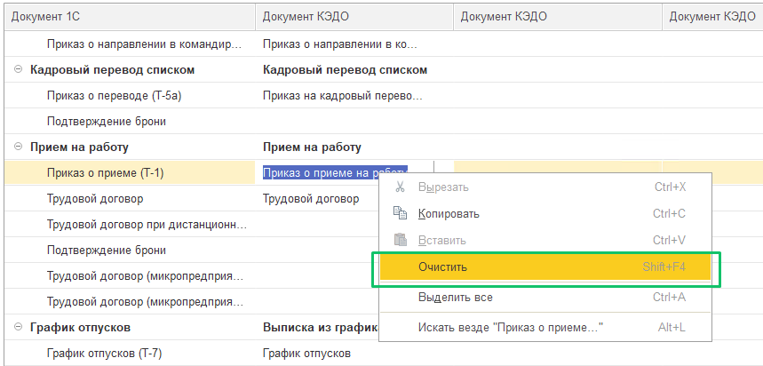
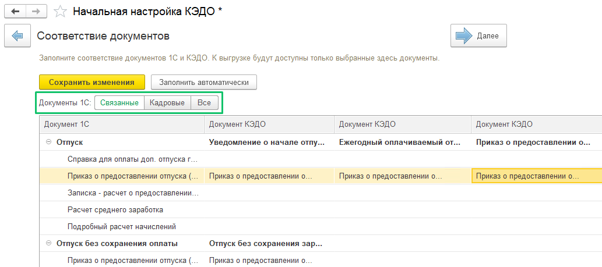
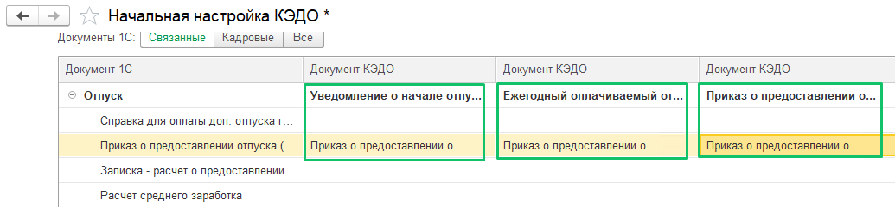
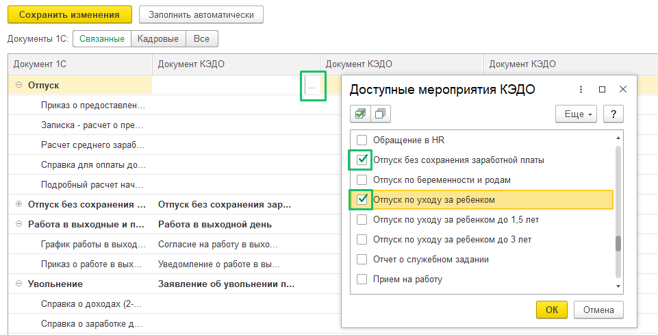
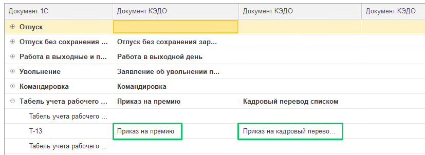

Маппинг – это сопоставление печатных форм 1С и документов, которые в дальнейшем будут отправлены в КЭДО. Маппинг необходим для того, чтобы из документа 1С по кнопке «КЭДО» автоматически отправлять документ и его печатные формы в КЭДО, а также чтобы из заявки в разделе «Рабочее место кадровика» можно было нажать кнопку «Создать документ» и перейти в сопоставленный документ 1С для его отправки в КЭДО (см. [Создание документа 1С из заявки](/ru/1C/kedo_event/documents)). 

В разделе **КЭДО → Начальная настройка → Соответствие документов**, на вкладке «Все», в столбце «Документ 1С» отображены все внешние и внутренние печатные формы 1С. В столбце «Документ КЭДО» сначала выберите название бизнес-процесса (БП), а затем те документы, которые будут отправлены в КЭДО и подписаны представителем компании и сотрудником. 

 

<warn>
После выбора бизнес-процесса необходимо соотнести документы в процессе, то есть напротив используемого вами документа 1С необходимо выбрать соответствующее название документа в КЭДО. Соотносить нужно только те документы, которые отправляются от Отдела кадров сотруднику, т.е. приказы, допсоглашения и другие печатные формы (если они есть в 1С:ЗУП). 
 
Поскольку все заявления формируются на стороне сотрудника, то заявления соотносить не нужно (Отдел кадров соотносит документы, печатные формы которых отправляются из 1С:ЗУП). Если в списке документов 1С нет нужных печатных форм документов, обратитесь к своим 1С-специалистам, чтобы они добавили необходимые вам печатные формы.
</warn>

 

В типовом 1С, в столбце «Документ 1С» присутствуют встроенные печатные формы, которые автоматически отображаются в маппинге. Также у вас могут быть настроены внешние печатные формы, которые вы делали для определенных процессов под свои требования. Эти печатные формы тоже отобразятся в столбце «Документ 1С», и их тоже можно будет соотнести.

Пример маппинга для процесса «Прием на работу». Чтобы правильно настроить маппинг для этого процесса:

**1**\. В столбце «Документ КЭДО» дважды нажмите на ячейку для выбора бизнес-процесса (БП). В форме «Доступные мероприятия КЭДО» выберите подходящий БП, например, «Прием на работу» и нажмите на кнопку «OK»:

 

**Для пользователей 1С версии 8.3.23 и выше.** Если в ранних версиях 1С при настройке соответствия документов нажимали два раза по строке, а после нажимали на многоточие, то теперь настройка соответствия печатных форм будет происходить двойным нажатием, после которого появится выпадающий список с печатными формами.

**2**\. Сопоставьте те документы, которые вы будете отправлять в КЭДО, и те печатные формы, которые будут отправляться (маппинг). Для этого в столбце «Документ КЭДО» из списка документов выберите «Приказ о приеме на работу» и «Трудовой договор»:

 

**3**\. Нажмите на кнопку «Сохранить изменения» по завершении маппинга для процесса «Прием на работу»:

 

**4**\. Чтобы удалить документ или БП из ячейки в столбце «Документ КЭДО», дважды нажмите на необходимый документ КЭДО, нажмите на правую кнопку мыши и выберите в контекстном меню команду «Очистить»: 

 

Для сопоставленного документа 1С можно выбирать любой доступный документ из ячейки столбца «Документ КЭДО», если у этого документа КЭДО есть печатные формы. В форме вы можете использовать фильтр по Связанным/Кадровым/Всем документам:

 

Рассмотрим случай, когда один и тот же документ в 1С используется в разных БП, например, отпуск. Приказ о предоставлении отпуска может быть использован в таких бизнес-процессах, как:

- «Уведомление о начале отпуска» (отпуск по графику, когда сотрудник не подает заявление на отпуск, ему автоматически приходит уведомление об отпуске, и если он соглашается на отпуск, то сотрудник отдела кадров подгружает ему приказ);
- «Ежегодный оплачиваемый отпуск (не по графику)» (когда сотрудник подает заявление на отпуск и Отдел кадров прикладывает приказ на подписание сотруднику);
- «Приказ о предоставлении отпуска работнику» (когда сотрудник Отдела кадров может отправить приказ сотрудника без заявления на отпуск и уведомления о начале отпуска).

Так можно использовать печатную форму приказа о предоставлении отпуска сразу в нескольких процессах «Уведомление о начале отпуска», «Приказ о предоставлении отпуска работнику», «Ежегодный оплачиваемый отпуск (не по графику)»:

 

Чтобы выбрать несколько БП для одного документа 1С, в столбце «Документ КЭДО» дважды нажмите на ячейку для выбора БП, в форме «Доступные мероприятия КЭДО» выберите необходимые БП и нажмите на кнопку «ОК»: 

 

После выбора бизнес-процессов для каждого из них нужно указать печатные формы, отправляемые в КЭДО. Печатные формы для разных бизнес-процессов могут отличаться:

 

Аналогично проставьте бизнес-процессы для всех используемых документов 1С и сохраните изменения в форме. 

Если используются документы с внешними печатными формами – необходимо, чтобы была добавлена внешняя печатная форма на каждый документ, т.е. один документ в КЭДО – одна печатная форма в 1С. Это необходимо, чтобы на каждом из документов в дальнейшем была проставлена электронная подпись – только так документ будет иметь юридическую силу.

Например, часто при приеме на работу объединяют все документы для приема в один файл для печати, но для маппинга документов в КЭДО такая печатная форма должна быть разбита на отдельные документы: отдельно приказ, отдельно трудовой договор, отдельно лист ознакомления с ЛНА, отдельно соглашение о неразглашении и т.д.

## Какие документы НЕ нужно маппить
1. Документы, которые формируются на стороне сервиса VK HR Tek (все заявления от сотрудников, уведомление об отпуске).
2. Документы, в которые после формирования нужно вносить изменения.
3. Документы, печатные формы которых не загружены в расширение 1С.

## Маппинг для «распила» документов

Распил — это пакетная отправка части одного документа на группу сотрудников.

1С документы, которые можно «распилить»:
- Изменение графика работы списком (Приказ об изменении графика работы);
- Изменение плановых начислений (Приказ об индексации заработка);
- Кадровый перевод списком (Приказ о переводе Т-5а);
- Работа в выходные и праздничные дни (Приказ о работе в выходной (праздничный день));
- Табель учёта рабочего времени (Т-13);
- Приказ на премию;
- График отпусков; 
- Отпуск сотрудников.

Если вы сделали маппинг для этих документов 1С и процессов КЭДО в соответствии с [таблицей](/ru/1C/user/mapping/table), то при отправке в КЭДО эти документы будут «распилены», т. е. каждый сотрудник получит свою часть документа на подписание.

<warn>
«Распиливать» можно только внутренние печатные формы.
</warn>